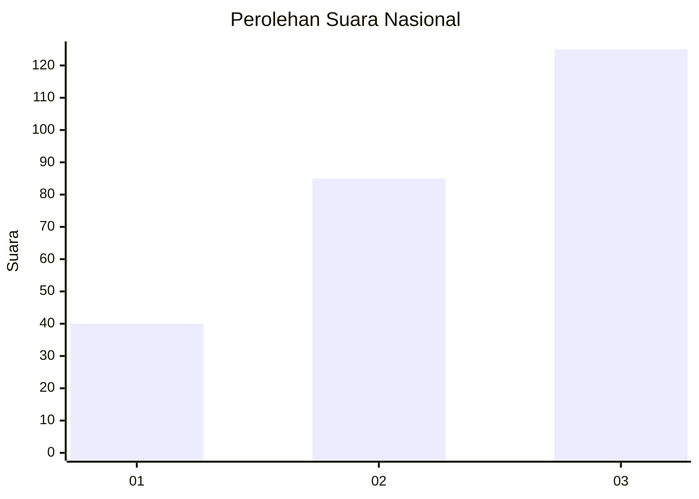
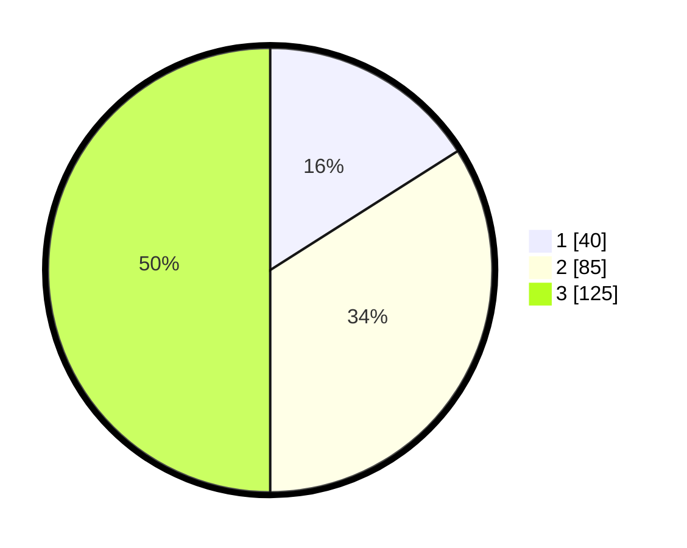

# Hasil

## Grafik

## Tabel

| No. | Nama Paslon    | Suara | Suara (raw) | Persentase |
|:--- |:-------------- | -----:| -----------:| ----------:|
| 1   | ANIES MUHAIMIN | 40    | [40][p-1]   | 16,00      |
| 2   | PRABOWO GIBRAN | 85    | [85][p-2]   | 34,00      |
| 3   | GANJAR MAHFUD  | 125   | [125][p-3]  | 50,00      |

[p-1]: https://github.com/gigit-pemilu/pemilu-2024/blob/main/pilpres/hitung-suara/sub/34-di-yogyakarta/sub/02-bantul/sub/15-sewon/sub/2004-panggungharjo/sub/039-tps/sub/paslon-1.txt
[p-2]: https://github.com/gigit-pemilu/pemilu-2024/blob/main/pilpres/hitung-suara/sub/34-di-yogyakarta/sub/02-bantul/sub/15-sewon/sub/2004-panggungharjo/sub/039-tps/sub/paslon-2.txt
[p-3]: https://github.com/gigit-pemilu/pemilu-2024/blob/main/pilpres/hitung-suara/sub/34-di-yogyakarta/sub/02-bantul/sub/15-sewon/sub/2004-panggungharjo/sub/039-tps/sub/paslon-3.txt

## Foto C Plano

https://sirekap-obj-formc.kpu.go.id/be4b/pemilu/ppwp/34/02/15/20/04/3402152004039-20240214-203120--61ac73fb-2d43-4d01-8398-d7695dae6489.jpg

https://sirekap-obj-formc.kpu.go.id/be4b/pemilu/ppwp/34/02/15/20/04/3402152004039-20240214-203130--b09fd07f-72f9-48c5-9606-f7573ff1e78e.jpg

https://sirekap-obj-formc.kpu.go.id/be4b/pemilu/ppwp/34/02/15/20/04/3402152004039-20240214-203141--2d1e5b28-ee05-4ecc-b803-86f7612335d8.jpg

## Metadata

| Key        | Value               |
| ---------- | ------------------- |
| Time Stamp | 2024-02-16 08:30:27 |

