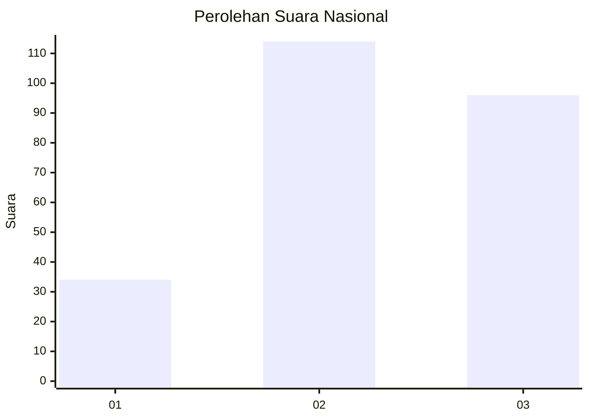
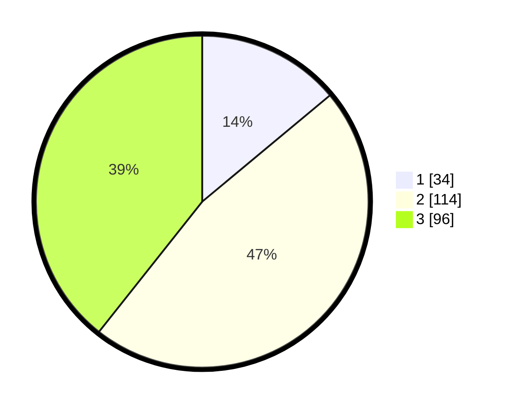

# Hasil

## Grafik

## Tabel

| No. | Nama Paslon    | Suara | Suara (raw) | Persentase |
|:--- |:-------------- | -----:| -----------:| ----------:|
| 1   | ANIES MUHAIMIN | 34    | [34][p-1]   | 13,93      |
| 2   | PRABOWO GIBRAN | 114   | [114][p-2]  | 46,72      |
| 3   | GANJAR MAHFUD  | 96    | [96][p-3]   | 39,34      |

[p-1]: https://github.com/gigit-pemilu/pemilu-2024/blob/main/pilpres/hitung-suara/sub/34-di-yogyakarta/sub/02-bantul/sub/15-sewon/sub/2004-panggungharjo/sub/041-tps/sub/paslon-1.txt
[p-2]: https://github.com/gigit-pemilu/pemilu-2024/blob/main/pilpres/hitung-suara/sub/34-di-yogyakarta/sub/02-bantul/sub/15-sewon/sub/2004-panggungharjo/sub/041-tps/sub/paslon-2.txt
[p-3]: https://github.com/gigit-pemilu/pemilu-2024/blob/main/pilpres/hitung-suara/sub/34-di-yogyakarta/sub/02-bantul/sub/15-sewon/sub/2004-panggungharjo/sub/041-tps/sub/paslon-3.txt

## Foto C Plano

https://sirekap-obj-formc.kpu.go.id/70da/pemilu/ppwp/34/02/15/20/04/3402152004041-20240215-002239--21bb757a-1cf9-4f5b-b6e4-92a4f73f58ff.jpg

https://sirekap-obj-formc.kpu.go.id/70da/pemilu/ppwp/34/02/15/20/04/3402152004041-20240215-002448--cf21ad49-7b6f-4885-a92f-53aeef658ff0.jpg

https://sirekap-obj-formc.kpu.go.id/70da/pemilu/ppwp/34/02/15/20/04/3402152004041-20240214-223431--585cdf0e-0eba-4bd0-9305-6d4a72e26b88.jpg

## Metadata

| Key        | Value               |
| ---------- | ------------------- |
| Time Stamp | 2024-02-25 22:00:00 |

