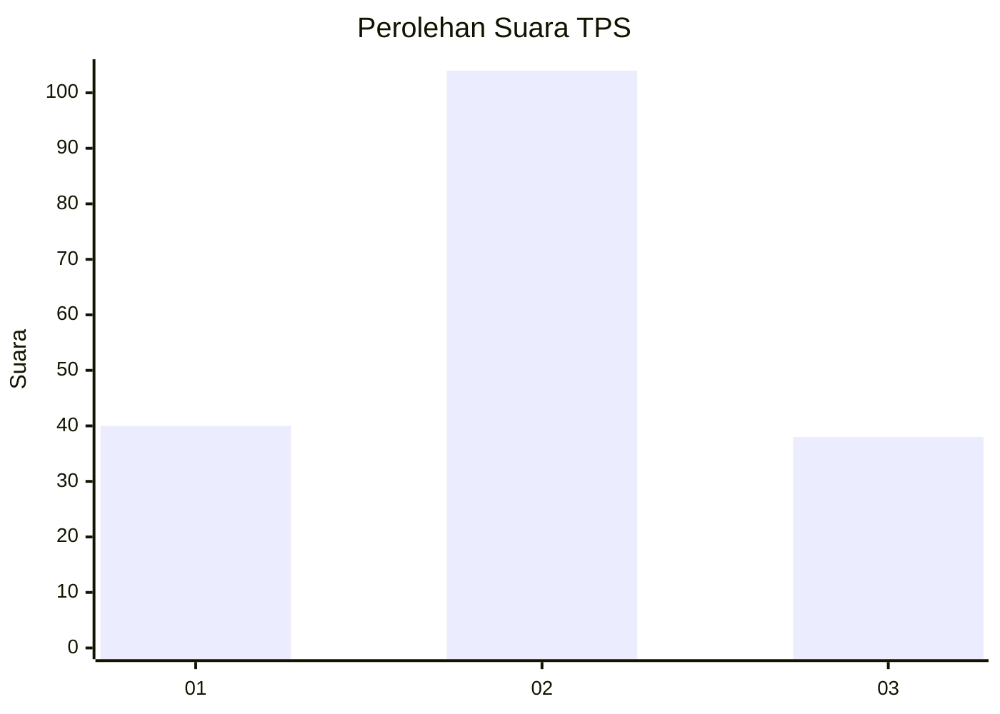
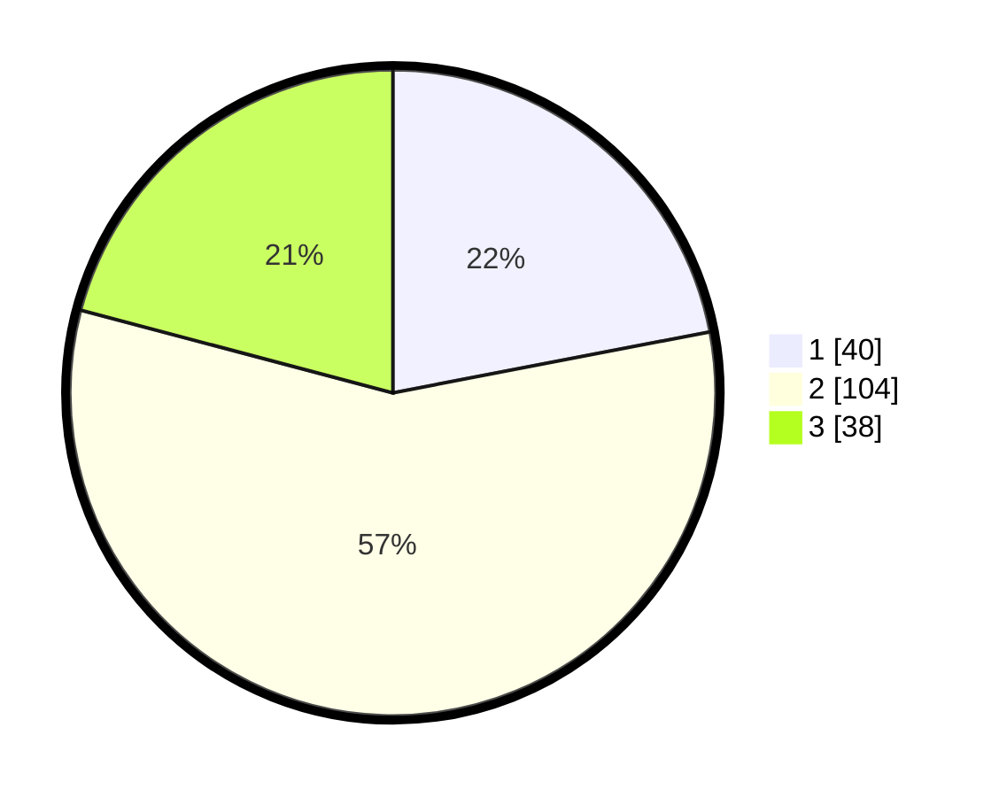

# Hasil

## Grafik

## Tabel

| No. | Nama Paslon    | Suara | Suara (raw) | Persentase |
|:--- |:-------------- | -----:| -----------:| ----------:|
| 1   | ANIES MUHAIMIN | 40    | [40][p-1]   | 21,98      |
| 2   | PRABOWO GIBRAN | 104   | [104][p-2]  | 57,14      |
| 3   | GANJAR MAHFUD  | 38    | [38][p-3]   | 20,88      |

[p-1]: https://github.com/gigit-pemilu/pemilu-2024-34-di-yogyakarta/blob/main/pilpres/hitung-suara/sub/34-di-yogyakarta/sub/02-bantul/sub/15-sewon/sub/2004-panggungharjo/sub/042-tps/sub/paslon-1.txt
[p-2]: https://github.com/gigit-pemilu/pemilu-2024-34-di-yogyakarta/blob/main/pilpres/hitung-suara/sub/34-di-yogyakarta/sub/02-bantul/sub/15-sewon/sub/2004-panggungharjo/sub/042-tps/sub/paslon-2.txt
[p-3]: https://github.com/gigit-pemilu/pemilu-2024-34-di-yogyakarta/blob/main/pilpres/hitung-suara/sub/34-di-yogyakarta/sub/02-bantul/sub/15-sewon/sub/2004-panggungharjo/sub/042-tps/sub/paslon-3.txt

## Foto C Plano

https://sirekap-obj-formc.kpu.go.id/de22/pemilu/ppwp/34/02/15/20/04/3402152004042-20240214-203838--bea58951-ac69-4ba6-9a9a-5798a3f5b041.jpg

https://sirekap-obj-formc.kpu.go.id/de22/pemilu/ppwp/34/02/15/20/04/3402152004042-20240214-203943--bbe3344d-e1d9-4337-9b45-31178518afa8.jpg

https://sirekap-obj-formc.kpu.go.id/de22/pemilu/ppwp/34/02/15/20/04/3402152004042-20240214-204039--e8c668f5-aa81-4371-a4e0-b15714fb3286.jpg

## Metadata

| Key        | Value               |
| ---------- | ------------------- |
| Time Stamp | 2024-02-24 22:31:28 |

