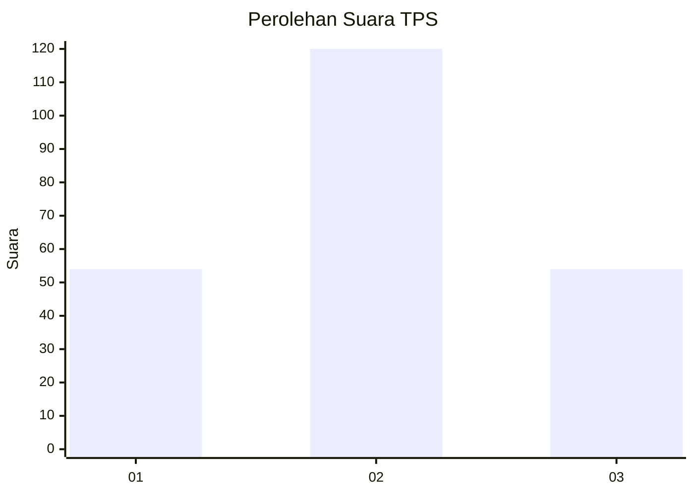
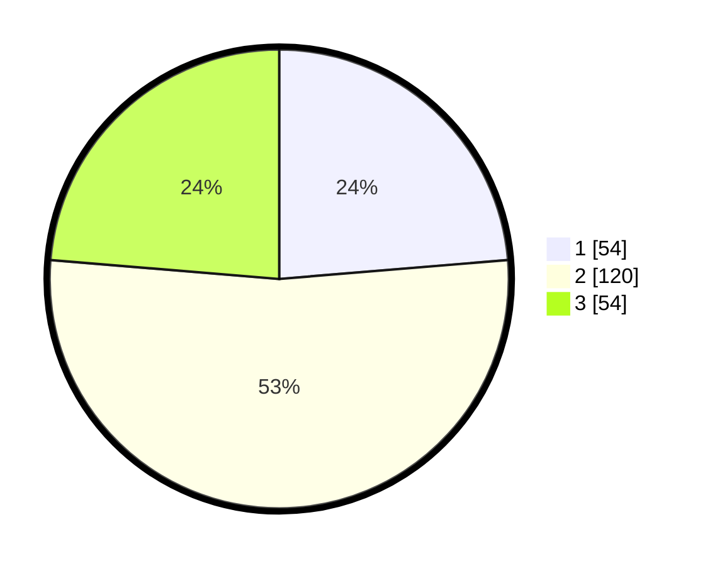

# Hasil

## Grafik

## Tabel

| No. | Nama Paslon    | Suara | Suara (raw) | Persentase |
|:--- |:-------------- | -----:| -----------:| ----------:|
| 1   | ANIES MUHAIMIN | 54    | [54][p-1]   | 23,68      |
| 2   | PRABOWO GIBRAN | 120   | [120][p-2]  | 52,63      |
| 3   | GANJAR MAHFUD  | 54    | [54][p-3]   | 23,68      |

[p-1]: https://github.com/gigit-pemilu/pemilu-2024-34-di-yogyakarta/blob/main/pilpres/hitung-suara/sub/34-di-yogyakarta/sub/02-bantul/sub/15-sewon/sub/2004-panggungharjo/sub/044-tps/sub/paslon-1.txt
[p-2]: https://github.com/gigit-pemilu/pemilu-2024-34-di-yogyakarta/blob/main/pilpres/hitung-suara/sub/34-di-yogyakarta/sub/02-bantul/sub/15-sewon/sub/2004-panggungharjo/sub/044-tps/sub/paslon-2.txt
[p-3]: https://github.com/gigit-pemilu/pemilu-2024-34-di-yogyakarta/blob/main/pilpres/hitung-suara/sub/34-di-yogyakarta/sub/02-bantul/sub/15-sewon/sub/2004-panggungharjo/sub/044-tps/sub/paslon-3.txt

## Foto C Plano

https://sirekap-obj-formc.kpu.go.id/027c/pemilu/ppwp/34/02/15/20/04/3402152004044-20240214-213913--2ba1ed1f-1816-4b35-9dc4-54a223ad1ad1.jpg

https://sirekap-obj-formc.kpu.go.id/027c/pemilu/ppwp/34/02/15/20/04/3402152004044-20240214-202842--db9dd83c-7fae-405c-aeea-f4b795413cf8.jpg

https://sirekap-obj-formc.kpu.go.id/027c/pemilu/ppwp/34/02/15/20/04/3402152004044-20240214-214255--de104eb4-22d1-4192-b201-3f7178999e72.jpg

## Metadata

| Key        | Value               |
| ---------- | ------------------- |
| Time Stamp | 2024-02-14 21:46:01 |

