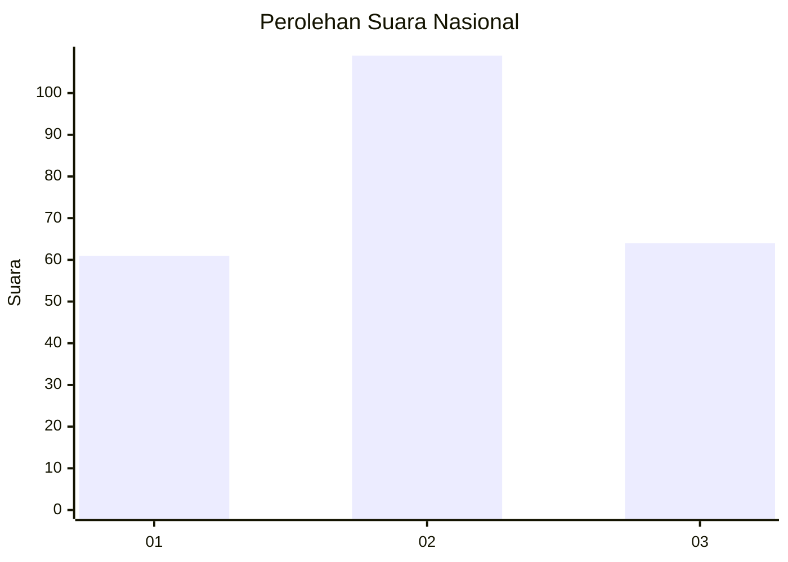
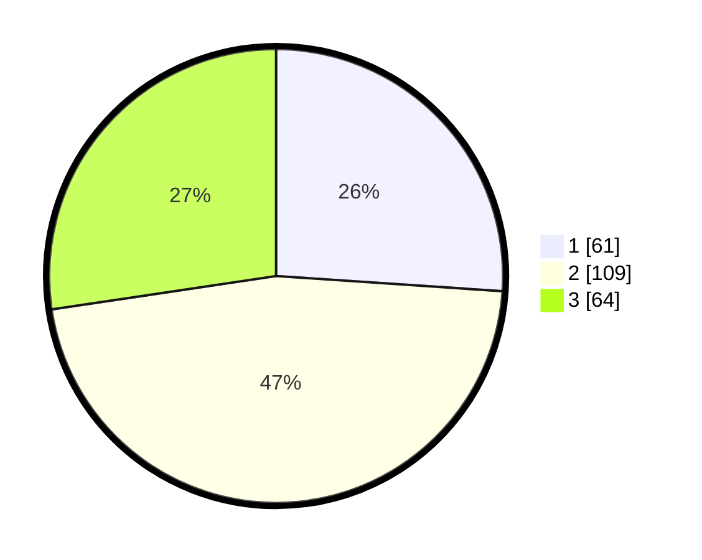

# Hasil

## Grafik

## Tabel

| No. | Nama Paslon    | Suara | Suara (raw) | Persentase |
|:--- |:-------------- | -----:| -----------:| ----------:|
| 1   | ANIES MUHAIMIN | 61    | [61][p-1]   | 26,07      |
| 2   | PRABOWO GIBRAN | 109   | [109][p-2]  | 46,58      |
| 3   | GANJAR MAHFUD  | 64    | [64][p-3]   | 27,35      |

[p-1]: https://github.com/gigit-pemilu/pemilu-2024/blob/main/pilpres/hitung-suara/sub/34-di-yogyakarta/sub/02-bantul/sub/15-sewon/sub/2004-panggungharjo/sub/046-tps/sub/paslon-1.txt
[p-2]: https://github.com/gigit-pemilu/pemilu-2024/blob/main/pilpres/hitung-suara/sub/34-di-yogyakarta/sub/02-bantul/sub/15-sewon/sub/2004-panggungharjo/sub/046-tps/sub/paslon-2.txt
[p-3]: https://github.com/gigit-pemilu/pemilu-2024/blob/main/pilpres/hitung-suara/sub/34-di-yogyakarta/sub/02-bantul/sub/15-sewon/sub/2004-panggungharjo/sub/046-tps/sub/paslon-3.txt

## Foto C Plano

https://sirekap-obj-formc.kpu.go.id/3747/pemilu/ppwp/34/02/15/20/04/3402152004046-20240215-030126--ddd6a0a7-7cb6-4f88-a3e7-005e59202b89.jpg

https://sirekap-obj-formc.kpu.go.id/3747/pemilu/ppwp/34/02/15/20/04/3402152004046-20240215-005549--d1b4ab02-e718-40da-8756-852adce050d5.jpg

https://sirekap-obj-formc.kpu.go.id/3747/pemilu/ppwp/34/02/15/20/04/3402152004046-20240215-005736--c38e6354-3726-4866-bc32-7478a44b0b37.jpg

## Metadata

| Key        | Value               |
| ---------- | ------------------- |
| Time Stamp | 2024-02-15 15:00:29 |

