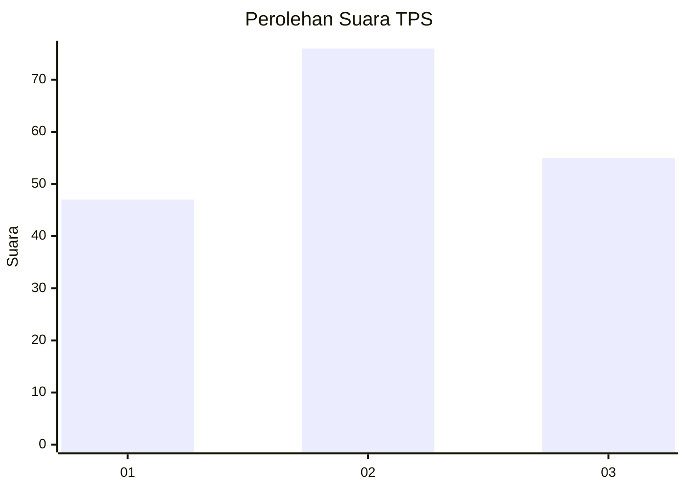
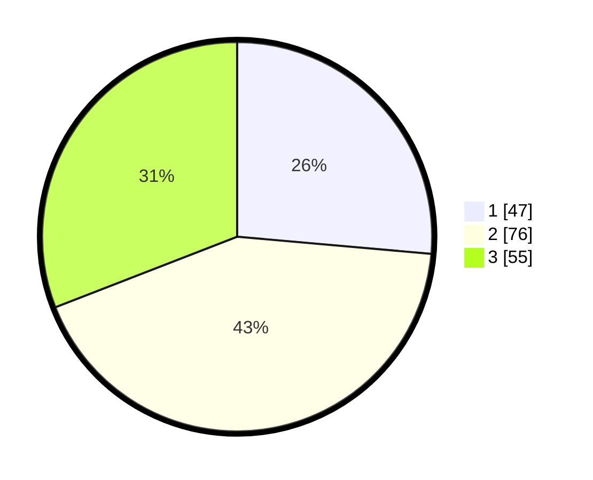

# Hasil

## Grafik

## Tabel

| No. | Nama Paslon    | Suara | Suara (raw) | Persentase |
|:--- |:-------------- | -----:| -----------:| ----------:|
| 1   | ANIES MUHAIMIN | 47    | [47][p-1]   | 26,40      |
| 2   | PRABOWO GIBRAN | 76    | [76][p-2]   | 42,70      |
| 3   | GANJAR MAHFUD  | 55    | [55][p-3]   | 30,90      |

[p-1]: https://github.com/gigit-pemilu/pemilu-2024-34-di-yogyakarta/blob/main/pilpres/hitung-suara/sub/34-di-yogyakarta/sub/02-bantul/sub/15-sewon/sub/2004-panggungharjo/sub/049-tps/sub/paslon-1.txt
[p-2]: https://github.com/gigit-pemilu/pemilu-2024-34-di-yogyakarta/blob/main/pilpres/hitung-suara/sub/34-di-yogyakarta/sub/02-bantul/sub/15-sewon/sub/2004-panggungharjo/sub/049-tps/sub/paslon-2.txt
[p-3]: https://github.com/gigit-pemilu/pemilu-2024-34-di-yogyakarta/blob/main/pilpres/hitung-suara/sub/34-di-yogyakarta/sub/02-bantul/sub/15-sewon/sub/2004-panggungharjo/sub/049-tps/sub/paslon-3.txt

## Foto C Plano

https://sirekap-obj-formc.kpu.go.id/d62e/pemilu/ppwp/34/02/15/20/04/3402152004049-20240215-085544--00eee3d9-49a9-4d89-96e8-a85fe532afa9.jpg

https://sirekap-obj-formc.kpu.go.id/d62e/pemilu/ppwp/34/02/15/20/04/3402152004049-20240215-085556--d29da39d-42b6-4b2d-8063-5772028344a1.jpg

https://sirekap-obj-formc.kpu.go.id/d62e/pemilu/ppwp/34/02/15/20/04/3402152004049-20240215-085603--73989531-c0a8-4f89-8b6a-d335a38dcda2.jpg

## Metadata

| Key        | Value               |
| ---------- | ------------------- |
| Time Stamp | 2024-02-24 22:31:28 |

