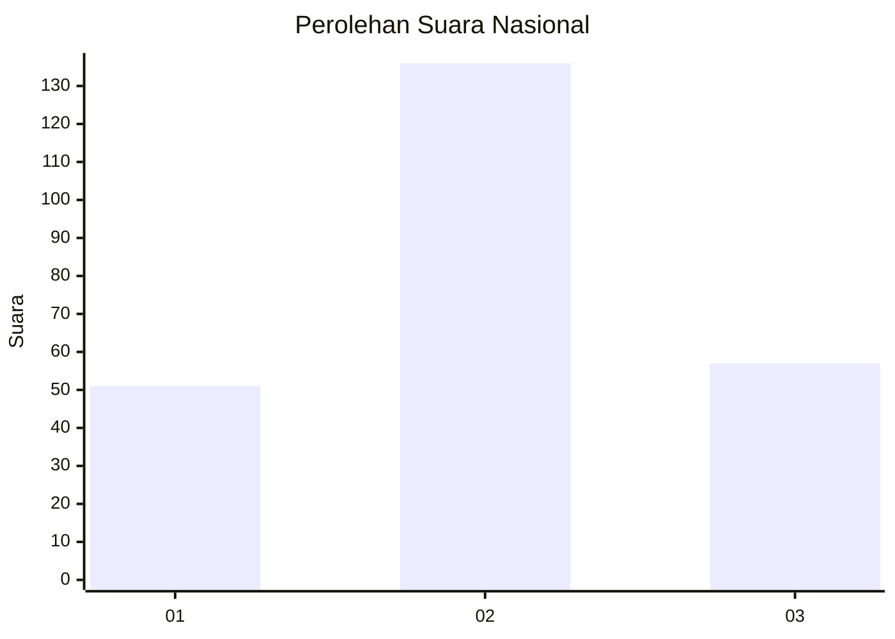
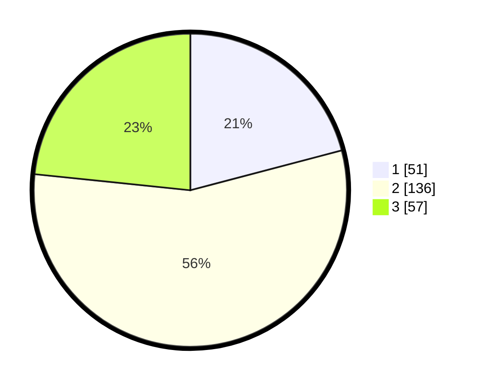

# Hasil

## Grafik

## Tabel

| No. | Nama Paslon    | Suara | Suara (raw) | Persentase |
|:--- |:-------------- | -----:| -----------:| ----------:|
| 1   | ANIES MUHAIMIN | 51    | [51][p-1]   | 20,90      |
| 2   | PRABOWO GIBRAN | 136   | [136][p-2]  | 55,74      |
| 3   | GANJAR MAHFUD  | 57    | [57][p-3]   | 23,36      |

[p-1]: https://github.com/gigit-pemilu/pemilu-2024/blob/main/pilpres/hitung-suara/sub/34-di-yogyakarta/sub/02-bantul/sub/15-sewon/sub/2004-panggungharjo/sub/053-tps/sub/paslon-1.txt
[p-2]: https://github.com/gigit-pemilu/pemilu-2024/blob/main/pilpres/hitung-suara/sub/34-di-yogyakarta/sub/02-bantul/sub/15-sewon/sub/2004-panggungharjo/sub/053-tps/sub/paslon-2.txt
[p-3]: https://github.com/gigit-pemilu/pemilu-2024/blob/main/pilpres/hitung-suara/sub/34-di-yogyakarta/sub/02-bantul/sub/15-sewon/sub/2004-panggungharjo/sub/053-tps/sub/paslon-3.txt

## Foto C Plano

https://sirekap-obj-formc.kpu.go.id/6162/pemilu/ppwp/34/02/15/20/04/3402152004053-20240214-213804--47d19556-ef58-439c-a229-4678b42987f3.jpg

https://sirekap-obj-formc.kpu.go.id/6162/pemilu/ppwp/34/02/15/20/04/3402152004053-20240214-213844--db2d16b7-257c-4ee4-8dcc-ed2b28e39de7.jpg

https://sirekap-obj-formc.kpu.go.id/6162/pemilu/ppwp/34/02/15/20/04/3402152004053-20240214-213910--fd009f7c-9c21-4105-9be8-b8439347cb9a.jpg

## Metadata

| Key        | Value               |
| ---------- | ------------------- |
| Time Stamp | 2024-02-24 22:31:28 |

