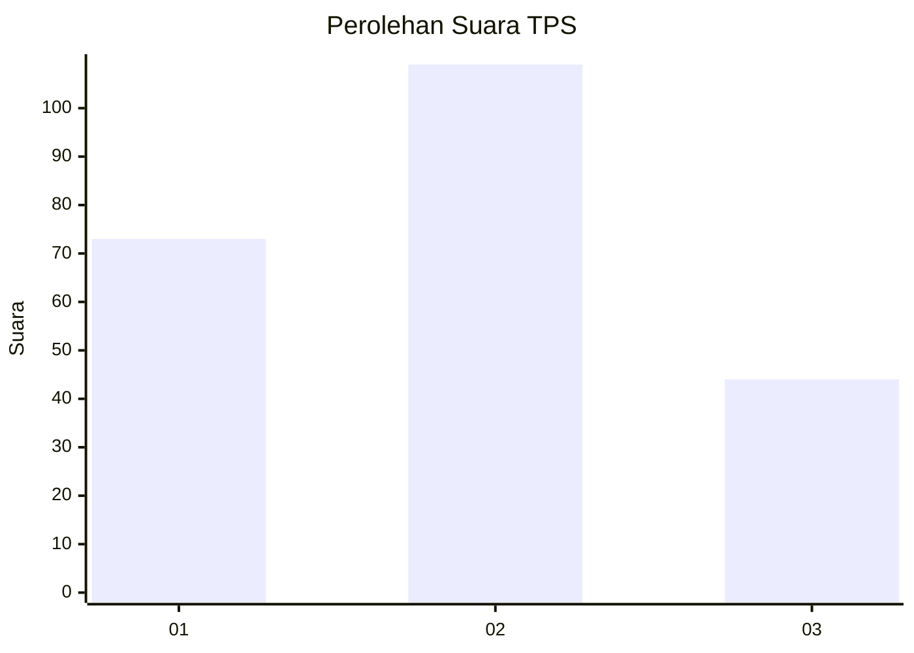
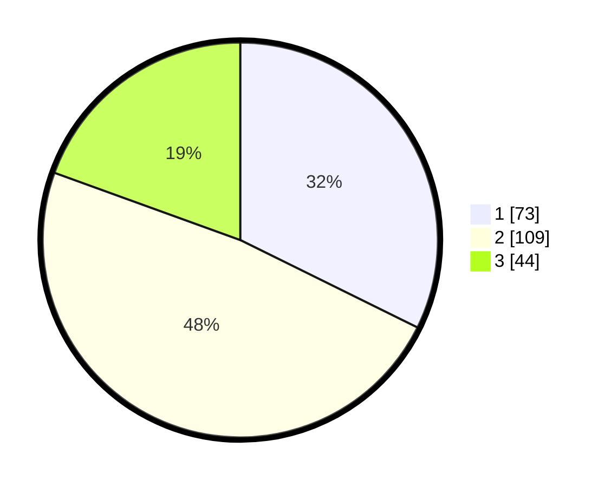

# Hasil

## Grafik

## Tabel

| No. | Nama Paslon    | Suara | Suara (raw) | Persentase |
|:--- |:-------------- | -----:| -----------:| ----------:|
| 1   | ANIES MUHAIMIN | 73    | [73][p-1]   | 32,30      |
| 2   | PRABOWO GIBRAN | 109   | [109][p-2]  | 48,23      |
| 3   | GANJAR MAHFUD  | 44    | [44][p-3]   | 19,47      |

[p-1]: https://github.com/gigit-pemilu/pemilu-2024-34-di-yogyakarta/blob/main/pilpres/hitung-suara/sub/34-di-yogyakarta/sub/02-bantul/sub/15-sewon/sub/2004-panggungharjo/sub/054-tps/sub/paslon-1.txt
[p-2]: https://github.com/gigit-pemilu/pemilu-2024-34-di-yogyakarta/blob/main/pilpres/hitung-suara/sub/34-di-yogyakarta/sub/02-bantul/sub/15-sewon/sub/2004-panggungharjo/sub/054-tps/sub/paslon-2.txt
[p-3]: https://github.com/gigit-pemilu/pemilu-2024-34-di-yogyakarta/blob/main/pilpres/hitung-suara/sub/34-di-yogyakarta/sub/02-bantul/sub/15-sewon/sub/2004-panggungharjo/sub/054-tps/sub/paslon-3.txt

## Foto C Plano

https://sirekap-obj-formc.kpu.go.id/f1c1/pemilu/ppwp/34/02/15/20/04/3402152004054-20240214-225156--c62c4161-2630-4210-a2ed-58a3657c93ec.jpg

https://sirekap-obj-formc.kpu.go.id/f1c1/pemilu/ppwp/34/02/15/20/04/3402152004054-20240214-225228--69367123-58ab-4c67-952e-8d41611bf84f.jpg

https://sirekap-obj-formc.kpu.go.id/f1c1/pemilu/ppwp/34/02/15/20/04/3402152004054-20240214-225256--38b99342-55c0-4dca-a19a-fe9e4b0a3ad4.jpg

## Metadata

| Key        | Value               |
| ---------- | ------------------- |
| Time Stamp | 2024-02-24 22:31:28 |

