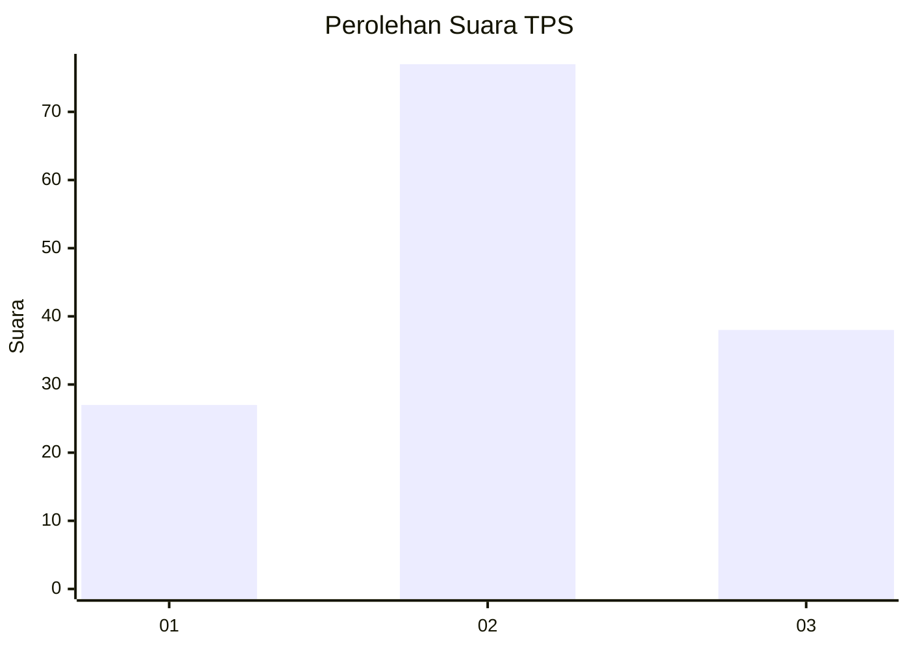
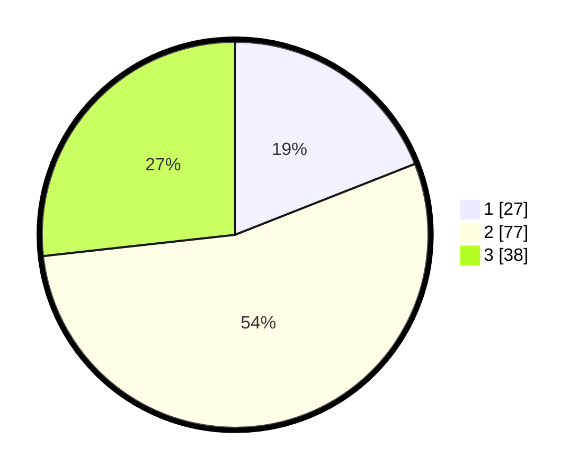

# Hasil

## Grafik

## Tabel

| No. | Nama Paslon    | Suara | Suara (raw) | Persentase |
|:--- |:-------------- | -----:| -----------:| ----------:|
| 1   | ANIES MUHAIMIN | 27    | [27][p-1]   | 19,01      |
| 2   | PRABOWO GIBRAN | 77    | [77][p-2]   | 54,23      |
| 3   | GANJAR MAHFUD  | 38    | [38][p-3]   | 26,76      |

[p-1]: https://github.com/gigit-pemilu/pemilu-2024-34-di-yogyakarta/blob/main/pilpres/hitung-suara/sub/34-di-yogyakarta/sub/02-bantul/sub/15-sewon/sub/2004-panggungharjo/sub/056-tps/sub/paslon-1.txt
[p-2]: https://github.com/gigit-pemilu/pemilu-2024-34-di-yogyakarta/blob/main/pilpres/hitung-suara/sub/34-di-yogyakarta/sub/02-bantul/sub/15-sewon/sub/2004-panggungharjo/sub/056-tps/sub/paslon-2.txt
[p-3]: https://github.com/gigit-pemilu/pemilu-2024-34-di-yogyakarta/blob/main/pilpres/hitung-suara/sub/34-di-yogyakarta/sub/02-bantul/sub/15-sewon/sub/2004-panggungharjo/sub/056-tps/sub/paslon-3.txt

## Foto C Plano

https://sirekap-obj-formc.kpu.go.id/8586/pemilu/ppwp/34/02/15/20/04/3402152004056-20240215-002212--8ee696c1-5587-449b-97ac-a7c803fba271.jpg

https://sirekap-obj-formc.kpu.go.id/8586/pemilu/ppwp/34/02/15/20/04/3402152004056-20240215-002415--a98c11b9-d87d-461f-ad6e-ad29b575bd3d.jpg

https://sirekap-obj-formc.kpu.go.id/8586/pemilu/ppwp/34/02/15/20/04/3402152004056-20240215-003124--aeec0e62-9220-4dcf-bd97-df974eb8c467.jpg

## Metadata

| Key        | Value               |
| ---------- | ------------------- |
| Time Stamp | 2024-02-24 22:31:28 |

