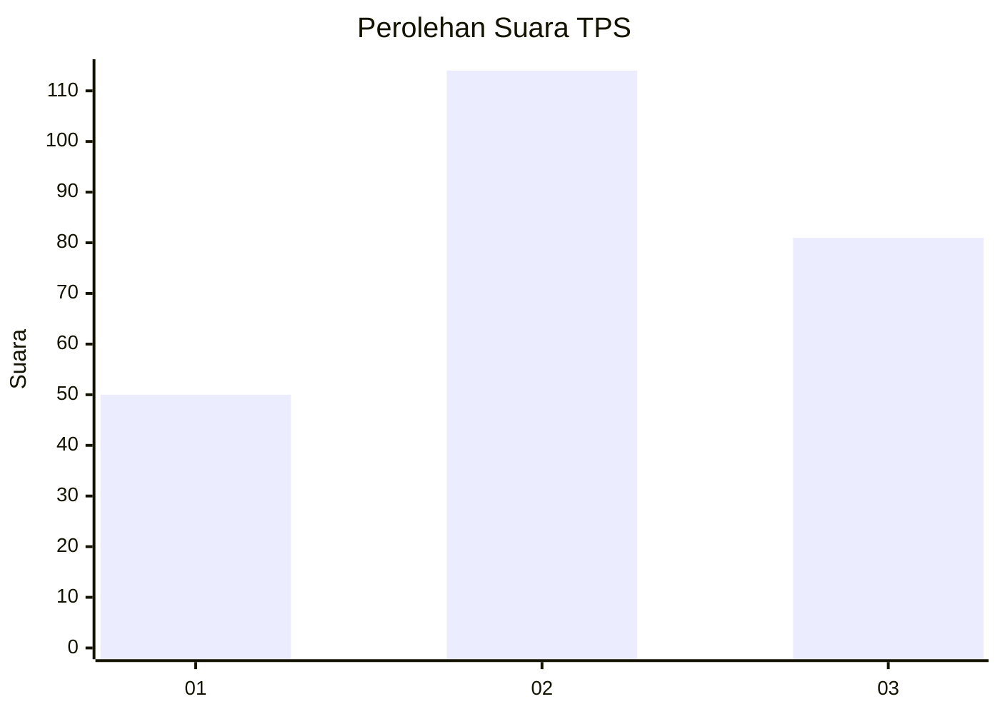
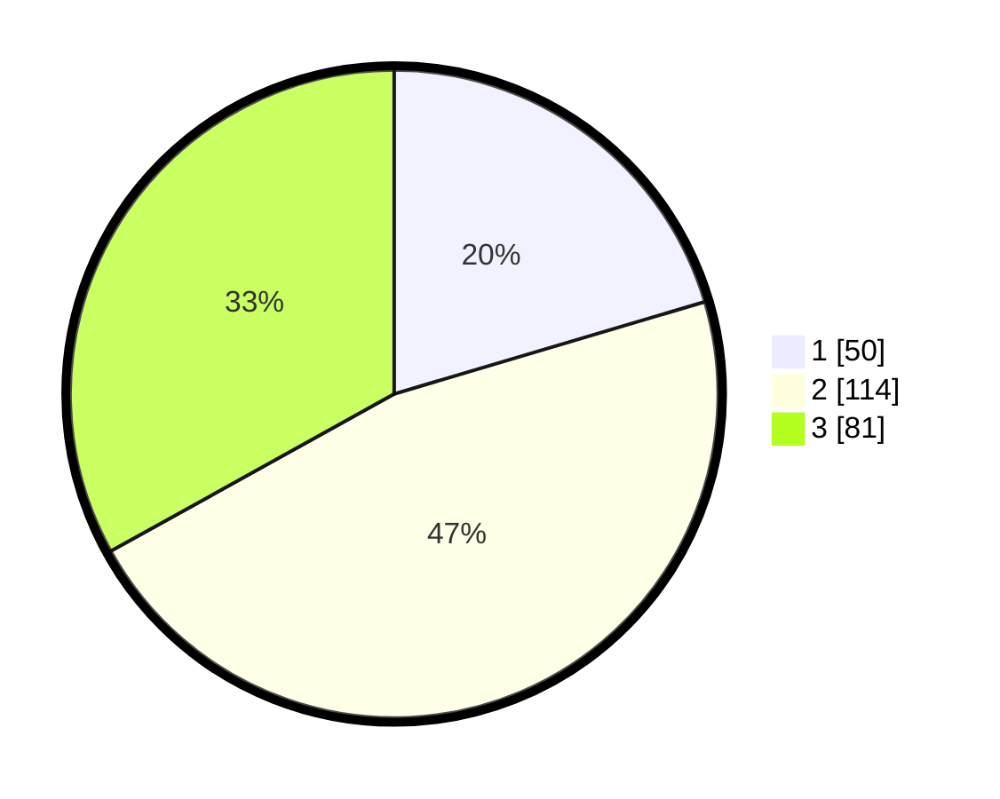

# Hasil

## Grafik

## Tabel

| No. | Nama Paslon    | Suara | Suara (raw) | Persentase |
|:--- |:-------------- | -----:| -----------:| ----------:|
| 1   | ANIES MUHAIMIN | 50    | [50][p-1]   | 20,41      |
| 2   | PRABOWO GIBRAN | 114   | [114][p-2]  | 46,53      |
| 3   | GANJAR MAHFUD  | 81    | [81][p-3]   | 33,06      |

[p-1]: https://github.com/gigit-pemilu/pemilu-2024-34-di-yogyakarta/blob/main/pilpres/hitung-suara/sub/34-di-yogyakarta/sub/02-bantul/sub/15-sewon/sub/2004-panggungharjo/sub/061-tps/sub/paslon-1.txt
[p-2]: https://github.com/gigit-pemilu/pemilu-2024-34-di-yogyakarta/blob/main/pilpres/hitung-suara/sub/34-di-yogyakarta/sub/02-bantul/sub/15-sewon/sub/2004-panggungharjo/sub/061-tps/sub/paslon-2.txt
[p-3]: https://github.com/gigit-pemilu/pemilu-2024-34-di-yogyakarta/blob/main/pilpres/hitung-suara/sub/34-di-yogyakarta/sub/02-bantul/sub/15-sewon/sub/2004-panggungharjo/sub/061-tps/sub/paslon-3.txt

## Foto C Plano

https://sirekap-obj-formc.kpu.go.id/22b9/pemilu/ppwp/34/02/15/20/04/3402152004061-20240214-225512--904961a4-0f02-4f9b-af08-5fd647b73840.jpg

https://sirekap-obj-formc.kpu.go.id/22b9/pemilu/ppwp/34/02/15/20/04/3402152004061-20240215-012255--5b3c0fed-3f48-409d-880a-072a716754c8.jpg

https://sirekap-obj-formc.kpu.go.id/22b9/pemilu/ppwp/34/02/15/20/04/3402152004061-20240215-012405--3c478b2c-ba33-4cd4-9b20-fe28c22e2bd1.jpg

## Metadata

| Key        | Value               |
| ---------- | ------------------- |
| Time Stamp | 2024-02-24 22:31:28 |

