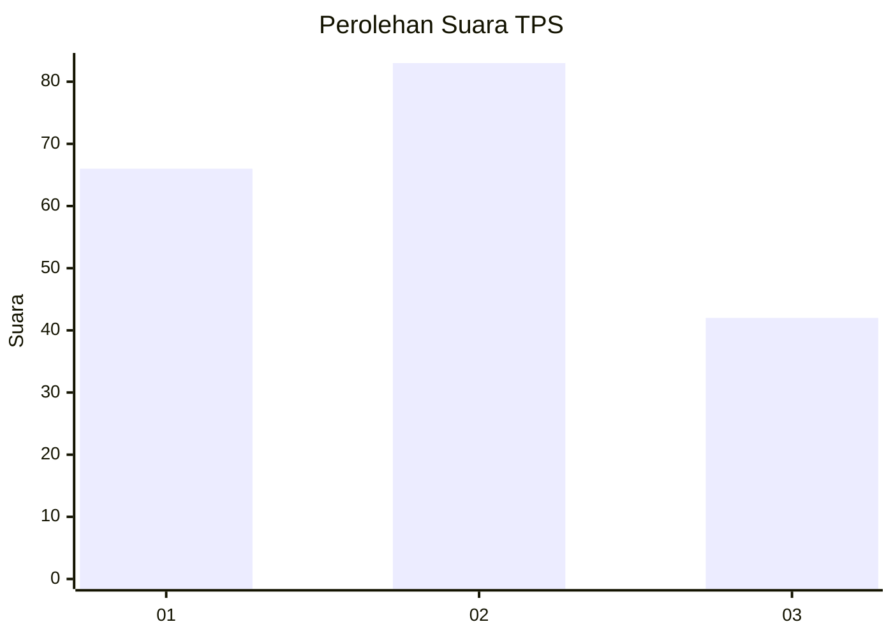
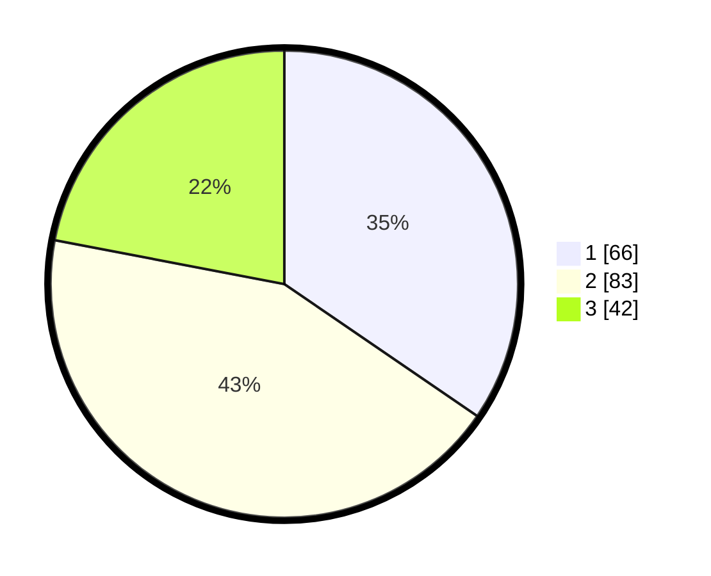

# Hasil

## Grafik

## Tabel

| No. | Nama Paslon    | Suara | Suara (raw) | Persentase |
|:--- |:-------------- | -----:| -----------:| ----------:|
| 1   | ANIES MUHAIMIN | 66    | [66][p-1]   | 34,55      |
| 2   | PRABOWO GIBRAN | 83    | [83][p-2]   | 43,46      |
| 3   | GANJAR MAHFUD  | 42    | [42][p-3]   | 21,99      |

[p-1]: https://github.com/gigit-pemilu/pemilu-2024-34-di-yogyakarta/blob/main/pilpres/hitung-suara/sub/34-di-yogyakarta/sub/02-bantul/sub/15-sewon/sub/2004-panggungharjo/sub/064-tps/sub/paslon-1.txt
[p-2]: https://github.com/gigit-pemilu/pemilu-2024-34-di-yogyakarta/blob/main/pilpres/hitung-suara/sub/34-di-yogyakarta/sub/02-bantul/sub/15-sewon/sub/2004-panggungharjo/sub/064-tps/sub/paslon-2.txt
[p-3]: https://github.com/gigit-pemilu/pemilu-2024-34-di-yogyakarta/blob/main/pilpres/hitung-suara/sub/34-di-yogyakarta/sub/02-bantul/sub/15-sewon/sub/2004-panggungharjo/sub/064-tps/sub/paslon-3.txt

## Foto C Plano

https://sirekap-obj-formc.kpu.go.id/1db8/pemilu/ppwp/34/02/15/20/04/3402152004064-20240214-230533--b8501bd0-42be-4c73-a5b1-da30409c30e2.jpg

https://sirekap-obj-formc.kpu.go.id/1db8/pemilu/ppwp/34/02/15/20/04/3402152004064-20240214-225122--e769bb4a-1312-46fc-b2b7-4e876c2294d2.jpg

https://sirekap-obj-formc.kpu.go.id/1db8/pemilu/ppwp/34/02/15/20/04/3402152004064-20240214-225149--a9cdd61f-978d-46dc-a536-16268da51e75.jpg

## Metadata

| Key        | Value               |
| ---------- | ------------------- |
| Time Stamp | 2024-02-21 10:00:00 |

