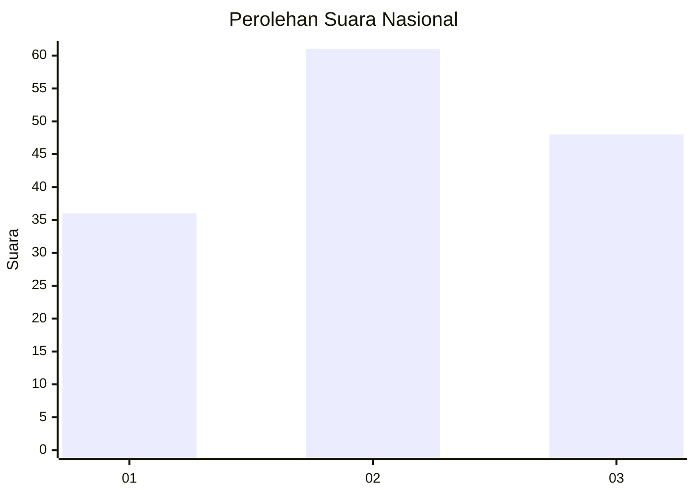
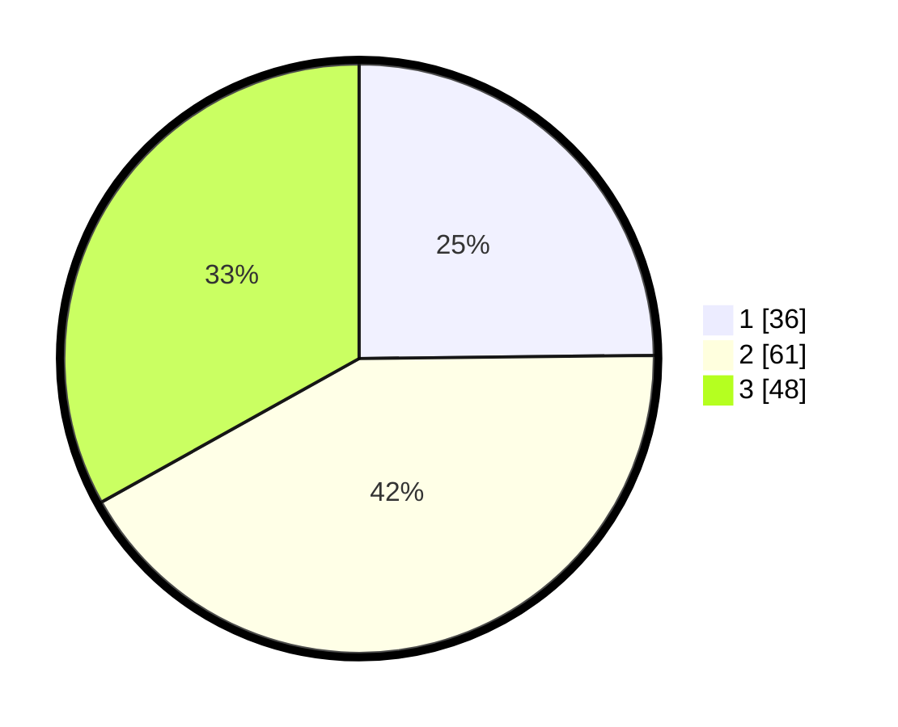

# Hasil

## Grafik

## Tabel

| No. | Nama Paslon    | Suara | Suara (raw) | Persentase |
|:--- |:-------------- | -----:| -----------:| ----------:|
| 1   | ANIES MUHAIMIN | 36    | [36][p-1]   | 24,83      |
| 2   | PRABOWO GIBRAN | 61    | [61][p-2]   | 42,07      |
| 3   | GANJAR MAHFUD  | 48    | [48][p-3]   | 33,10      |

[p-1]: https://github.com/gigit-pemilu/pemilu-2024/blob/main/pilpres/hitung-suara/sub/34-di-yogyakarta/sub/02-bantul/sub/15-sewon/sub/2004-panggungharjo/sub/071-tps/sub/paslon-1.txt
[p-2]: https://github.com/gigit-pemilu/pemilu-2024/blob/main/pilpres/hitung-suara/sub/34-di-yogyakarta/sub/02-bantul/sub/15-sewon/sub/2004-panggungharjo/sub/071-tps/sub/paslon-2.txt
[p-3]: https://github.com/gigit-pemilu/pemilu-2024/blob/main/pilpres/hitung-suara/sub/34-di-yogyakarta/sub/02-bantul/sub/15-sewon/sub/2004-panggungharjo/sub/071-tps/sub/paslon-3.txt

## Foto C Plano

https://sirekap-obj-formc.kpu.go.id/15e9/pemilu/ppwp/34/02/15/20/04/3402152004071-20240214-223449--3151fca4-4340-4c93-b7b6-5f0676f02b37.jpg

https://sirekap-obj-formc.kpu.go.id/15e9/pemilu/ppwp/34/02/15/20/04/3402152004071-20240214-223600--d8f45289-397e-44cf-9494-7a45593f8c23.jpg

https://sirekap-obj-formc.kpu.go.id/15e9/pemilu/ppwp/34/02/15/20/04/3402152004071-20240214-223649--546205f9-14ff-4443-a852-a91f09820961.jpg

## Metadata

| Key        | Value               |
| ---------- | ------------------- |
| Time Stamp | 2024-02-24 22:31:28 |

