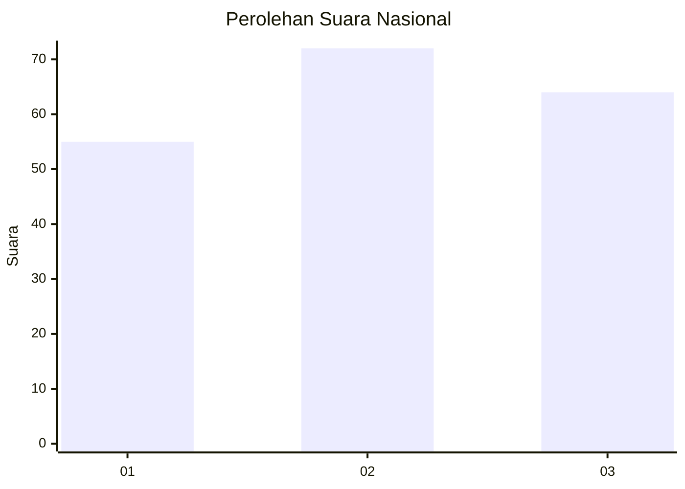
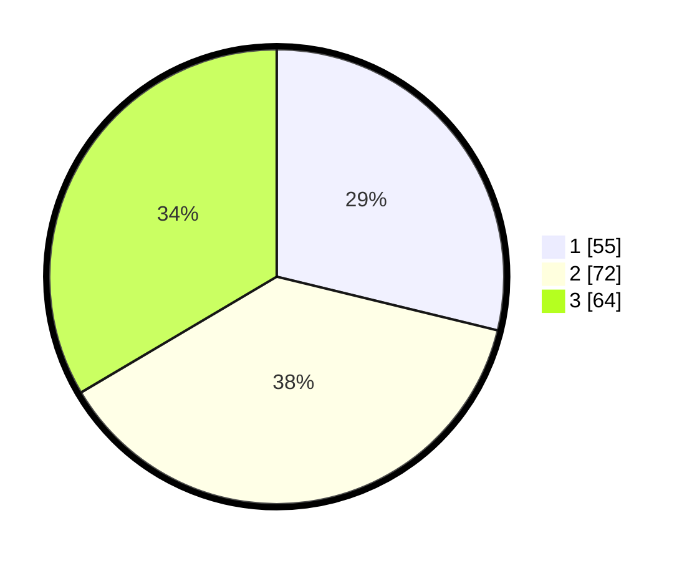

# Hasil

## Grafik

## Tabel

| No. | Nama Paslon    | Suara | Suara (raw) | Persentase |
|:--- |:-------------- | -----:| -----------:| ----------:|
| 1   | ANIES MUHAIMIN | 55    | [55][p-1]   | 28,80      |
| 2   | PRABOWO GIBRAN | 72    | [72][p-2]   | 37,70      |
| 3   | GANJAR MAHFUD  | 64    | [64][p-3]   | 33,51      |

[p-1]: https://github.com/gigit-pemilu/pemilu-2024/blob/main/pilpres/hitung-suara/sub/34-di-yogyakarta/sub/02-bantul/sub/15-sewon/sub/2004-panggungharjo/sub/074-tps/sub/paslon-1.txt
[p-2]: https://github.com/gigit-pemilu/pemilu-2024/blob/main/pilpres/hitung-suara/sub/34-di-yogyakarta/sub/02-bantul/sub/15-sewon/sub/2004-panggungharjo/sub/074-tps/sub/paslon-2.txt
[p-3]: https://github.com/gigit-pemilu/pemilu-2024/blob/main/pilpres/hitung-suara/sub/34-di-yogyakarta/sub/02-bantul/sub/15-sewon/sub/2004-panggungharjo/sub/074-tps/sub/paslon-3.txt

## Foto C Plano

https://sirekap-obj-formc.kpu.go.id/7c3a/pemilu/ppwp/34/02/15/20/04/3402152004074-20240214-221503--95b29bb0-2431-478b-98f4-8b633e1dafff.jpg

https://sirekap-obj-formc.kpu.go.id/7c3a/pemilu/ppwp/34/02/15/20/04/3402152004074-20240214-221644--09694d6d-1998-43aa-803c-c6de4c4693d8.jpg

https://sirekap-obj-formc.kpu.go.id/7c3a/pemilu/ppwp/34/02/15/20/04/3402152004074-20240214-221808--96ef715e-4708-49e8-821a-413891718d03.jpg

## Metadata

| Key        | Value               |
| ---------- | ------------------- |
| Time Stamp | 2024-02-24 22:31:28 |

