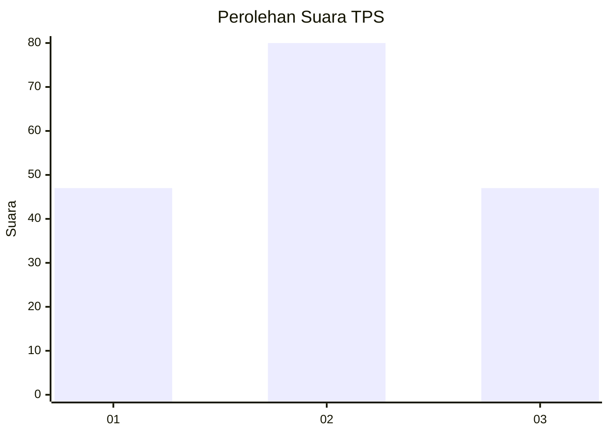
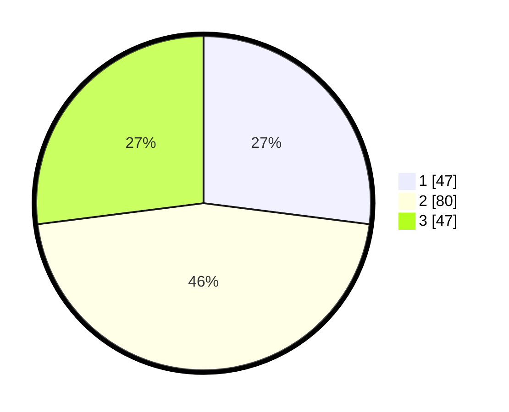

# Hasil

## Grafik

## Tabel

| No. | Nama Paslon    | Suara | Suara (raw) | Persentase |
|:--- |:-------------- | -----:| -----------:| ----------:|
| 1   | ANIES MUHAIMIN | 47    | [47][p-1]   | 27,01      |
| 2   | PRABOWO GIBRAN | 80    | [80][p-2]   | 45,98      |
| 3   | GANJAR MAHFUD  | 47    | [47][p-3]   | 27,01      |

[p-1]: https://github.com/gigit-pemilu/pemilu-2024-34-di-yogyakarta/blob/main/pilpres/hitung-suara/sub/34-di-yogyakarta/sub/02-bantul/sub/15-sewon/sub/2004-panggungharjo/sub/077-tps/sub/paslon-1.txt
[p-2]: https://github.com/gigit-pemilu/pemilu-2024-34-di-yogyakarta/blob/main/pilpres/hitung-suara/sub/34-di-yogyakarta/sub/02-bantul/sub/15-sewon/sub/2004-panggungharjo/sub/077-tps/sub/paslon-2.txt
[p-3]: https://github.com/gigit-pemilu/pemilu-2024-34-di-yogyakarta/blob/main/pilpres/hitung-suara/sub/34-di-yogyakarta/sub/02-bantul/sub/15-sewon/sub/2004-panggungharjo/sub/077-tps/sub/paslon-3.txt

## Foto C Plano

https://sirekap-obj-formc.kpu.go.id/9036/pemilu/ppwp/34/02/15/20/04/3402152004077-20240215-022952--ba2a9234-62ef-4a8e-9fc1-bb48a060539c.jpg

https://sirekap-obj-formc.kpu.go.id/9036/pemilu/ppwp/34/02/15/20/04/3402152004077-20240215-023119--51b6507f-ad65-4a6a-bd4c-8fc5c5c25a95.jpg

https://sirekap-obj-formc.kpu.go.id/9036/pemilu/ppwp/34/02/15/20/04/3402152004077-20240215-023258--61f69894-7cb7-4649-9d4e-4fefa1620f50.jpg

## Metadata

| Key        | Value               |
| ---------- | ------------------- |
| Time Stamp | 2024-02-24 22:31:28 |

