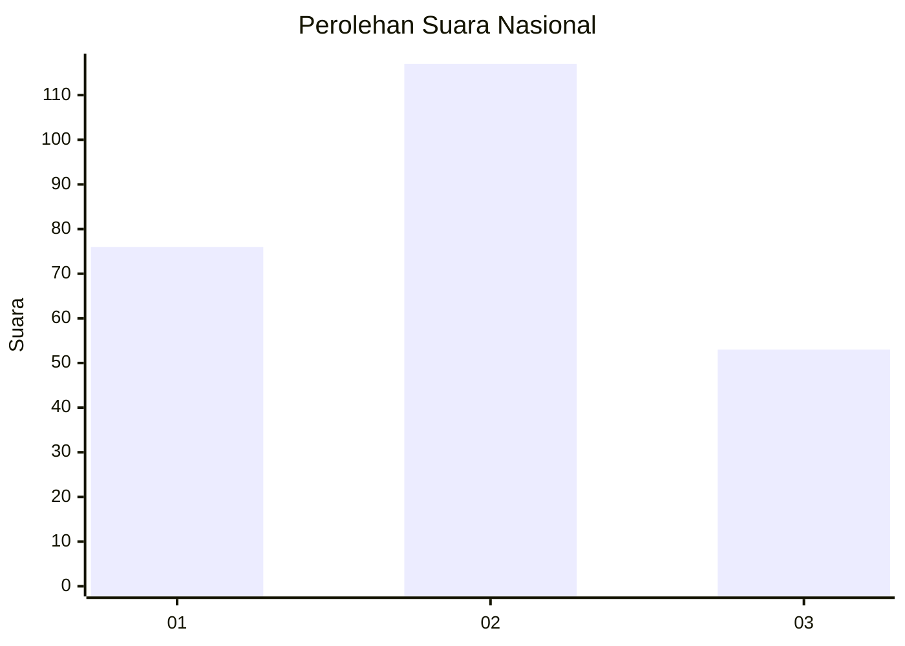
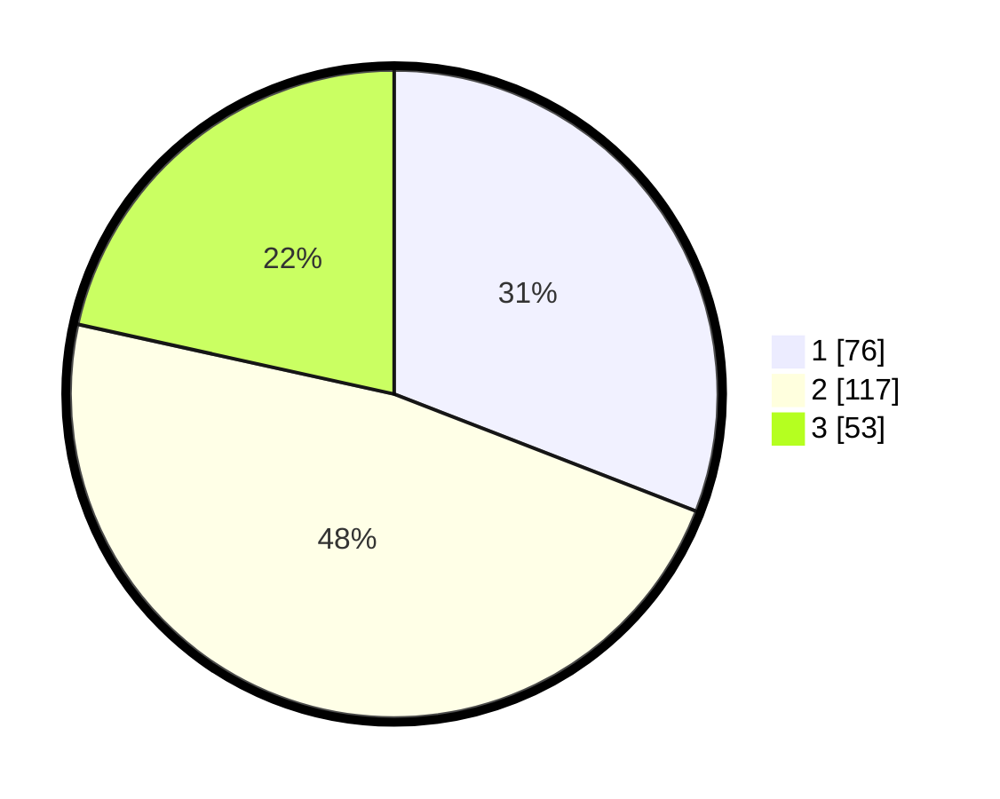

# Hasil

## Grafik

## Tabel

| No. | Nama Paslon    | Suara | Suara (raw) | Persentase |
|:--- |:-------------- | -----:| -----------:| ----------:|
| 1   | ANIES MUHAIMIN | 76    | [76][p-1]   | 30,89      |
| 2   | PRABOWO GIBRAN | 117   | [117][p-2]  | 47,56      |
| 3   | GANJAR MAHFUD  | 53    | [53][p-3]   | 21,54      |

[p-1]: https://github.com/gigit-pemilu/pemilu-2024/blob/main/pilpres/hitung-suara/sub/34-di-yogyakarta/sub/02-bantul/sub/15-sewon/sub/2004-panggungharjo/sub/080-tps/sub/paslon-1.txt
[p-2]: https://github.com/gigit-pemilu/pemilu-2024/blob/main/pilpres/hitung-suara/sub/34-di-yogyakarta/sub/02-bantul/sub/15-sewon/sub/2004-panggungharjo/sub/080-tps/sub/paslon-2.txt
[p-3]: https://github.com/gigit-pemilu/pemilu-2024/blob/main/pilpres/hitung-suara/sub/34-di-yogyakarta/sub/02-bantul/sub/15-sewon/sub/2004-panggungharjo/sub/080-tps/sub/paslon-3.txt

## Foto C Plano

https://sirekap-obj-formc.kpu.go.id/88d9/pemilu/ppwp/34/02/15/20/04/3402152004080-20240215-091938--7e01607b-b49f-4cd8-8d26-22ef0ca0d6ff.jpg

https://sirekap-obj-formc.kpu.go.id/88d9/pemilu/ppwp/34/02/15/20/04/3402152004080-20240215-092121--f12b0bc8-0fc1-4e41-b51e-595c59da3fc1.jpg

## Metadata

| Key        | Value               |
| ---------- | ------------------- |
| Time Stamp | 2024-02-24 22:31:28 |

