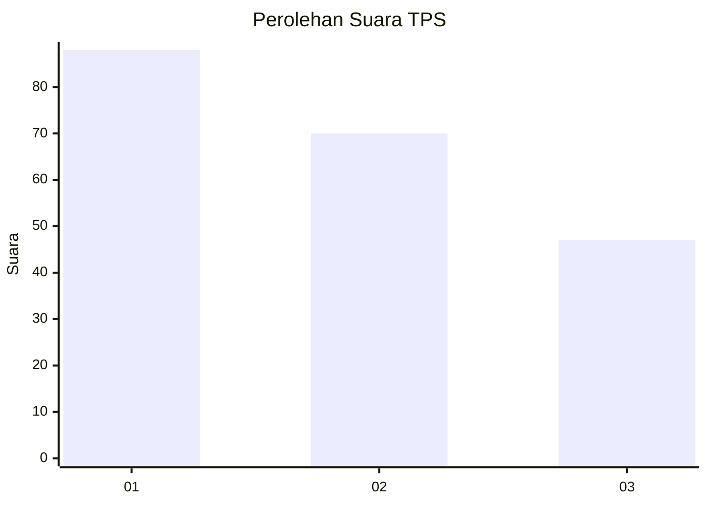
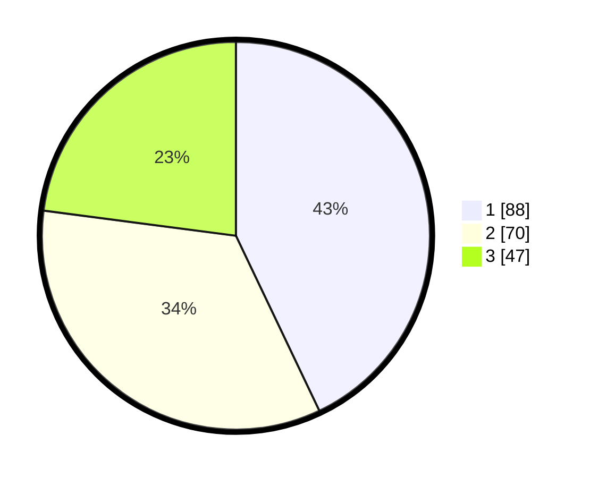

# Hasil

## Grafik

## Tabel

| No. | Nama Paslon    | Suara | Suara (raw) | Persentase |
|:--- |:-------------- | -----:| -----------:| ----------:|
| 1   | ANIES MUHAIMIN | 88    | [88][p-1]   | 42,93      |
| 2   | PRABOWO GIBRAN | 70    | [70][p-2]   | 34,15      |
| 3   | GANJAR MAHFUD  | 47    | [47][p-3]   | 22,93      |

[p-1]: https://github.com/gigit-pemilu/pemilu-2024-34-di-yogyakarta/blob/main/pilpres/hitung-suara/sub/34-di-yogyakarta/sub/02-bantul/sub/15-sewon/sub/2004-panggungharjo/sub/082-tps/sub/paslon-1.txt
[p-2]: https://github.com/gigit-pemilu/pemilu-2024-34-di-yogyakarta/blob/main/pilpres/hitung-suara/sub/34-di-yogyakarta/sub/02-bantul/sub/15-sewon/sub/2004-panggungharjo/sub/082-tps/sub/paslon-2.txt
[p-3]: https://github.com/gigit-pemilu/pemilu-2024-34-di-yogyakarta/blob/main/pilpres/hitung-suara/sub/34-di-yogyakarta/sub/02-bantul/sub/15-sewon/sub/2004-panggungharjo/sub/082-tps/sub/paslon-3.txt

## Foto C Plano

https://sirekap-obj-formc.kpu.go.id/6781/pemilu/ppwp/34/02/15/20/04/3402152004082-20240215-033631--53cd8f63-10be-445d-a775-d3dcd55e0694.jpg

https://sirekap-obj-formc.kpu.go.id/6781/pemilu/ppwp/34/02/15/20/04/3402152004082-20240215-033732--da56f11e-9d05-45df-b9e9-44424e03df75.jpg

https://sirekap-obj-formc.kpu.go.id/6781/pemilu/ppwp/34/02/15/20/04/3402152004082-20240215-033812--40887b95-5541-4f74-a113-e195d497e1e1.jpg

## Metadata

| Key        | Value               |
| ---------- | ------------------- |
| Time Stamp | 2024-02-24 22:31:28 |

