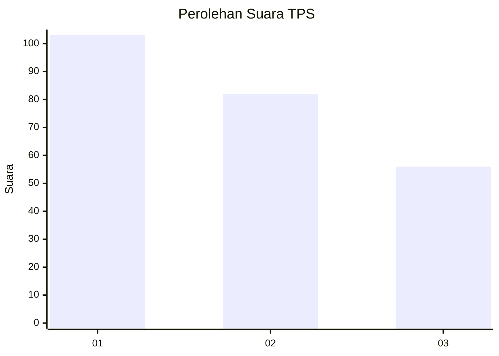
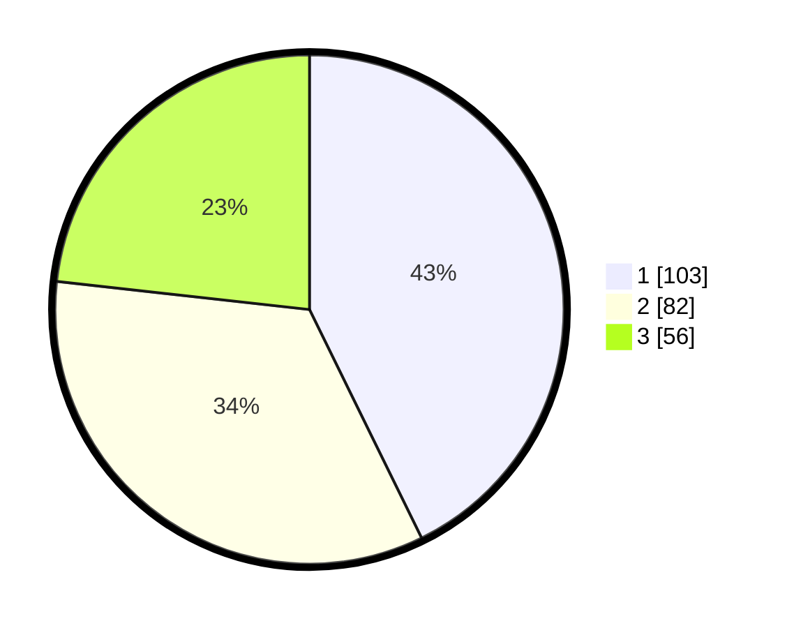

# Hasil

## Grafik

## Tabel

| No. | Nama Paslon    | Suara | Suara (raw) | Persentase |
|:--- |:-------------- | -----:| -----------:| ----------:|
| 1   | ANIES MUHAIMIN | 103   | [103][p-1]  | 42,74      |
| 2   | PRABOWO GIBRAN | 82    | [82][p-2]   | 34,02      |
| 3   | GANJAR MAHFUD  | 56    | [56][p-3]   | 23,24      |

[p-1]: https://github.com/gigit-pemilu/pemilu-2024-34-di-yogyakarta/blob/main/pilpres/hitung-suara/sub/34-di-yogyakarta/sub/02-bantul/sub/15-sewon/sub/2004-panggungharjo/sub/083-tps/sub/paslon-1.txt
[p-2]: https://github.com/gigit-pemilu/pemilu-2024-34-di-yogyakarta/blob/main/pilpres/hitung-suara/sub/34-di-yogyakarta/sub/02-bantul/sub/15-sewon/sub/2004-panggungharjo/sub/083-tps/sub/paslon-2.txt
[p-3]: https://github.com/gigit-pemilu/pemilu-2024-34-di-yogyakarta/blob/main/pilpres/hitung-suara/sub/34-di-yogyakarta/sub/02-bantul/sub/15-sewon/sub/2004-panggungharjo/sub/083-tps/sub/paslon-3.txt

## Foto C Plano

https://sirekap-obj-formc.kpu.go.id/2971/pemilu/ppwp/34/02/15/20/04/3402152004083-20240214-235428--7618bb0e-5be9-4df2-8427-f1efb16da65c.jpg

https://sirekap-obj-formc.kpu.go.id/2971/pemilu/ppwp/34/02/15/20/04/3402152004083-20240214-235405--7626d53b-f23d-4d38-b045-938ed23bf22d.jpg

https://sirekap-obj-formc.kpu.go.id/2971/pemilu/ppwp/34/02/15/20/04/3402152004083-20240214-235419--41074569-ff56-4f90-8ef2-cbd4f4dfe259.jpg

## Metadata

| Key        | Value               |
| ---------- | ------------------- |
| Time Stamp | 2024-02-15 15:00:29 |

