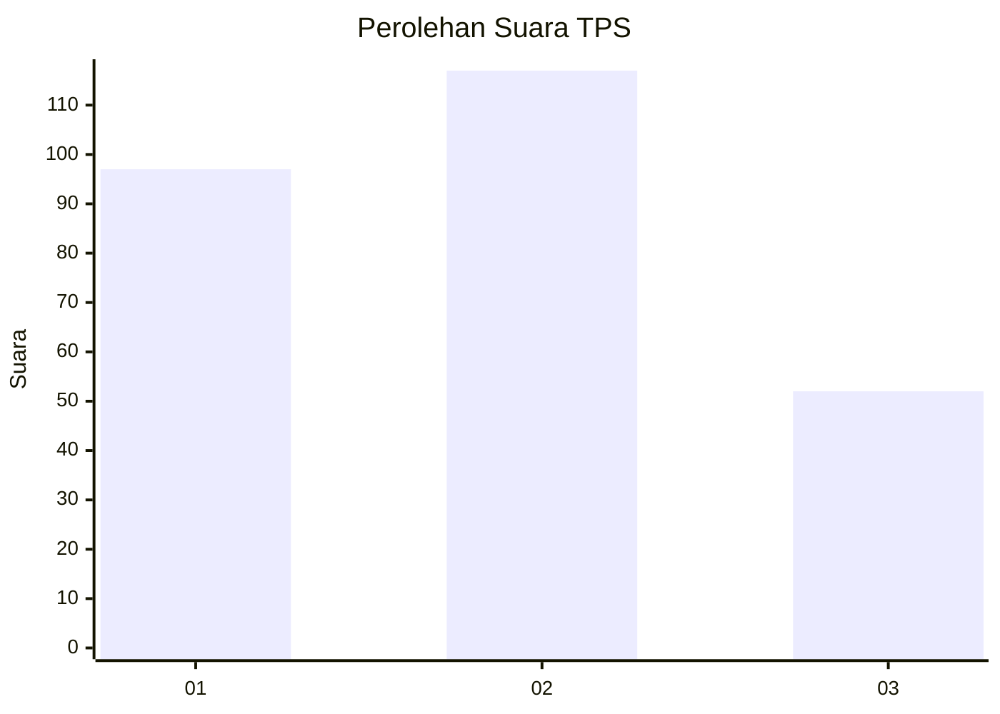
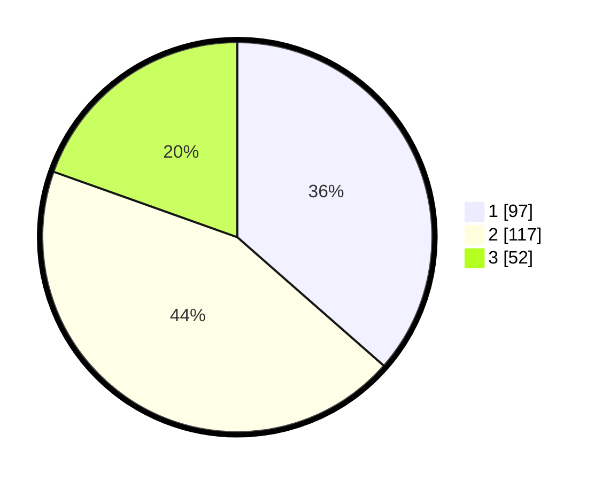

# Hasil

## Grafik

## Tabel

| No. | Nama Paslon    | Suara | Suara (raw) | Persentase |
|:--- |:-------------- | -----:| -----------:| ----------:|
| 1   | ANIES MUHAIMIN | 97    | [97][p-1]   | 36,47      |
| 2   | PRABOWO GIBRAN | 117   | [117][p-2]  | 43,98      |
| 3   | GANJAR MAHFUD  | 52    | [52][p-3]   | 19,55      |

[p-1]: https://github.com/gigit-pemilu/pemilu-2024-34-di-yogyakarta/blob/main/pilpres/hitung-suara/sub/34-di-yogyakarta/sub/02-bantul/sub/15-sewon/sub/2004-panggungharjo/sub/088-tps/sub/paslon-1.txt
[p-2]: https://github.com/gigit-pemilu/pemilu-2024-34-di-yogyakarta/blob/main/pilpres/hitung-suara/sub/34-di-yogyakarta/sub/02-bantul/sub/15-sewon/sub/2004-panggungharjo/sub/088-tps/sub/paslon-2.txt
[p-3]: https://github.com/gigit-pemilu/pemilu-2024-34-di-yogyakarta/blob/main/pilpres/hitung-suara/sub/34-di-yogyakarta/sub/02-bantul/sub/15-sewon/sub/2004-panggungharjo/sub/088-tps/sub/paslon-3.txt

## Foto C Plano

https://sirekap-obj-formc.kpu.go.id/dbf9/pemilu/ppwp/34/02/15/20/04/3402152004088-20240215-004402--04888084-cdd3-4e2c-862b-47d830927ba2.jpg

https://sirekap-obj-formc.kpu.go.id/dbf9/pemilu/ppwp/34/02/15/20/04/3402152004088-20240215-003600--645e5551-ce9f-459b-a22d-91decaf139a6.jpg

https://sirekap-obj-formc.kpu.go.id/dbf9/pemilu/ppwp/34/02/15/20/04/3402152004088-20240215-002204--2b612f9e-6723-4947-ac1c-aa595b322970.jpg

## Metadata

| Key        | Value               |
| ---------- | ------------------- |
| Time Stamp | 2024-02-24 22:31:28 |

