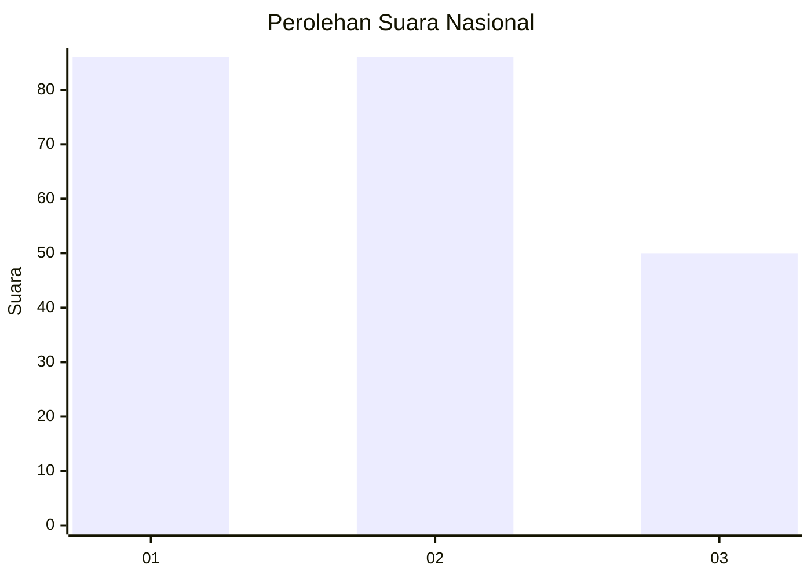
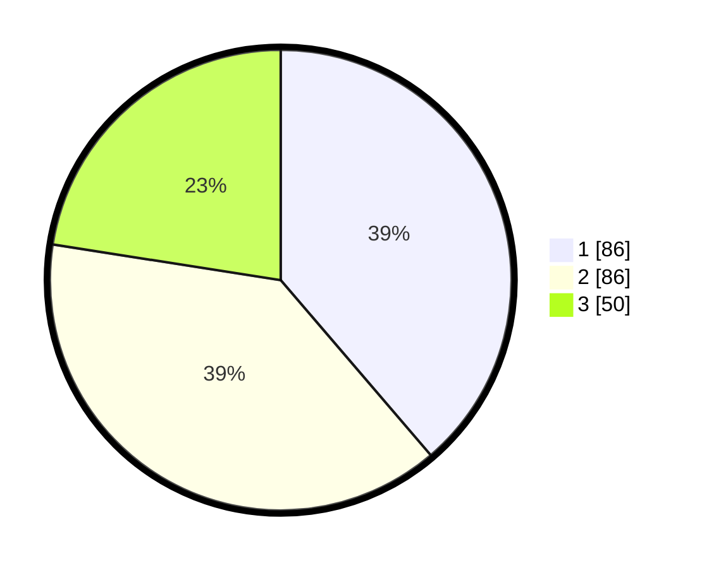

# Hasil

## Grafik

## Tabel

| No. | Nama Paslon    | Suara | Suara (raw) | Persentase |
|:--- |:-------------- | -----:| -----------:| ----------:|
| 1   | ANIES MUHAIMIN | 86    | [86][p-1]   | 38,74      |
| 2   | PRABOWO GIBRAN | 86    | [86][p-2]   | 38,74      |
| 3   | GANJAR MAHFUD  | 50    | [50][p-3]   | 22,52      |

[p-1]: https://github.com/gigit-pemilu/pemilu-2024/blob/main/pilpres/hitung-suara/sub/34-di-yogyakarta/sub/02-bantul/sub/15-sewon/sub/2004-panggungharjo/sub/089-tps/sub/paslon-1.txt
[p-2]: https://github.com/gigit-pemilu/pemilu-2024/blob/main/pilpres/hitung-suara/sub/34-di-yogyakarta/sub/02-bantul/sub/15-sewon/sub/2004-panggungharjo/sub/089-tps/sub/paslon-2.txt
[p-3]: https://github.com/gigit-pemilu/pemilu-2024/blob/main/pilpres/hitung-suara/sub/34-di-yogyakarta/sub/02-bantul/sub/15-sewon/sub/2004-panggungharjo/sub/089-tps/sub/paslon-3.txt

## Foto C Plano

https://sirekap-obj-formc.kpu.go.id/06b7/pemilu/ppwp/34/02/15/20/04/3402152004089-20240214-204630--57002c79-a0ae-4a14-b3c4-680094944e45.jpg

https://sirekap-obj-formc.kpu.go.id/06b7/pemilu/ppwp/34/02/15/20/04/3402152004089-20240214-204805--ec2fde5a-7dbe-4f00-8a5f-6b91d7f9353c.jpg

## Metadata

| Key        | Value               |
| ---------- | ------------------- |
| Time Stamp | 2024-02-25 15:00:00 |

