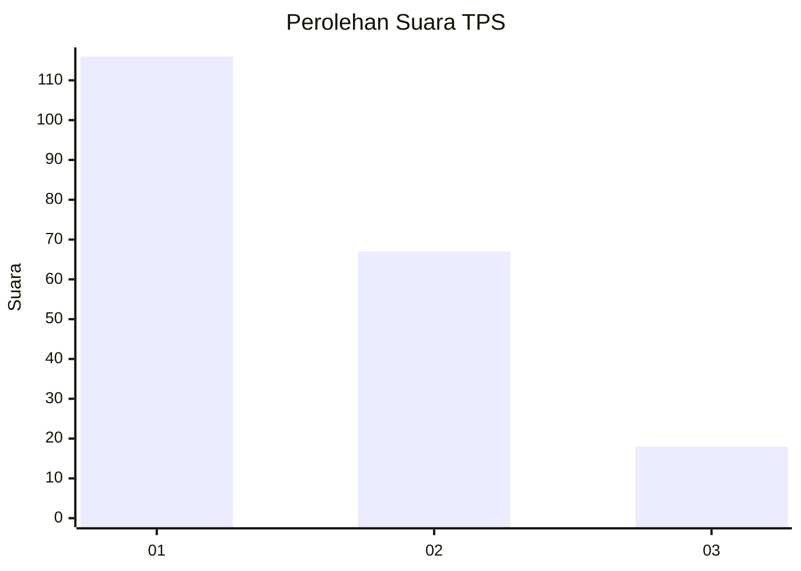
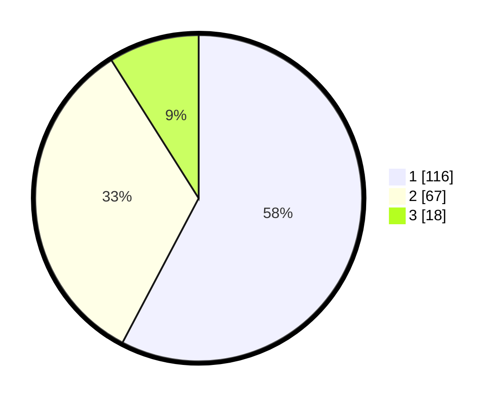

# Hasil

## Grafik

## Tabel

| No. | Nama Paslon    | Suara | Suara (raw) | Persentase |
|:--- |:-------------- | -----:| -----------:| ----------:|
| 1   | ANIES MUHAIMIN | 116   | [116][p-1]  | 57,71      |
| 2   | PRABOWO GIBRAN | 67    | [67][p-2]   | 33,33      |
| 3   | GANJAR MAHFUD  | 18    | [18][p-3]   | 8,96       |

[p-1]: https://github.com/gigit-pemilu/pemilu-2024-34-di-yogyakarta/blob/main/pilpres/hitung-suara/sub/34-di-yogyakarta/sub/02-bantul/sub/15-sewon/sub/2004-panggungharjo/sub/094-tps/sub/paslon-1.txt
[p-2]: https://github.com/gigit-pemilu/pemilu-2024-34-di-yogyakarta/blob/main/pilpres/hitung-suara/sub/34-di-yogyakarta/sub/02-bantul/sub/15-sewon/sub/2004-panggungharjo/sub/094-tps/sub/paslon-2.txt
[p-3]: https://github.com/gigit-pemilu/pemilu-2024-34-di-yogyakarta/blob/main/pilpres/hitung-suara/sub/34-di-yogyakarta/sub/02-bantul/sub/15-sewon/sub/2004-panggungharjo/sub/094-tps/sub/paslon-3.txt

## Foto C Plano

https://sirekap-obj-formc.kpu.go.id/18b5/pemilu/ppwp/34/02/15/20/04/3402152004094-20240214-234242--8aeafed9-4d3a-4fbb-b718-f7653ccf02ba.jpg

https://sirekap-obj-formc.kpu.go.id/18b5/pemilu/ppwp/34/02/15/20/04/3402152004094-20240214-234415--2b57143b-ef0f-4ec9-8328-548462aa3728.jpg

https://sirekap-obj-formc.kpu.go.id/18b5/pemilu/ppwp/34/02/15/20/04/3402152004094-20240214-234539--543438c2-470a-458f-9d06-2666b7a3850a.jpg

## Metadata

| Key        | Value               |
| ---------- | ------------------- |
| Time Stamp | 2024-02-24 22:31:28 |

