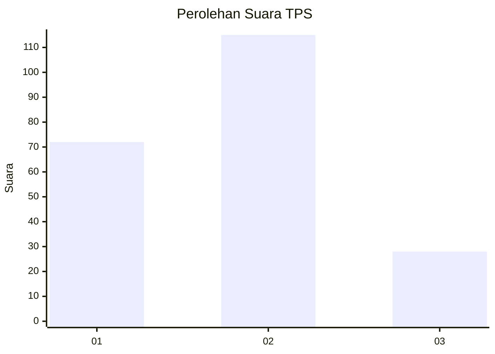
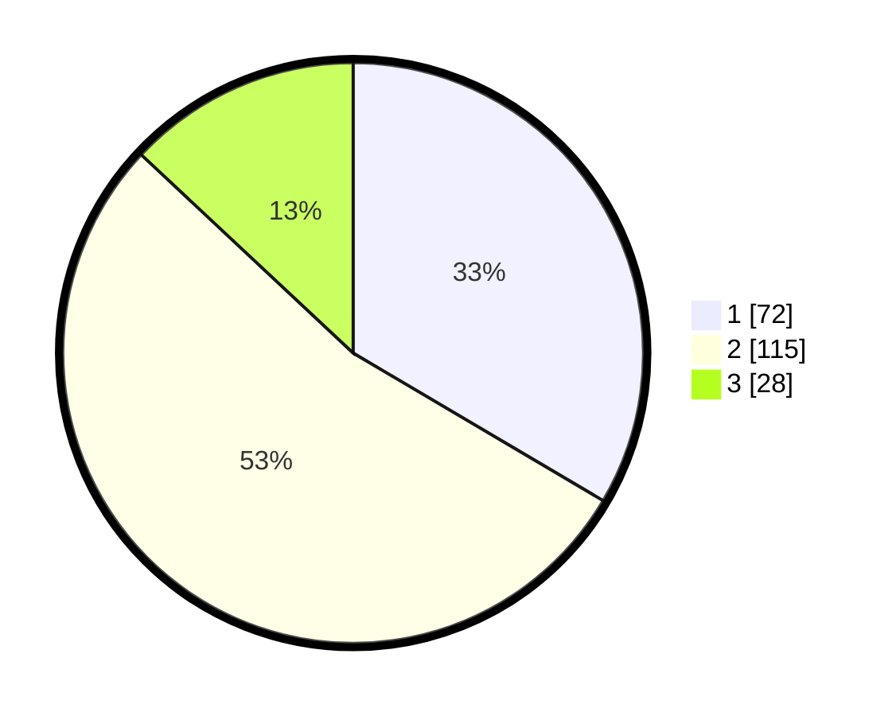

# Hasil

## Grafik

## Tabel

| No. | Nama Paslon    | Suara | Suara (raw) | Persentase |
|:--- |:-------------- | -----:| -----------:| ----------:|
| 1   | ANIES MUHAIMIN | 72    | [72][p-1]   | 33,49      |
| 2   | PRABOWO GIBRAN | 115   | [115][p-2]  | 53,49      |
| 3   | GANJAR MAHFUD  | 28    | [28][p-3]   | 13,02      |

[p-1]: https://github.com/gigit-pemilu/pemilu-2024-34-di-yogyakarta/blob/main/pilpres/hitung-suara/sub/34-di-yogyakarta/sub/02-bantul/sub/15-sewon/sub/2004-panggungharjo/sub/905-tps/sub/paslon-1.txt
[p-2]: https://github.com/gigit-pemilu/pemilu-2024-34-di-yogyakarta/blob/main/pilpres/hitung-suara/sub/34-di-yogyakarta/sub/02-bantul/sub/15-sewon/sub/2004-panggungharjo/sub/905-tps/sub/paslon-2.txt
[p-3]: https://github.com/gigit-pemilu/pemilu-2024-34-di-yogyakarta/blob/main/pilpres/hitung-suara/sub/34-di-yogyakarta/sub/02-bantul/sub/15-sewon/sub/2004-panggungharjo/sub/905-tps/sub/paslon-3.txt

## Foto C Plano

https://sirekap-obj-formc.kpu.go.id/b0cd/pemilu/ppwp/34/02/15/20/04/3402152004905-20240214-213417--0b4210ec-12bb-47d2-bf97-7e3cb1b1a4fe.jpg

https://sirekap-obj-formc.kpu.go.id/b0cd/pemilu/ppwp/34/02/15/20/04/3402152004905-20240214-194731--d557557f-1aa9-4fa2-b69a-e712a500288a.jpg

https://sirekap-obj-formc.kpu.go.id/b0cd/pemilu/ppwp/34/02/15/20/04/3402152004905-20240214-222408--56c7b3f7-e1b5-4cff-a047-bb7cf63d0268.jpg

## Metadata

| Key        | Value               |
| ---------- | ------------------- |
| Time Stamp | 2024-02-15 20:30:46 |

