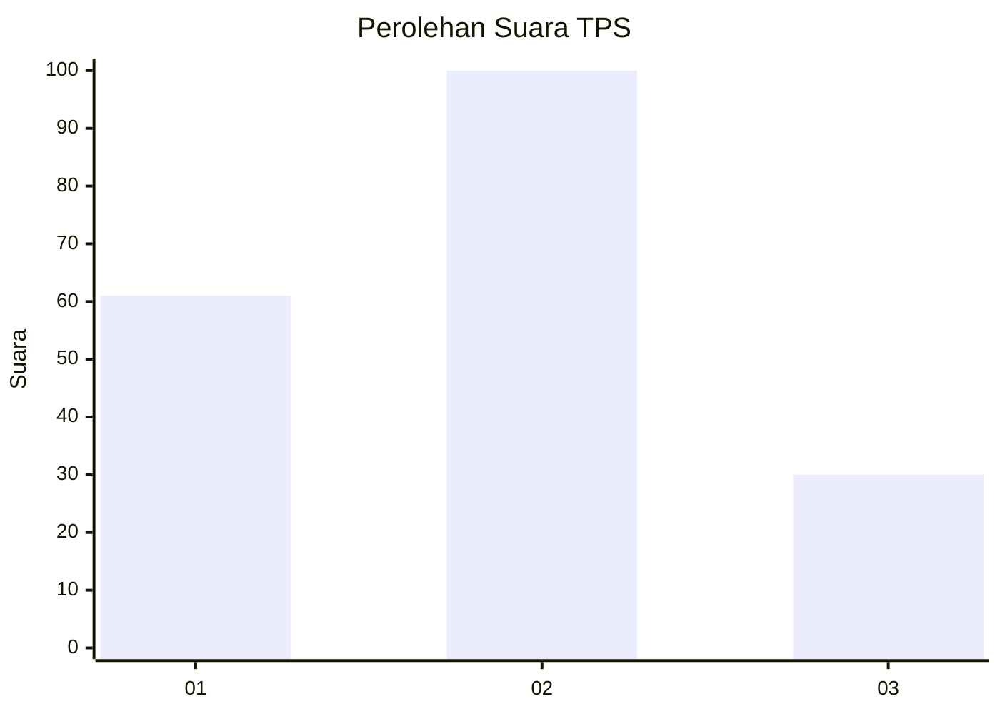
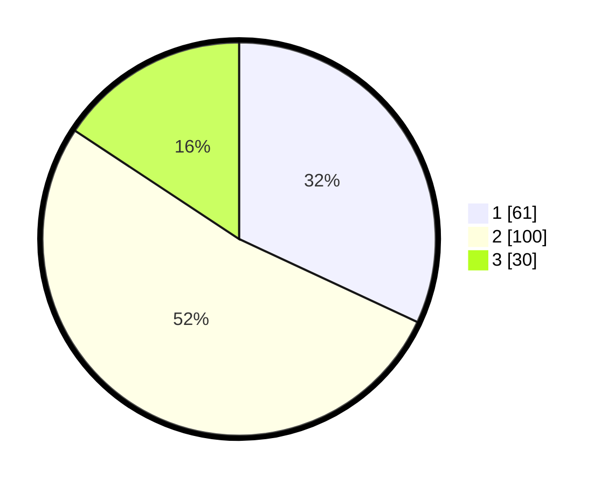

# Hasil

## Grafik

## Tabel

| No. | Nama Paslon    | Suara | Suara (raw) | Persentase |
|:--- |:-------------- | -----:| -----------:| ----------:|
| 1   | ANIES MUHAIMIN | 61    | [61][p-1]   | 31,94      |
| 2   | PRABOWO GIBRAN | 100   | [100][p-2]  | 52,36      |
| 3   | GANJAR MAHFUD  | 30    | [30][p-3]   | 15,71      |

[p-1]: https://github.com/gigit-pemilu/pemilu-2024-34-di-yogyakarta/blob/main/pilpres/hitung-suara/sub/34-di-yogyakarta/sub/02-bantul/sub/15-sewon/sub/2004-panggungharjo/sub/908-tps/sub/paslon-1.txt
[p-2]: https://github.com/gigit-pemilu/pemilu-2024-34-di-yogyakarta/blob/main/pilpres/hitung-suara/sub/34-di-yogyakarta/sub/02-bantul/sub/15-sewon/sub/2004-panggungharjo/sub/908-tps/sub/paslon-2.txt
[p-3]: https://github.com/gigit-pemilu/pemilu-2024-34-di-yogyakarta/blob/main/pilpres/hitung-suara/sub/34-di-yogyakarta/sub/02-bantul/sub/15-sewon/sub/2004-panggungharjo/sub/908-tps/sub/paslon-3.txt

## Foto C Plano

https://sirekap-obj-formc.kpu.go.id/33eb/pemilu/ppwp/34/02/15/20/04/3402152004908-20240214-223929--18da693c-8c6f-4c7a-bcf5-035593d20d32.jpg

https://sirekap-obj-formc.kpu.go.id/33eb/pemilu/ppwp/34/02/15/20/04/3402152004908-20240214-203522--aaf0ac9f-d408-41ae-943f-37062cb1d6fe.jpg

https://sirekap-obj-formc.kpu.go.id/33eb/pemilu/ppwp/34/02/15/20/04/3402152004908-20240214-203711--f4cb51a7-2ecb-419f-94e2-d3ed55024ad6.jpg

## Metadata

| Key        | Value               |
| ---------- | ------------------- |
| Time Stamp | 2024-02-15 00:41:44 |

