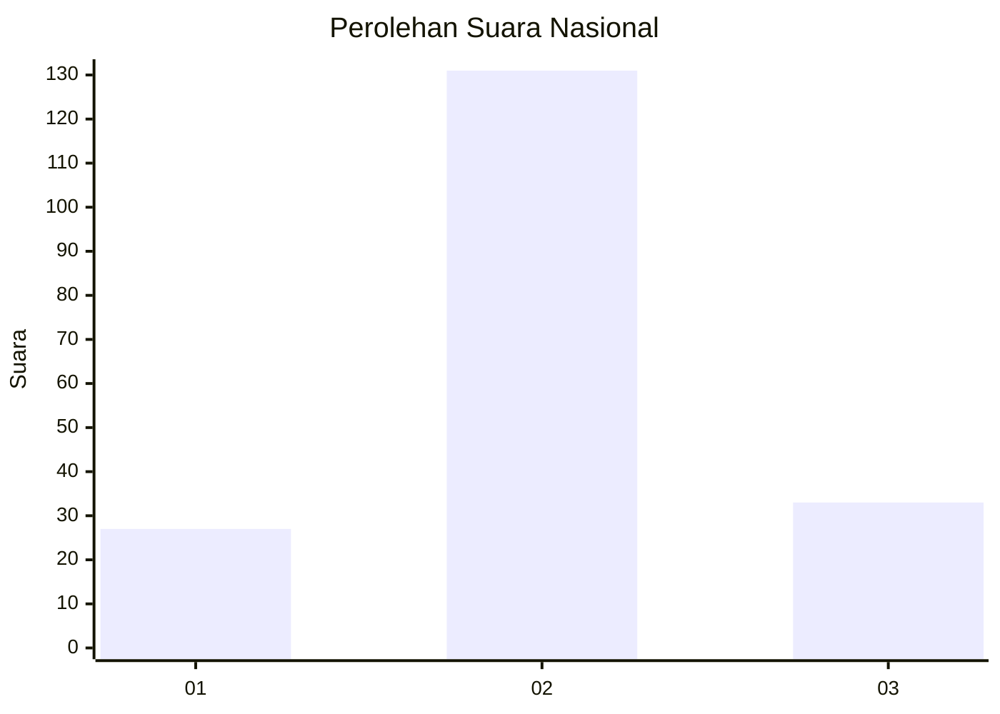
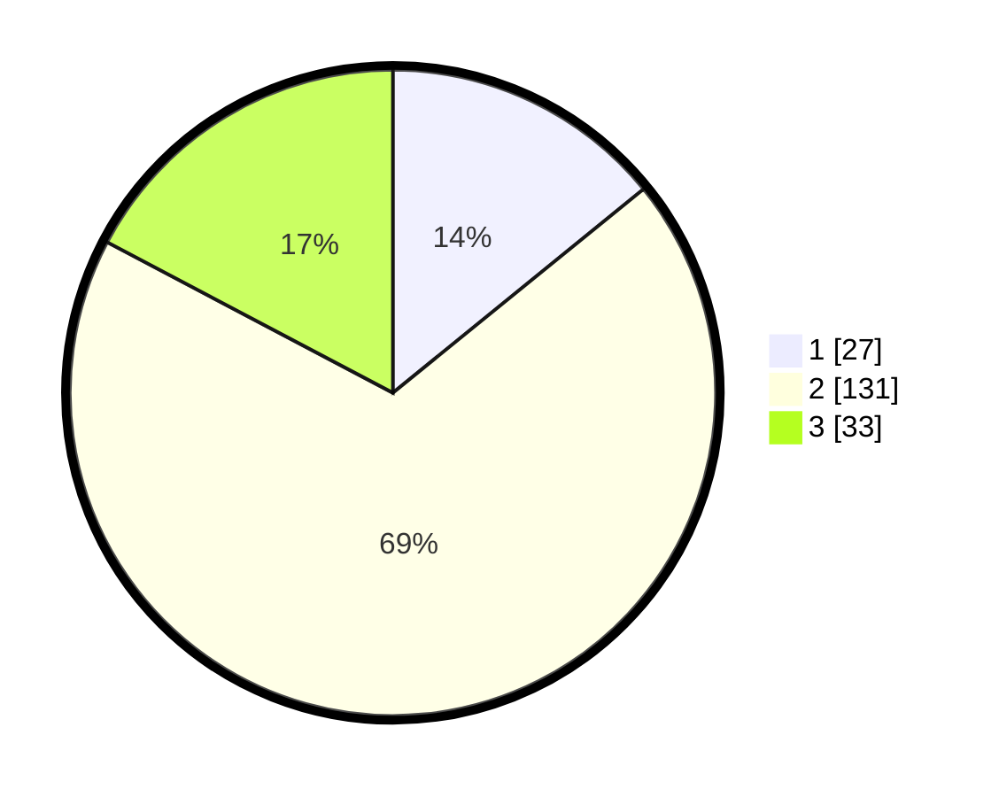

# Hasil

## Grafik

## Tabel

| No. | Nama Paslon    | Suara | Suara (raw) | Persentase |
|:--- |:-------------- | -----:| -----------:| ----------:|
| 1   | ANIES MUHAIMIN | 27    | [27][p-1]   | 14,14      |
| 2   | PRABOWO GIBRAN | 131   | [131][p-2]  | 68,59      |
| 3   | GANJAR MAHFUD  | 33    | [33][p-3]   | 17,28      |

[p-1]: https://github.com/gigit-pemilu/pemilu-2024/blob/main/pilpres/hitung-suara/sub/34-di-yogyakarta/sub/02-bantul/sub/16-kasihan/sub/2001-bangunjiwo/sub/003-tps/sub/paslon-1.txt
[p-2]: https://github.com/gigit-pemilu/pemilu-2024/blob/main/pilpres/hitung-suara/sub/34-di-yogyakarta/sub/02-bantul/sub/16-kasihan/sub/2001-bangunjiwo/sub/003-tps/sub/paslon-2.txt
[p-3]: https://github.com/gigit-pemilu/pemilu-2024/blob/main/pilpres/hitung-suara/sub/34-di-yogyakarta/sub/02-bantul/sub/16-kasihan/sub/2001-bangunjiwo/sub/003-tps/sub/paslon-3.txt

## Foto C Plano

https://sirekap-obj-formc.kpu.go.id/56c5/pemilu/ppwp/34/02/16/20/01/3402162001003-20240216-140241--efda1751-50bb-45c9-9fce-74c084c33c9b.jpg

https://sirekap-obj-formc.kpu.go.id/56c5/pemilu/ppwp/34/02/16/20/01/3402162001003-20240216-140242--51b568b6-66ef-4871-8b3e-5d600e64fad4.jpg

https://sirekap-obj-formc.kpu.go.id/56c5/pemilu/ppwp/34/02/16/20/01/3402162001003-20240216-140241--73e6f54c-606a-41fe-906a-4ca7c9d99256.jpg

## Metadata

| Key        | Value               |
| ---------- | ------------------- |
| Time Stamp | 2024-02-21 15:00:00 |

## DATA PEMILIH TETAP

Jumlah pemilih dalam DPT: **218**.
 * L: **103**.
 * P: **115**.

## DATA PENGGUNA HAK PILIH

Jumlah pengguna hak pilih dalam DPT: **193**.
 * L: **94**.
 * P: **99**.

Jumlah pengguna hak pilih dalam DPTb: **5**.
 * L: **2**.
 * P: **3**.

Jumlah pengguna hak pilih dalam DPK: **3**.
 * L: **1**.
 * P: **2**.

Jumlah pengguna hak pilih: **201**.
 * L: **97**.
 * P: **104**.

## JUMLAH SUARA SAH DAN TIDAK SAH

JUMLAH SELURUH SUARA SAH: **191**.

JUMLAH SUARA TIDAK SAH: **10**.

JUMLAH SELURUH SUARA SAH DAN SUARA TIDAK SAH: **201**.

