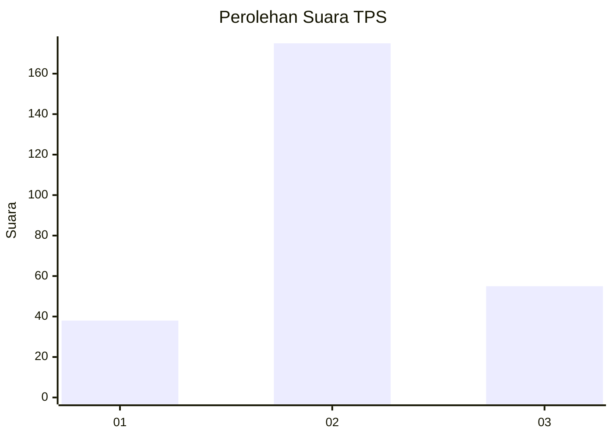
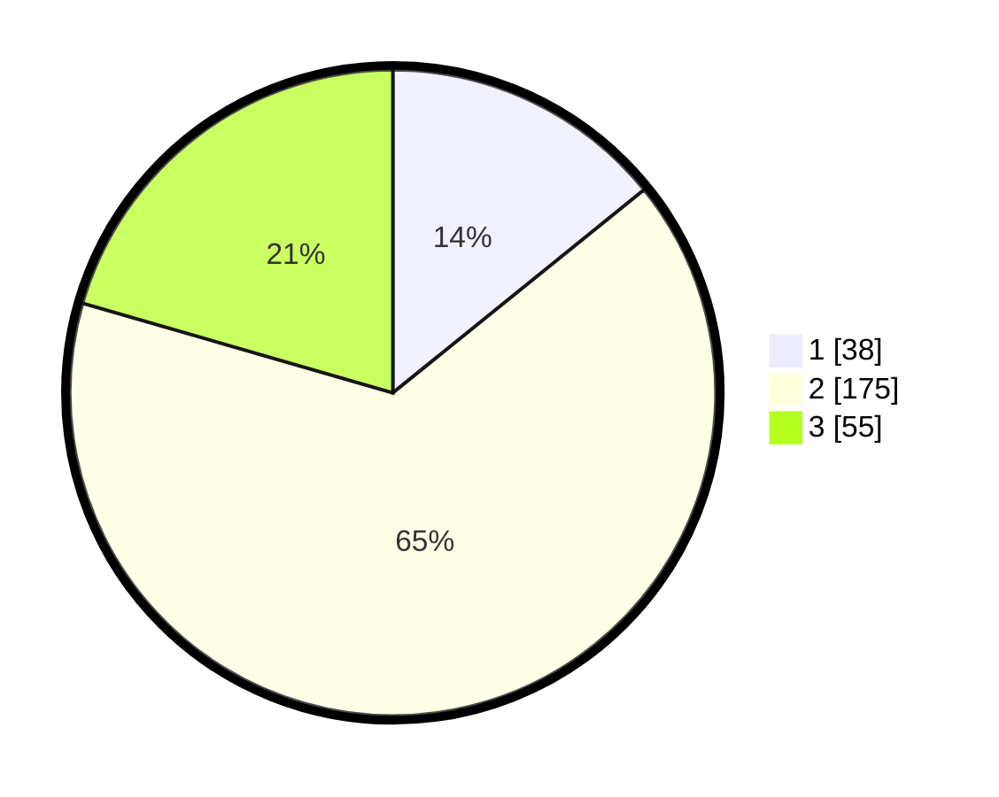

# Hasil

## Grafik

## Tabel

| No. | Nama Paslon    | Suara | Suara (raw) | Persentase |
|:--- |:-------------- | -----:| -----------:| ----------:|
| 1   | ANIES MUHAIMIN | 38    | [38][p-1]   | 14,18      |
| 2   | PRABOWO GIBRAN | 175   | [175][p-2]  | 65,30      |
| 3   | GANJAR MAHFUD  | 55    | [55][p-3]   | 20,52      |

[p-1]: https://github.com/gigit-pemilu/pemilu-2024-34-di-yogyakarta/blob/main/pilpres/hitung-suara/sub/34-di-yogyakarta/sub/02-bantul/sub/16-kasihan/sub/2001-bangunjiwo/sub/004-tps/sub/paslon-1.txt
[p-2]: https://github.com/gigit-pemilu/pemilu-2024-34-di-yogyakarta/blob/main/pilpres/hitung-suara/sub/34-di-yogyakarta/sub/02-bantul/sub/16-kasihan/sub/2001-bangunjiwo/sub/004-tps/sub/paslon-2.txt
[p-3]: https://github.com/gigit-pemilu/pemilu-2024-34-di-yogyakarta/blob/main/pilpres/hitung-suara/sub/34-di-yogyakarta/sub/02-bantul/sub/16-kasihan/sub/2001-bangunjiwo/sub/004-tps/sub/paslon-3.txt

## Foto C Plano

https://sirekap-obj-formc.kpu.go.id/f16a/pemilu/ppwp/34/02/16/20/01/3402162001004-20240214-202545--963776b4-069f-4bc4-90c0-6ed2ce4ddaa3.jpg

https://sirekap-obj-formc.kpu.go.id/f16a/pemilu/ppwp/34/02/16/20/01/3402162001004-20240216-073751--d0991a3e-42b2-4127-8d24-f2e6e200ec22.jpg

https://sirekap-obj-formc.kpu.go.id/f16a/pemilu/ppwp/34/02/16/20/01/3402162001004-20240216-073749--366c4ba1-d86b-45ca-88c7-6b6f45cc8d34.jpg

## Metadata

| Key        | Value               |
| ---------- | ------------------- |
| Time Stamp | 2024-02-16 12:51:22 |

## DATA PEMILIH TETAP

Jumlah pemilih dalam DPT: **282**.
 * L: **135**.
 * P: **147**.

## DATA PENGGUNA HAK PILIH

Jumlah pengguna hak pilih dalam DPT: **262**.
 * L: **124**.
 * P: **138**.

Jumlah pengguna hak pilih dalam DPTb: **3**.
 * L: **2**.
 * P: **1**.

Jumlah pengguna hak pilih dalam DPK: **5**.
 * L: **3**.
 * P: **2**.

Jumlah pengguna hak pilih: **270**.
 * L: **129**.
 * P: **141**.

## JUMLAH SUARA SAH DAN TIDAK SAH

JUMLAH SELURUH SUARA SAH: **268**.

JUMLAH SUARA TIDAK SAH: **2**.

JUMLAH SELURUH SUARA SAH DAN SUARA TIDAK SAH: **270**.

