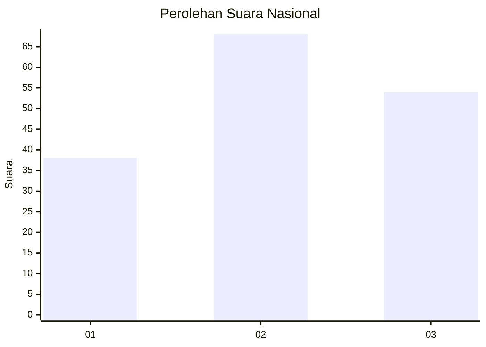
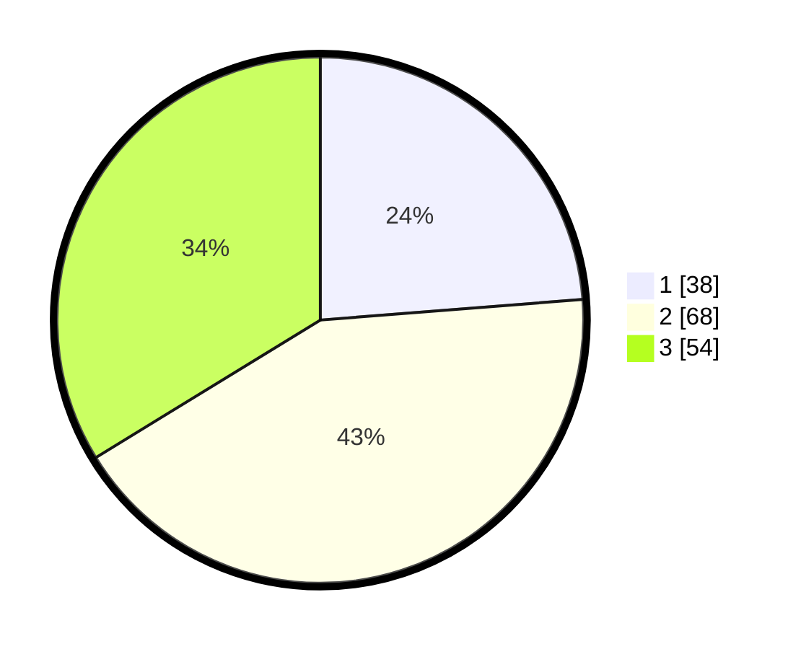

# Hasil

## Grafik

## Tabel

| No. | Nama Paslon    | Suara | Suara (raw) | Persentase |
|:--- |:-------------- | -----:| -----------:| ----------:|
| 1   | ANIES MUHAIMIN | 38    | [38][p-1]   | 23,75      |
| 2   | PRABOWO GIBRAN | 68    | [68][p-2]   | 42,50      |
| 3   | GANJAR MAHFUD  | 54    | [54][p-3]   | 33,75      |

[p-1]: https://github.com/gigit-pemilu/pemilu-2024/blob/main/pilpres/hitung-suara/sub/34-di-yogyakarta/sub/02-bantul/sub/16-kasihan/sub/2001-bangunjiwo/sub/006-tps/sub/paslon-1.txt
[p-2]: https://github.com/gigit-pemilu/pemilu-2024/blob/main/pilpres/hitung-suara/sub/34-di-yogyakarta/sub/02-bantul/sub/16-kasihan/sub/2001-bangunjiwo/sub/006-tps/sub/paslon-2.txt
[p-3]: https://github.com/gigit-pemilu/pemilu-2024/blob/main/pilpres/hitung-suara/sub/34-di-yogyakarta/sub/02-bantul/sub/16-kasihan/sub/2001-bangunjiwo/sub/006-tps/sub/paslon-3.txt

## Foto C Plano

https://sirekap-obj-formc.kpu.go.id/d8e7/pemilu/ppwp/34/02/16/20/01/3402162001006-20240214-205200--bd2628e8-6274-4fce-8628-639465b312c3.jpg

https://sirekap-obj-formc.kpu.go.id/d8e7/pemilu/ppwp/34/02/16/20/01/3402162001006-20240214-191153--21271d8a-d68b-4a6a-9cb5-644ad3eee6fd.jpg

https://sirekap-obj-formc.kpu.go.id/d8e7/pemilu/ppwp/34/02/16/20/01/3402162001006-20240214-191304--5d389d61-e354-4ed6-8dd5-322c58ae0985.jpg

## Metadata

| Key        | Value               |
| ---------- | ------------------- |
| Time Stamp | 2024-02-15 20:00:44 |

## DATA PEMILIH TETAP

Jumlah pemilih dalam DPT: **199**.
 * L: **92**.
 * P: **107**.

## DATA PENGGUNA HAK PILIH

Jumlah pengguna hak pilih dalam DPT: **156**.
 * L: **72**.
 * P: **84**.

Jumlah pengguna hak pilih dalam DPTb: **5**.
 * L: **3**.
 * P: **2**.

Jumlah pengguna hak pilih dalam DPK: **1**.
 * L: **0**.
 * P: **1**.

Jumlah pengguna hak pilih: **162**.
 * L: **75**.
 * P: **87**.

## JUMLAH SUARA SAH DAN TIDAK SAH

JUMLAH SELURUH SUARA SAH: **160**.

JUMLAH SUARA TIDAK SAH: **2**.

JUMLAH SELURUH SUARA SAH DAN SUARA TIDAK SAH: **162**.

