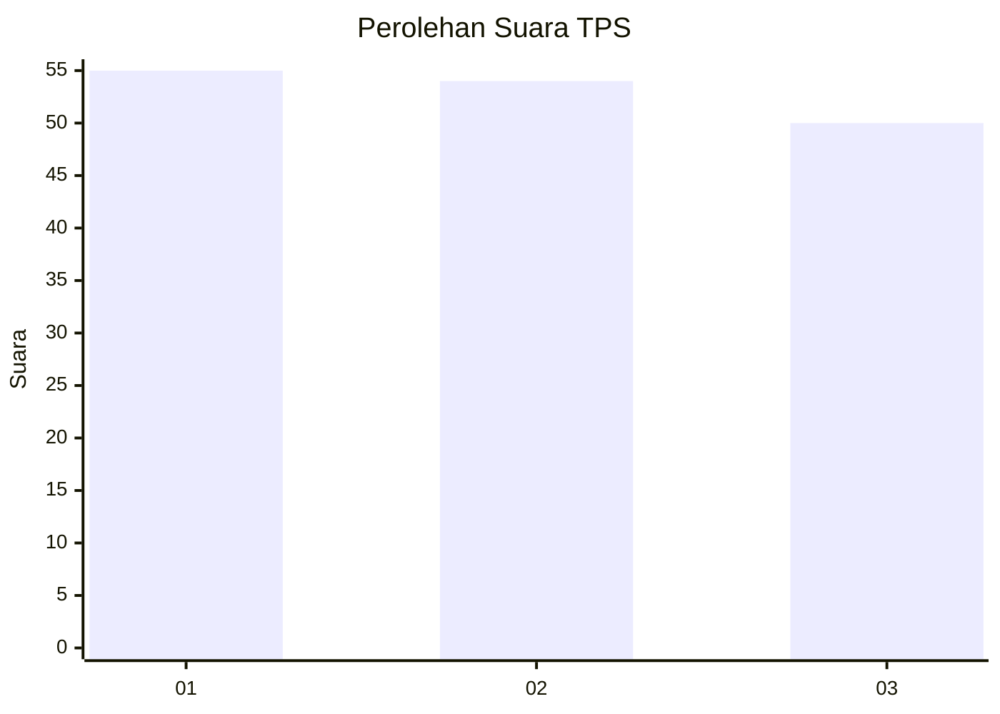
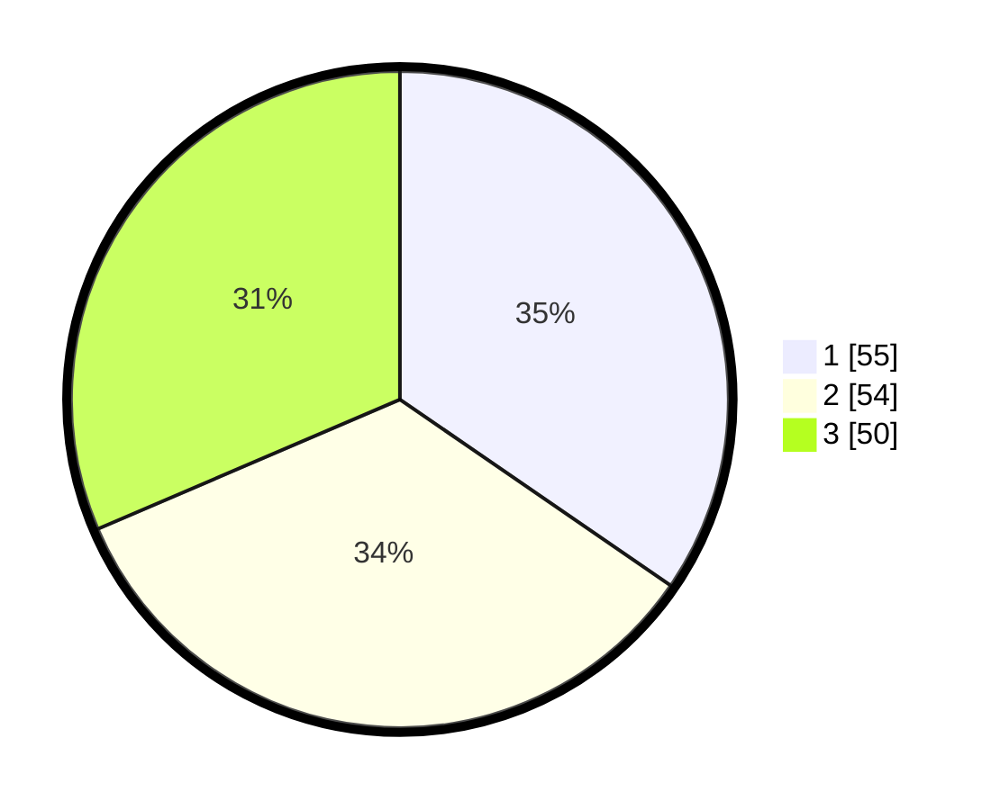

# Hasil

## Grafik

## Tabel

| No. | Nama Paslon    | Suara | Suara (raw) | Persentase |
|:--- |:-------------- | -----:| -----------:| ----------:|
| 1   | ANIES MUHAIMIN | 55    | [55][p-1]   | 34,59      |
| 2   | PRABOWO GIBRAN | 54    | [54][p-2]   | 33,96      |
| 3   | GANJAR MAHFUD  | 50    | [50][p-3]   | 31,45      |

[p-1]: https://github.com/gigit-pemilu/pemilu-2024-34-di-yogyakarta/blob/main/pilpres/hitung-suara/sub/34-di-yogyakarta/sub/02-bantul/sub/16-kasihan/sub/2001-bangunjiwo/sub/007-tps/sub/paslon-1.txt
[p-2]: https://github.com/gigit-pemilu/pemilu-2024-34-di-yogyakarta/blob/main/pilpres/hitung-suara/sub/34-di-yogyakarta/sub/02-bantul/sub/16-kasihan/sub/2001-bangunjiwo/sub/007-tps/sub/paslon-2.txt
[p-3]: https://github.com/gigit-pemilu/pemilu-2024-34-di-yogyakarta/blob/main/pilpres/hitung-suara/sub/34-di-yogyakarta/sub/02-bantul/sub/16-kasihan/sub/2001-bangunjiwo/sub/007-tps/sub/paslon-3.txt

## Foto C Plano

https://sirekap-obj-formc.kpu.go.id/2b2d/pemilu/ppwp/34/02/16/20/01/3402162001007-20240215-204819--f3210696-43e7-4485-a3f3-35ff81cbd5a1.jpg

https://sirekap-obj-formc.kpu.go.id/2b2d/pemilu/ppwp/34/02/16/20/01/3402162001007-20240215-204822--00c0d4dc-6156-4c18-a736-b1c846821f93.jpg

https://sirekap-obj-formc.kpu.go.id/2b2d/pemilu/ppwp/34/02/16/20/01/3402162001007-20240215-204821--0488676e-863c-4c97-81ca-60cefc68b496.jpg

## Metadata

| Key        | Value               |
| ---------- | ------------------- |
| Time Stamp | 2024-02-15 21:30:27 |

## DATA PEMILIH TETAP

Jumlah pemilih dalam DPT: **201**.
 * L: **92**.
 * P: **109**.

## DATA PENGGUNA HAK PILIH

Jumlah pengguna hak pilih dalam DPT: **163**.
 * L: **76**.
 * P: **87**.

Jumlah pengguna hak pilih dalam DPTb: **2**.
 * L: **1**.
 * P: **1**.

Jumlah pengguna hak pilih dalam DPK: **1**.
 * L: **0**.
 * P: **1**.

Jumlah pengguna hak pilih: **166**.
 * L: **77**.
 * P: **89**.

## JUMLAH SUARA SAH DAN TIDAK SAH

JUMLAH SELURUH SUARA SAH: **159**.

JUMLAH SUARA TIDAK SAH: **7**.

JUMLAH SELURUH SUARA SAH DAN SUARA TIDAK SAH: **166**.

