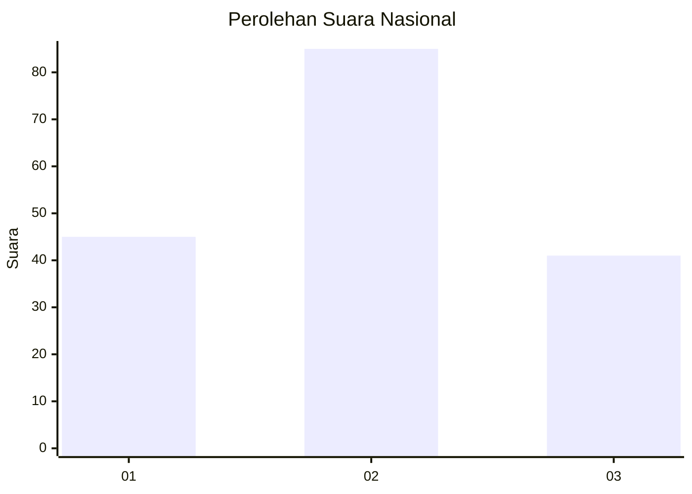
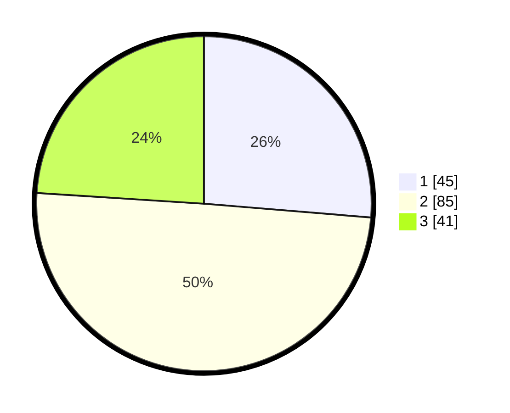

# Hasil

## Grafik

## Tabel

| No. | Nama Paslon    | Suara | Suara (raw) | Persentase |
|:--- |:-------------- | -----:| -----------:| ----------:|
| 1   | ANIES MUHAIMIN | 45    | [45][p-1]   | 26,32      |
| 2   | PRABOWO GIBRAN | 85    | [85][p-2]   | 49,71      |
| 3   | GANJAR MAHFUD  | 41    | [41][p-3]   | 23,98      |

[p-1]: https://github.com/gigit-pemilu/pemilu-2024/blob/main/pilpres/hitung-suara/sub/34-di-yogyakarta/sub/02-bantul/sub/16-kasihan/sub/2001-bangunjiwo/sub/008-tps/sub/paslon-1.txt
[p-2]: https://github.com/gigit-pemilu/pemilu-2024/blob/main/pilpres/hitung-suara/sub/34-di-yogyakarta/sub/02-bantul/sub/16-kasihan/sub/2001-bangunjiwo/sub/008-tps/sub/paslon-2.txt
[p-3]: https://github.com/gigit-pemilu/pemilu-2024/blob/main/pilpres/hitung-suara/sub/34-di-yogyakarta/sub/02-bantul/sub/16-kasihan/sub/2001-bangunjiwo/sub/008-tps/sub/paslon-3.txt

## Foto C Plano

https://sirekap-obj-formc.kpu.go.id/947f/pemilu/ppwp/34/02/16/20/01/3402162001008-20240216-032519--2bbb416d-d2e1-44ab-a7ea-4ab9ee757af1.jpg

https://sirekap-obj-formc.kpu.go.id/947f/pemilu/ppwp/34/02/16/20/01/3402162001008-20240216-032520--616a7039-2e12-4859-aa03-d22cecb3d34a.jpg

https://sirekap-obj-formc.kpu.go.id/947f/pemilu/ppwp/34/02/16/20/01/3402162001008-20240216-032519--cbb1bec6-c45e-43e7-942f-1625c578b0ed.jpg

## Metadata

| Key        | Value               |
| ---------- | ------------------- |
| Time Stamp | 2024-02-16 12:51:22 |

## DATA PEMILIH TETAP

Jumlah pemilih dalam DPT: **203**.
 * L: **96**.
 * P: **107**.

## DATA PENGGUNA HAK PILIH

Jumlah pengguna hak pilih dalam DPT: **163**.
 * L: **76**.
 * P: **87**.

Jumlah pengguna hak pilih dalam DPTb: **4**.
 * L: **0**.
 * P: **4**.

Jumlah pengguna hak pilih dalam DPK: **8**.
 * L: **2**.
 * P: **6**.

Jumlah pengguna hak pilih: **175**.
 * L: **76**.
 * P: **97**.

## JUMLAH SUARA SAH DAN TIDAK SAH

JUMLAH SELURUH SUARA SAH: **171**.

JUMLAH SUARA TIDAK SAH: **4**.

JUMLAH SELURUH SUARA SAH DAN SUARA TIDAK SAH: **175**.

