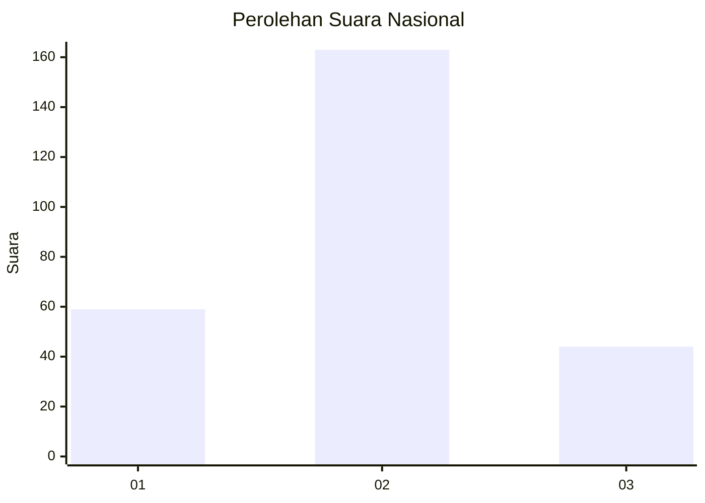

# Hasil

## Grafik

## Tabel

| No. | Nama Paslon    | Suara | Suara (raw) | Persentase |
|:--- |:-------------- | -----:| -----------:| ----------:|
| 1   | ANIES MUHAIMIN | 59    | [59][p-1]   | 22,18      |
| 2   | PRABOWO GIBRAN | 163   | [163][p-2]  | 61,28      |
| 3   | GANJAR MAHFUD  | 44    | [44][p-3]   | 16,54      |

[p-1]: https://github.com/gigit-pemilu/pemilu-2024/blob/main/pilpres/hitung-suara/sub/34-di-yogyakarta/sub/02-bantul/sub/16-kasihan/sub/2001-bangunjiwo/sub/014-tps/sub/paslon-1.txt
[p-2]: https://github.com/gigit-pemilu/pemilu-2024/blob/main/pilpres/hitung-suara/sub/34-di-yogyakarta/sub/02-bantul/sub/16-kasihan/sub/2001-bangunjiwo/sub/014-tps/sub/paslon-2.txt
[p-3]: https://github.com/gigit-pemilu/pemilu-2024/blob/main/pilpres/hitung-suara/sub/34-di-yogyakarta/sub/02-bantul/sub/16-kasihan/sub/2001-bangunjiwo/sub/014-tps/sub/paslon-3.txt

## Foto C Plano

https://sirekap-obj-formc.kpu.go.id/248d/pemilu/ppwp/34/02/16/20/01/3402162001014-20240216-024744--1ee59b7f-d6bb-4892-8394-cbaf7f8ca700.jpg

https://sirekap-obj-formc.kpu.go.id/248d/pemilu/ppwp/34/02/16/20/01/3402162001014-20240216-024803--0638250d-c9b8-4d30-ad0a-d07b9cfcfcaa.jpg

https://sirekap-obj-formc.kpu.go.id/248d/pemilu/ppwp/34/02/16/20/01/3402162001014-20240216-024752--a06af681-e553-4f91-ab56-6ceff8873768.jpg

## Metadata

| Key        | Value               |
| ---------- | ------------------- |
| Time Stamp | 2024-02-16 12:51:22 |

## DATA PEMILIH TETAP

Jumlah pemilih dalam DPT: **278**.
 * L: **140**.
 * P: **138**.

## DATA PENGGUNA HAK PILIH

Jumlah pengguna hak pilih dalam DPT: **263**.
 * L: **131**.
 * P: **132**.

Jumlah pengguna hak pilih dalam DPTb: **15**.
 * L: **6**.
 * P: **9**.

Jumlah pengguna hak pilih dalam DPK: **0**.
 * L: **0**.
 * P: **0**.

Jumlah pengguna hak pilih: **278**.
 * L: **137**.
 * P: **141**.

## JUMLAH SUARA SAH DAN TIDAK SAH

JUMLAH SELURUH SUARA SAH: **266**.

JUMLAH SUARA TIDAK SAH: **12**.

JUMLAH SELURUH SUARA SAH DAN SUARA TIDAK SAH: **278**.

