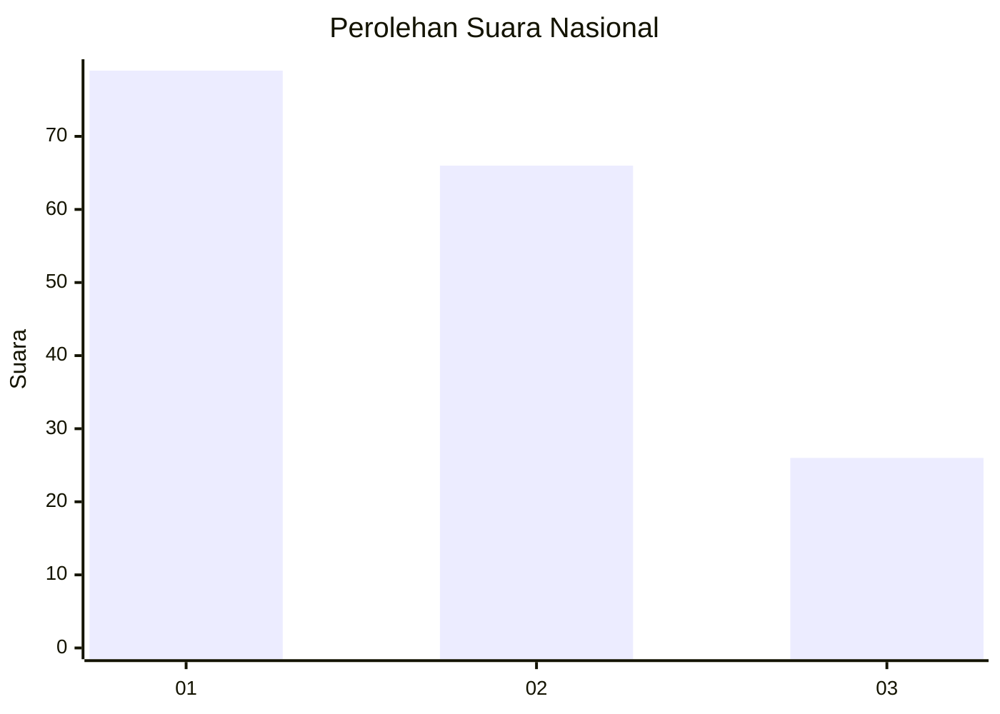
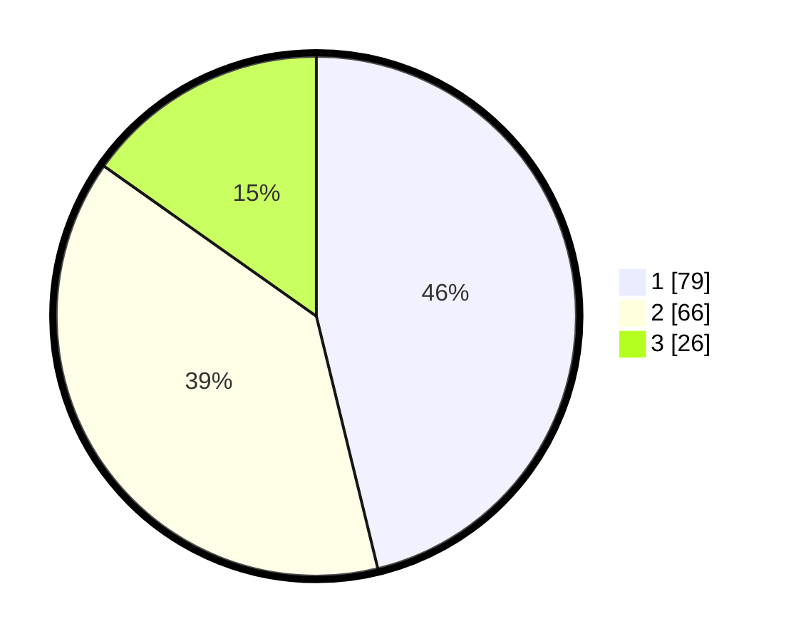

# Hasil

## Grafik

## Tabel

| No. | Nama Paslon    | Suara | Suara (raw) | Persentase |
|:--- |:-------------- | -----:| -----------:| ----------:|
| 1   | ANIES MUHAIMIN | 79    | [79][p-1]   | 46,20      |
| 2   | PRABOWO GIBRAN | 66    | [66][p-2]   | 38,60      |
| 3   | GANJAR MAHFUD  | 26    | [26][p-3]   | 15,20      |

[p-1]: https://github.com/gigit-pemilu/pemilu-2024/blob/main/pilpres/hitung-suara/sub/34-di-yogyakarta/sub/02-bantul/sub/16-kasihan/sub/2001-bangunjiwo/sub/018-tps/sub/paslon-1.txt
[p-2]: https://github.com/gigit-pemilu/pemilu-2024/blob/main/pilpres/hitung-suara/sub/34-di-yogyakarta/sub/02-bantul/sub/16-kasihan/sub/2001-bangunjiwo/sub/018-tps/sub/paslon-2.txt
[p-3]: https://github.com/gigit-pemilu/pemilu-2024/blob/main/pilpres/hitung-suara/sub/34-di-yogyakarta/sub/02-bantul/sub/16-kasihan/sub/2001-bangunjiwo/sub/018-tps/sub/paslon-3.txt

## Foto C Plano

https://sirekap-obj-formc.kpu.go.id/f8e9/pemilu/ppwp/34/02/16/20/01/3402162001018-20240214-193837--33ede613-e2a0-4fab-897a-ca58c01118a9.jpg

https://sirekap-obj-formc.kpu.go.id/f8e9/pemilu/ppwp/34/02/16/20/01/3402162001018-20240214-193859--84fb3714-93d6-4e0a-a619-a58a8f10574d.jpg

https://sirekap-obj-formc.kpu.go.id/f8e9/pemilu/ppwp/34/02/16/20/01/3402162001018-20240214-193848--d6ae7108-35ed-4f66-8110-424eb19cf67e.jpg

## Metadata

| Key        | Value               |
| ---------- | ------------------- |
| Time Stamp | 2024-02-15 20:00:44 |

## DATA PEMILIH TETAP

Jumlah pemilih dalam DPT: **204**.
 * L: **105**.
 * P: **99**.

## DATA PENGGUNA HAK PILIH

Jumlah pengguna hak pilih dalam DPT: **146**.
 * L: **73**.
 * P: **73**.

Jumlah pengguna hak pilih dalam DPTb: **6**.
 * L: **3**.
 * P: **3**.

Jumlah pengguna hak pilih dalam DPK: **23**.
 * L: **13**.
 * P: **10**.

Jumlah pengguna hak pilih: **175**.
 * L: **89**.
 * P: **86**.

## JUMLAH SUARA SAH DAN TIDAK SAH

JUMLAH SELURUH SUARA SAH: **171**.

JUMLAH SUARA TIDAK SAH: **4**.

JUMLAH SELURUH SUARA SAH DAN SUARA TIDAK SAH: **175**.

