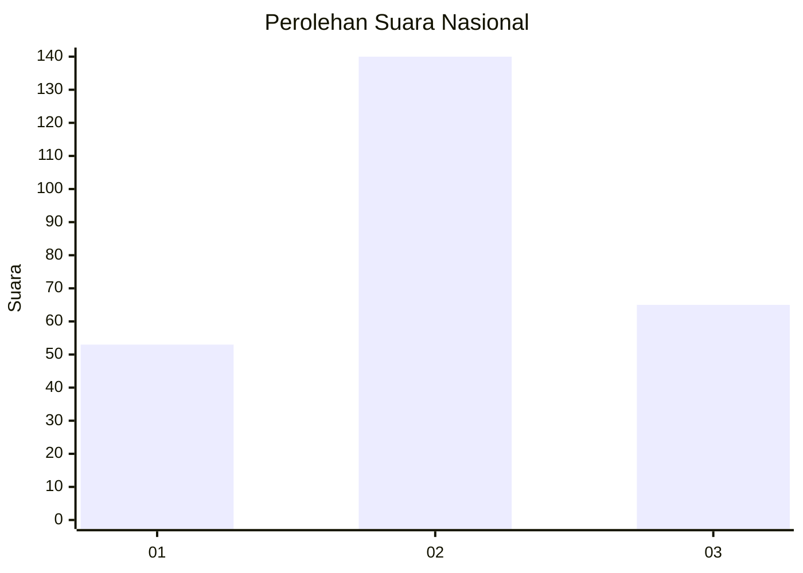
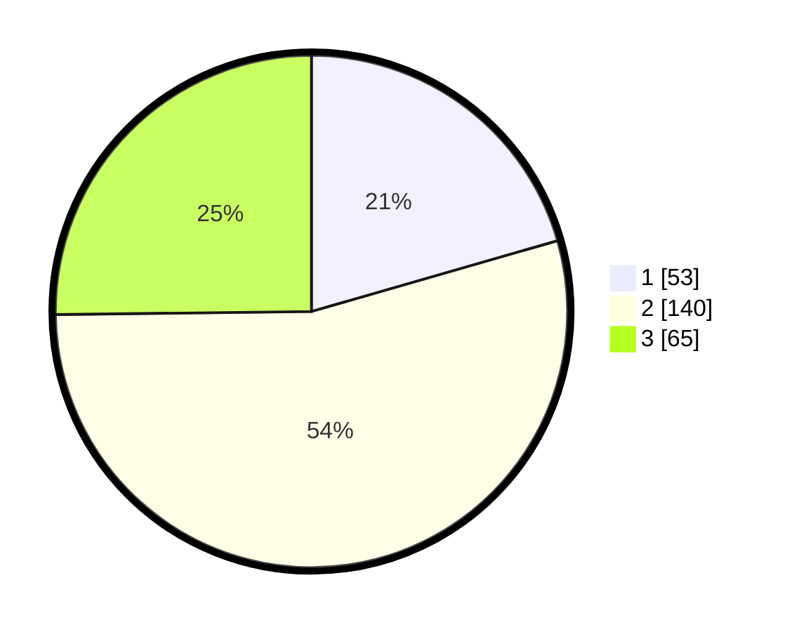

# Hasil

## Grafik

## Tabel

| No. | Nama Paslon    | Suara | Suara (raw) | Persentase |
|:--- |:-------------- | -----:| -----------:| ----------:|
| 1   | ANIES MUHAIMIN | 53    | [53][p-1]   | 20,54      |
| 2   | PRABOWO GIBRAN | 140   | [140][p-2]  | 54,26      |
| 3   | GANJAR MAHFUD  | 65    | [65][p-3]   | 25,19      |

[p-1]: https://github.com/gigit-pemilu/pemilu-2024/blob/main/pilpres/hitung-suara/sub/34-di-yogyakarta/sub/02-bantul/sub/16-kasihan/sub/2001-bangunjiwo/sub/020-tps/sub/paslon-1.txt
[p-2]: https://github.com/gigit-pemilu/pemilu-2024/blob/main/pilpres/hitung-suara/sub/34-di-yogyakarta/sub/02-bantul/sub/16-kasihan/sub/2001-bangunjiwo/sub/020-tps/sub/paslon-2.txt
[p-3]: https://github.com/gigit-pemilu/pemilu-2024/blob/main/pilpres/hitung-suara/sub/34-di-yogyakarta/sub/02-bantul/sub/16-kasihan/sub/2001-bangunjiwo/sub/020-tps/sub/paslon-3.txt

## Foto C Plano

https://sirekap-obj-formc.kpu.go.id/4123/pemilu/ppwp/34/02/16/20/01/3402162001020-20240214-190214--bde1ec19-ea29-45e0-b55f-e2bf0754b9c0.jpg

https://sirekap-obj-formc.kpu.go.id/4123/pemilu/ppwp/34/02/16/20/01/3402162001020-20240214-190510--cfbc7f0c-6ea3-42e0-bd2e-d63f6a9777ca.jpg

https://sirekap-obj-formc.kpu.go.id/4123/pemilu/ppwp/34/02/16/20/01/3402162001020-20240214-185853--228e6657-8af8-4a95-ae7b-970ae98648d0.jpg

## Metadata

| Key        | Value               |
| ---------- | ------------------- |
| Time Stamp | 2024-02-24 22:31:28 |

