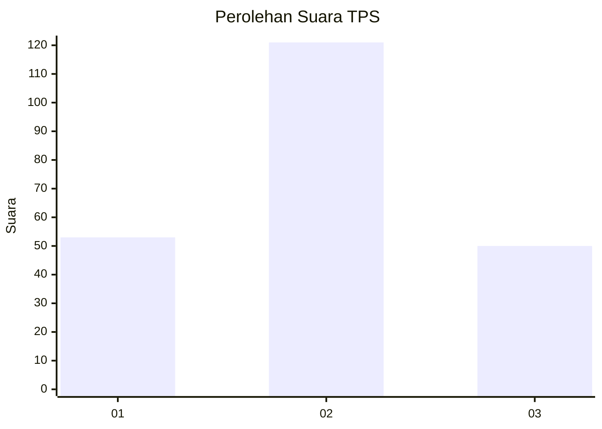
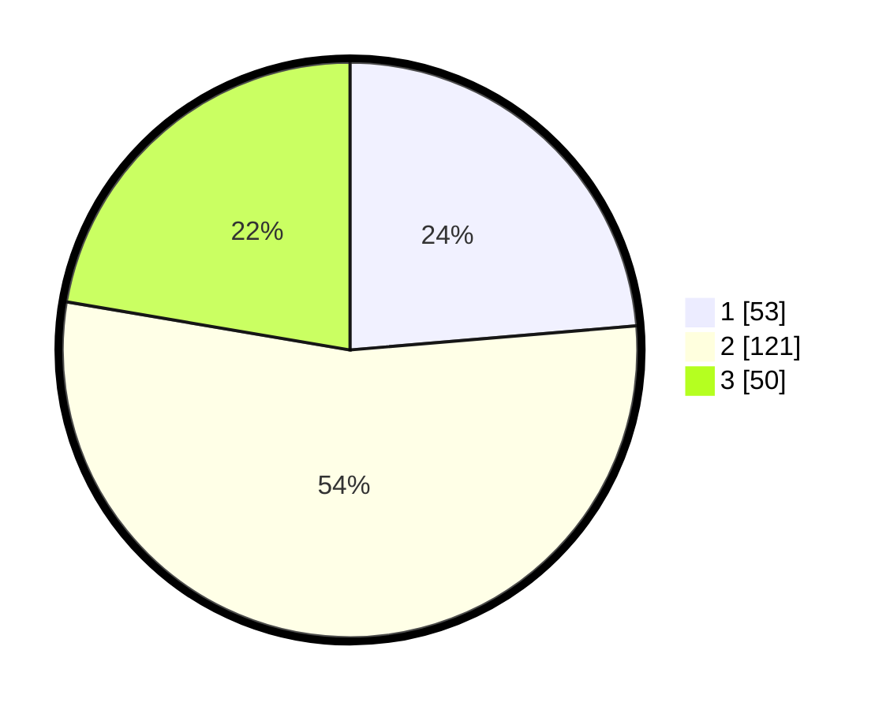

# Hasil

## Grafik

## Tabel

| No. | Nama Paslon    | Suara | Suara (raw) | Persentase |
|:--- |:-------------- | -----:| -----------:| ----------:|
| 1   | ANIES MUHAIMIN | 53    | [53][p-1]   | 23,66      |
| 2   | PRABOWO GIBRAN | 121   | [121][p-2]  | 54,02      |
| 3   | GANJAR MAHFUD  | 50    | [50][p-3]   | 22,32      |

[p-1]: https://github.com/gigit-pemilu/pemilu-2024-34-di-yogyakarta/blob/main/pilpres/hitung-suara/sub/34-di-yogyakarta/sub/02-bantul/sub/16-kasihan/sub/2001-bangunjiwo/sub/029-tps/sub/paslon-1.txt
[p-2]: https://github.com/gigit-pemilu/pemilu-2024-34-di-yogyakarta/blob/main/pilpres/hitung-suara/sub/34-di-yogyakarta/sub/02-bantul/sub/16-kasihan/sub/2001-bangunjiwo/sub/029-tps/sub/paslon-2.txt
[p-3]: https://github.com/gigit-pemilu/pemilu-2024-34-di-yogyakarta/blob/main/pilpres/hitung-suara/sub/34-di-yogyakarta/sub/02-bantul/sub/16-kasihan/sub/2001-bangunjiwo/sub/029-tps/sub/paslon-3.txt

## Foto C Plano

https://sirekap-obj-formc.kpu.go.id/221a/pemilu/ppwp/34/02/16/20/01/3402162001029-20240215-014826--46df0908-b808-4c0f-9dd0-6ae5d776b810.jpg

https://sirekap-obj-formc.kpu.go.id/221a/pemilu/ppwp/34/02/16/20/01/3402162001029-20240215-015211--0fe78fc7-2cb9-412d-b879-f7310413ede1.jpg

https://sirekap-obj-formc.kpu.go.id/221a/pemilu/ppwp/34/02/16/20/01/3402162001029-20240215-015347--3c10819a-b0d0-4c33-934f-2072dc055a1d.jpg

## Metadata

| Key        | Value               |
| ---------- | ------------------- |
| Time Stamp | 2024-02-24 22:31:28 |

