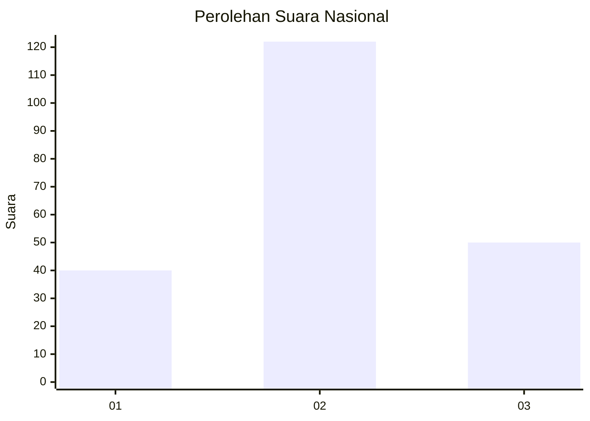
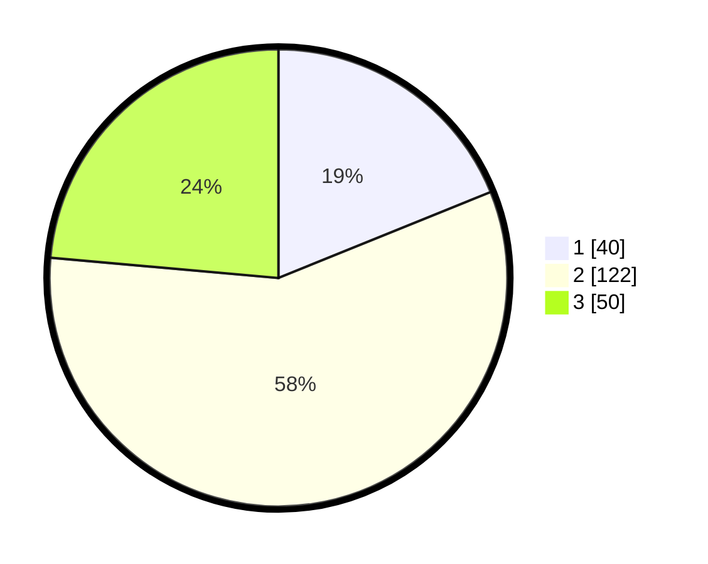

# Hasil

## Grafik

## Tabel

| No. | Nama Paslon    | Suara | Suara (raw) | Persentase |
|:--- |:-------------- | -----:| -----------:| ----------:|
| 1   | ANIES MUHAIMIN | 40    | [40][p-1]   | 18,87      |
| 2   | PRABOWO GIBRAN | 122   | [122][p-2]  | 57,55      |
| 3   | GANJAR MAHFUD  | 50    | [50][p-3]   | 23,58      |

[p-1]: https://github.com/gigit-pemilu/pemilu-2024/blob/main/pilpres/hitung-suara/sub/34-di-yogyakarta/sub/02-bantul/sub/16-kasihan/sub/2001-bangunjiwo/sub/030-tps/sub/paslon-1.txt
[p-2]: https://github.com/gigit-pemilu/pemilu-2024/blob/main/pilpres/hitung-suara/sub/34-di-yogyakarta/sub/02-bantul/sub/16-kasihan/sub/2001-bangunjiwo/sub/030-tps/sub/paslon-2.txt
[p-3]: https://github.com/gigit-pemilu/pemilu-2024/blob/main/pilpres/hitung-suara/sub/34-di-yogyakarta/sub/02-bantul/sub/16-kasihan/sub/2001-bangunjiwo/sub/030-tps/sub/paslon-3.txt

## Foto C Plano

https://sirekap-obj-formc.kpu.go.id/0b0b/pemilu/ppwp/34/02/16/20/01/3402162001030-20240223-000605--2174b593-5527-4b56-be59-d8959bea3ced.jpg

https://sirekap-obj-formc.kpu.go.id/0b0b/pemilu/ppwp/34/02/16/20/01/3402162001030-20240215-001707--ff65b0ad-ad78-4881-84b7-b3205c8fefc3.jpg

https://sirekap-obj-formc.kpu.go.id/0b0b/pemilu/ppwp/34/02/16/20/01/3402162001030-20240215-001803--3db88753-a57a-498e-9526-ec338469953e.jpg

## Metadata

| Key        | Value               |
| ---------- | ------------------- |
| Time Stamp | 2024-02-24 22:31:28 |

