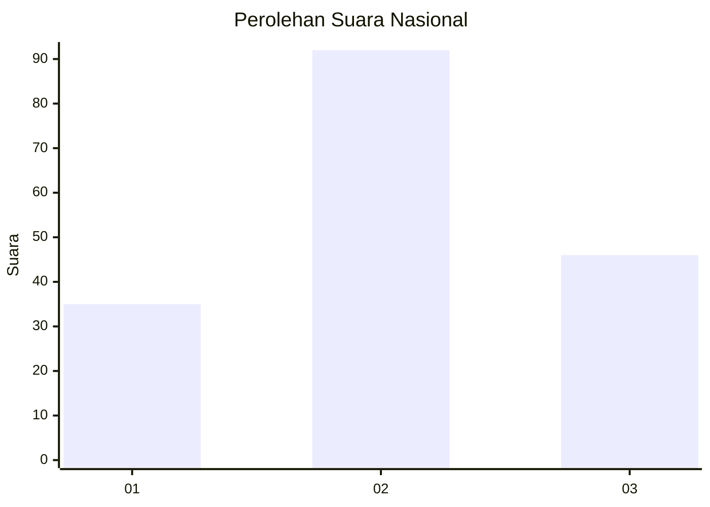
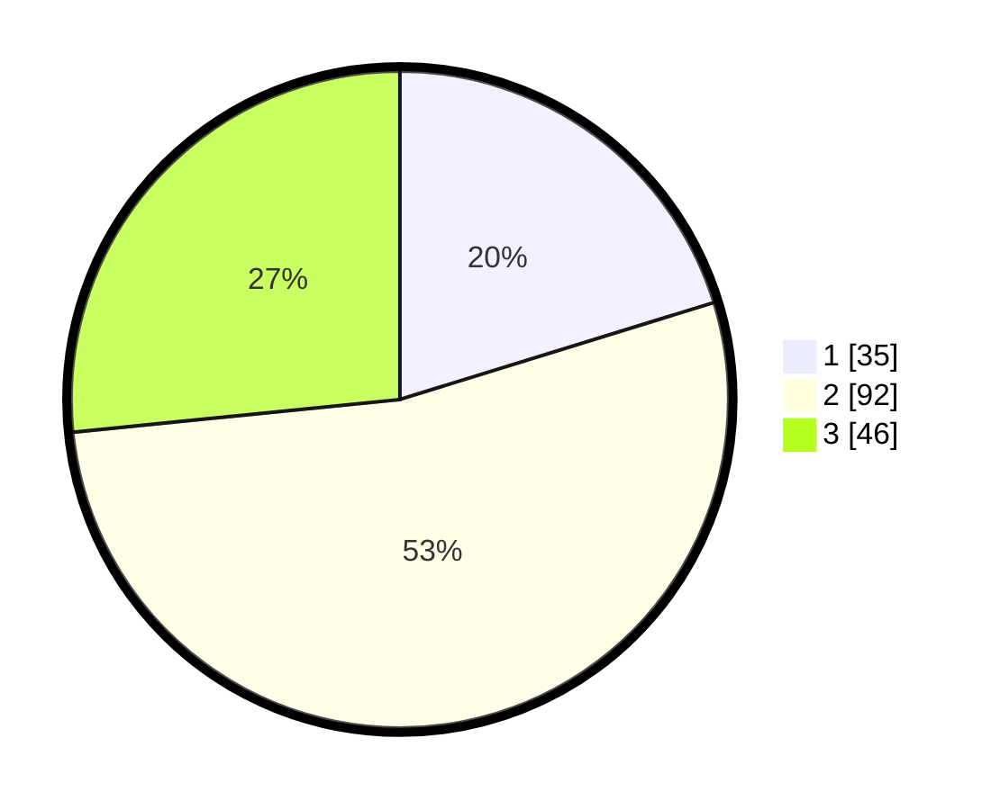

# Hasil

## Grafik

## Tabel

| No. | Nama Paslon    | Suara | Suara (raw) | Persentase |
|:--- |:-------------- | -----:| -----------:| ----------:|
| 1   | ANIES MUHAIMIN | 35    | [35][p-1]   | 20,23      |
| 2   | PRABOWO GIBRAN | 92    | [92][p-2]   | 53,18      |
| 3   | GANJAR MAHFUD  | 46    | [46][p-3]   | 26,59      |

[p-1]: https://github.com/gigit-pemilu/pemilu-2024/blob/main/pilpres/hitung-suara/sub/34-di-yogyakarta/sub/02-bantul/sub/16-kasihan/sub/2001-bangunjiwo/sub/042-tps/sub/paslon-1.txt
[p-2]: https://github.com/gigit-pemilu/pemilu-2024/blob/main/pilpres/hitung-suara/sub/34-di-yogyakarta/sub/02-bantul/sub/16-kasihan/sub/2001-bangunjiwo/sub/042-tps/sub/paslon-2.txt
[p-3]: https://github.com/gigit-pemilu/pemilu-2024/blob/main/pilpres/hitung-suara/sub/34-di-yogyakarta/sub/02-bantul/sub/16-kasihan/sub/2001-bangunjiwo/sub/042-tps/sub/paslon-3.txt

## Foto C Plano

https://sirekap-obj-formc.kpu.go.id/ba98/pemilu/ppwp/34/02/16/20/01/3402162001042-20240215-100053--611a138c-a78b-4c5a-98ac-eb4ccfa97c23.jpg

https://sirekap-obj-formc.kpu.go.id/ba98/pemilu/ppwp/34/02/16/20/01/3402162001042-20240215-100410--8eacb790-fb6f-4fce-8b28-4bfb9acd3cc4.jpg

https://sirekap-obj-formc.kpu.go.id/ba98/pemilu/ppwp/34/02/16/20/01/3402162001042-20240215-100532--2d381179-8991-48fd-89fd-9a7e50d61f84.jpg

## Metadata

| Key        | Value               |
| ---------- | ------------------- |
| Time Stamp | 2024-02-24 22:31:28 |

