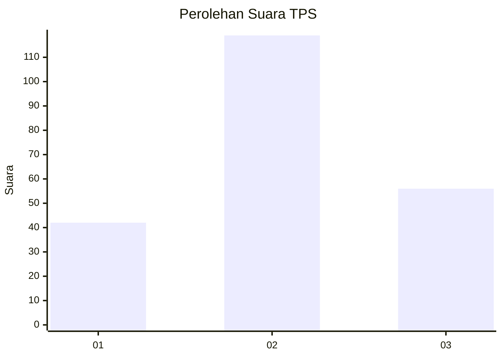
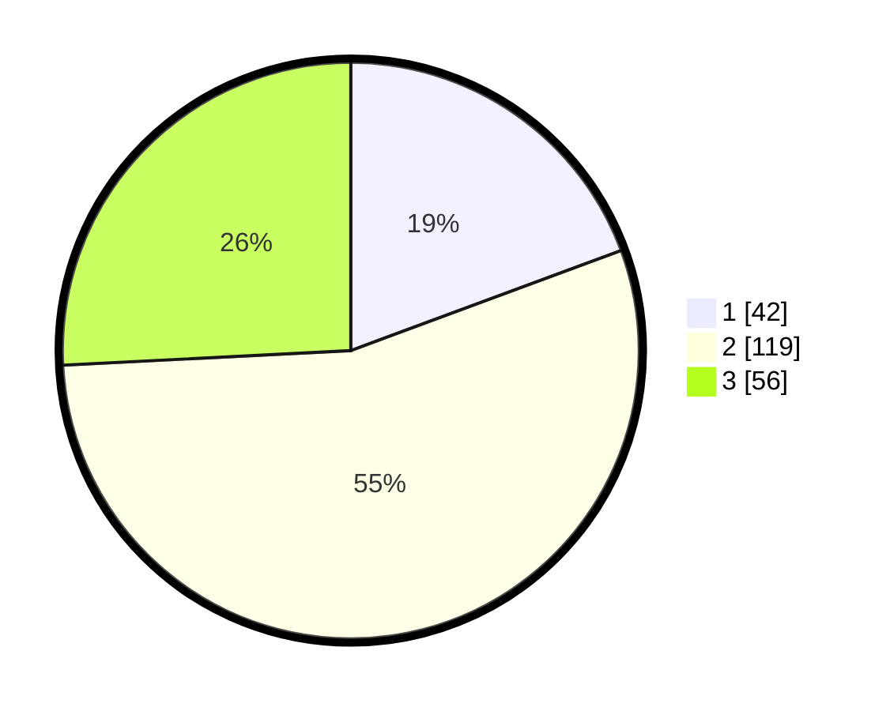

# Hasil

## Grafik

## Tabel

| No. | Nama Paslon    | Suara | Suara (raw) | Persentase |
|:--- |:-------------- | -----:| -----------:| ----------:|
| 1   | ANIES MUHAIMIN | 42    | [42][p-1]   | 19,35      |
| 2   | PRABOWO GIBRAN | 119   | [119][p-2]  | 54,84      |
| 3   | GANJAR MAHFUD  | 56    | [56][p-3]   | 25,81      |

[p-1]: https://github.com/gigit-pemilu/pemilu-2024-34-di-yogyakarta/blob/main/pilpres/hitung-suara/sub/34-di-yogyakarta/sub/02-bantul/sub/16-kasihan/sub/2001-bangunjiwo/sub/043-tps/sub/paslon-1.txt
[p-2]: https://github.com/gigit-pemilu/pemilu-2024-34-di-yogyakarta/blob/main/pilpres/hitung-suara/sub/34-di-yogyakarta/sub/02-bantul/sub/16-kasihan/sub/2001-bangunjiwo/sub/043-tps/sub/paslon-2.txt
[p-3]: https://github.com/gigit-pemilu/pemilu-2024-34-di-yogyakarta/blob/main/pilpres/hitung-suara/sub/34-di-yogyakarta/sub/02-bantul/sub/16-kasihan/sub/2001-bangunjiwo/sub/043-tps/sub/paslon-3.txt

## Foto C Plano

https://sirekap-obj-formc.kpu.go.id/ed7d/pemilu/ppwp/34/02/16/20/01/3402162001043-20240214-235918--3b241e53-d364-4824-9439-d550a95e4f6a.jpg

https://sirekap-obj-formc.kpu.go.id/ed7d/pemilu/ppwp/34/02/16/20/01/3402162001043-20240215-000100--a9e9090f-8fe7-4829-9bae-776ae7b51e4f.jpg

https://sirekap-obj-formc.kpu.go.id/ed7d/pemilu/ppwp/34/02/16/20/01/3402162001043-20240215-000224--c1bd1aa7-e76e-4d67-a6b8-b72083610b18.jpg

## Metadata

| Key        | Value               |
| ---------- | ------------------- |
| Time Stamp | 2024-02-24 22:31:28 |

