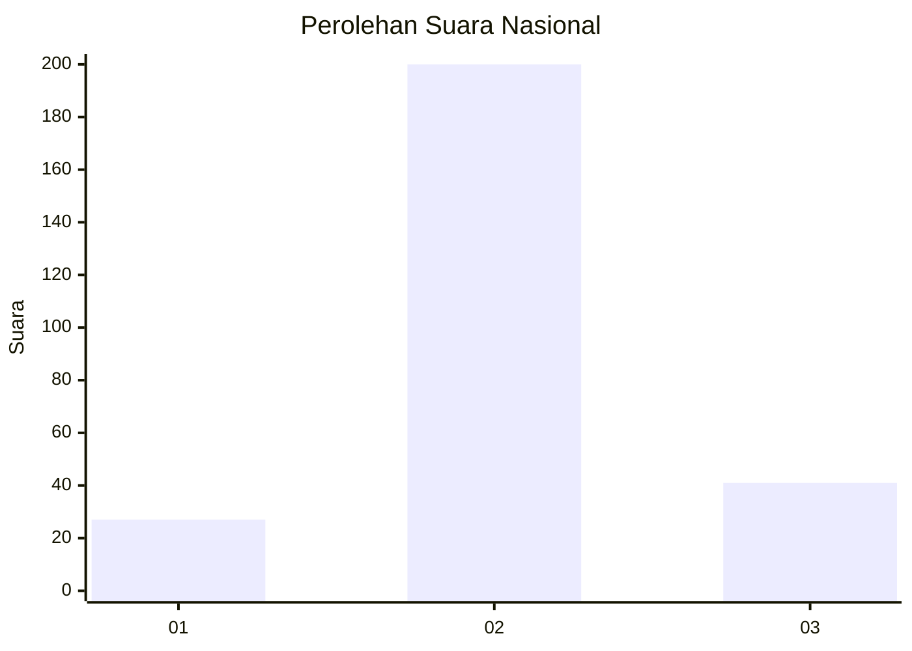
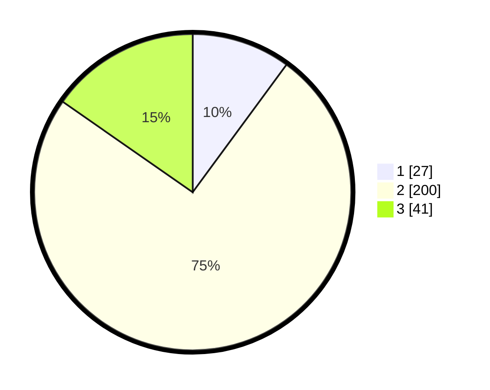

# Hasil

## Grafik

## Tabel

| No. | Nama Paslon    | Suara | Suara (raw) | Persentase |
|:--- |:-------------- | -----:| -----------:| ----------:|
| 1   | ANIES MUHAIMIN | 27    | [27][p-1]   | 10,07      |
| 2   | PRABOWO GIBRAN | 200   | [200][p-2]  | 74,63      |
| 3   | GANJAR MAHFUD  | 41    | [41][p-3]   | 15,30      |

[p-1]: https://github.com/gigit-pemilu/pemilu-2024/blob/main/pilpres/hitung-suara/sub/34-di-yogyakarta/sub/02-bantul/sub/16-kasihan/sub/2001-bangunjiwo/sub/054-tps/sub/paslon-1.txt
[p-2]: https://github.com/gigit-pemilu/pemilu-2024/blob/main/pilpres/hitung-suara/sub/34-di-yogyakarta/sub/02-bantul/sub/16-kasihan/sub/2001-bangunjiwo/sub/054-tps/sub/paslon-2.txt
[p-3]: https://github.com/gigit-pemilu/pemilu-2024/blob/main/pilpres/hitung-suara/sub/34-di-yogyakarta/sub/02-bantul/sub/16-kasihan/sub/2001-bangunjiwo/sub/054-tps/sub/paslon-3.txt

## Foto C Plano

https://sirekap-obj-formc.kpu.go.id/855a/pemilu/ppwp/34/02/16/20/01/3402162001054-20240216-014105--3adfa67b-ad47-4f73-94f1-b9571a79e2dd.jpg

https://sirekap-obj-formc.kpu.go.id/855a/pemilu/ppwp/34/02/16/20/01/3402162001054-20240216-014116--fb57fd47-b7bb-47c4-b654-7be5485427a2.jpg

https://sirekap-obj-formc.kpu.go.id/855a/pemilu/ppwp/34/02/16/20/01/3402162001054-20240216-014112--1e64b9ad-21a8-46c5-af32-6a2813268c72.jpg

## Metadata

| Key        | Value               |
| ---------- | ------------------- |
| Time Stamp | 2024-02-21 14:00:00 |

## DATA PEMILIH TETAP

Jumlah pemilih dalam DPT: **283**.
 * L: **145**.
 * P: **138**.

## DATA PENGGUNA HAK PILIH

Jumlah pengguna hak pilih dalam DPT: **267**.
 * L: **136**.
 * P: **131**.

Jumlah pengguna hak pilih dalam DPTb: **5**.
 * L: **3**.
 * P: **2**.

Jumlah pengguna hak pilih dalam DPK: **273**.
 * L: **139**.
 * P: **134**.

Jumlah pengguna hak pilih: **273**.
 * L: **139**.
 * P: **134**.

## JUMLAH SUARA SAH DAN TIDAK SAH

JUMLAH SELURUH SUARA SAH: **268**.

JUMLAH SUARA TIDAK SAH: **5**.

JUMLAH SELURUH SUARA SAH DAN SUARA TIDAK SAH: **273**.

