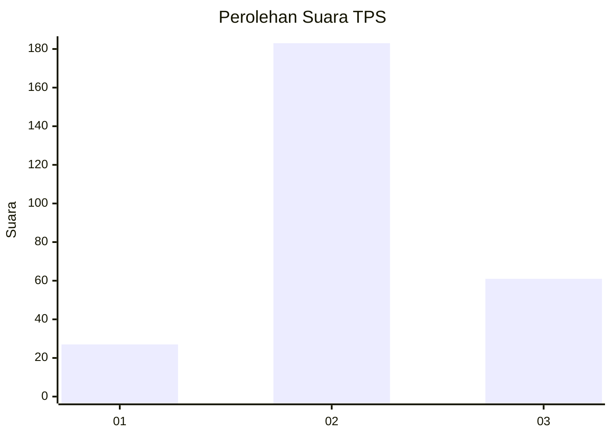
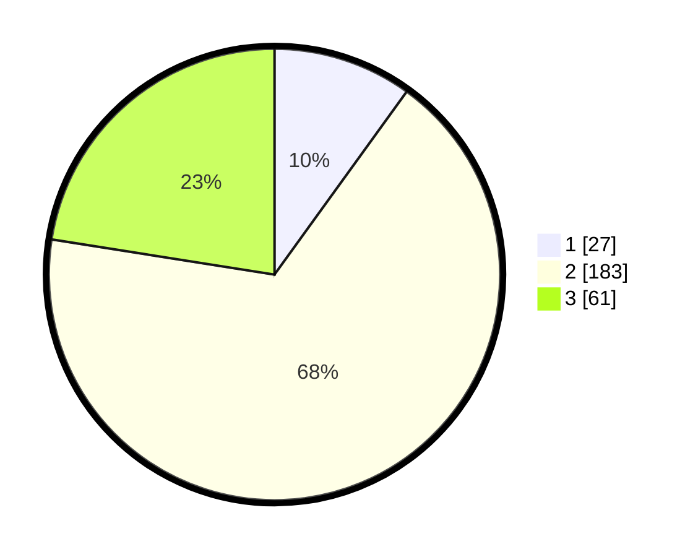

# Hasil

## Grafik

## Tabel

| No. | Nama Paslon    | Suara | Suara (raw) | Persentase |
|:--- |:-------------- | -----:| -----------:| ----------:|
| 1   | ANIES MUHAIMIN | 27    | [27][p-1]   | 9,96       |
| 2   | PRABOWO GIBRAN | 183   | [183][p-2]  | 67,53      |
| 3   | GANJAR MAHFUD  | 61    | [61][p-3]   | 22,51      |

[p-1]: https://github.com/gigit-pemilu/pemilu-2024-34-di-yogyakarta/blob/main/pilpres/hitung-suara/sub/34-di-yogyakarta/sub/02-bantul/sub/16-kasihan/sub/2001-bangunjiwo/sub/055-tps/sub/paslon-1.txt
[p-2]: https://github.com/gigit-pemilu/pemilu-2024-34-di-yogyakarta/blob/main/pilpres/hitung-suara/sub/34-di-yogyakarta/sub/02-bantul/sub/16-kasihan/sub/2001-bangunjiwo/sub/055-tps/sub/paslon-2.txt
[p-3]: https://github.com/gigit-pemilu/pemilu-2024-34-di-yogyakarta/blob/main/pilpres/hitung-suara/sub/34-di-yogyakarta/sub/02-bantul/sub/16-kasihan/sub/2001-bangunjiwo/sub/055-tps/sub/paslon-3.txt

## Foto C Plano

https://sirekap-obj-formc.kpu.go.id/3981/pemilu/ppwp/34/02/16/20/01/3402162001055-20240214-225628--d92faaec-b006-4dc2-beda-beac64f4b674.jpg

https://sirekap-obj-formc.kpu.go.id/3981/pemilu/ppwp/34/02/16/20/01/3402162001055-20240214-225910--1a011a05-1596-49ca-856f-e3dd3033303e.jpg

https://sirekap-obj-formc.kpu.go.id/3981/pemilu/ppwp/34/02/16/20/01/3402162001055-20240214-230050--959f46a0-cd60-440a-b0b3-f936f20303cb.jpg

## Metadata

| Key        | Value               |
| ---------- | ------------------- |
| Time Stamp | 2024-02-24 22:31:28 |

