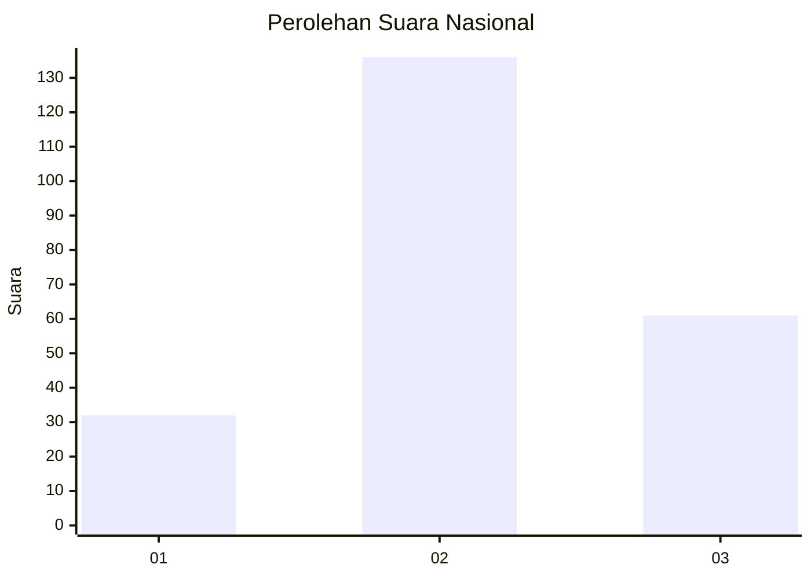
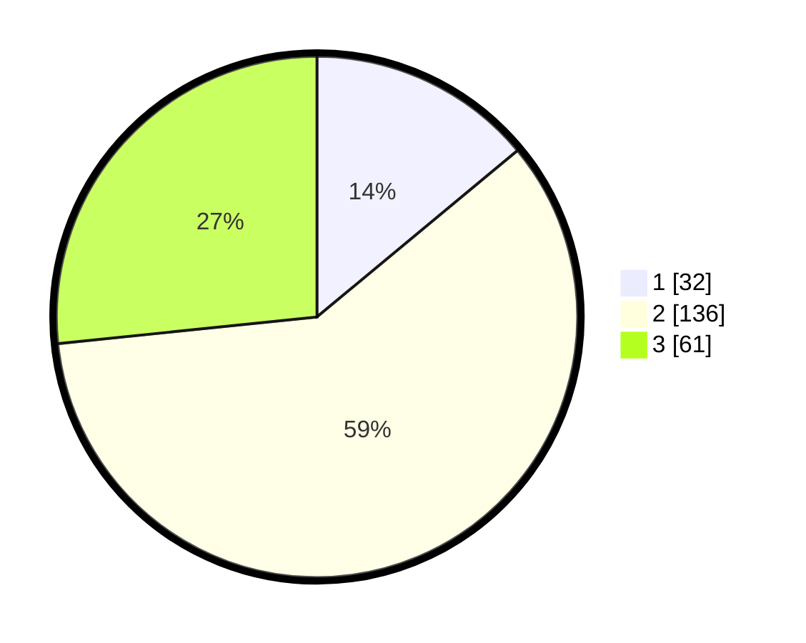

# Hasil

## Grafik

## Tabel

| No. | Nama Paslon    | Suara | Suara (raw) | Persentase |
|:--- |:-------------- | -----:| -----------:| ----------:|
| 1   | ANIES MUHAIMIN | 32    | [32][p-1]   | 13,97      |
| 2   | PRABOWO GIBRAN | 136   | [136][p-2]  | 59,39      |
| 3   | GANJAR MAHFUD  | 61    | [61][p-3]   | 26,64      |

[p-1]: https://github.com/gigit-pemilu/pemilu-2024/blob/main/pilpres/hitung-suara/sub/34-di-yogyakarta/sub/02-bantul/sub/16-kasihan/sub/2001-bangunjiwo/sub/066-tps/sub/paslon-1.txt
[p-2]: https://github.com/gigit-pemilu/pemilu-2024/blob/main/pilpres/hitung-suara/sub/34-di-yogyakarta/sub/02-bantul/sub/16-kasihan/sub/2001-bangunjiwo/sub/066-tps/sub/paslon-2.txt
[p-3]: https://github.com/gigit-pemilu/pemilu-2024/blob/main/pilpres/hitung-suara/sub/34-di-yogyakarta/sub/02-bantul/sub/16-kasihan/sub/2001-bangunjiwo/sub/066-tps/sub/paslon-3.txt

## Foto C Plano

https://sirekap-obj-formc.kpu.go.id/3622/pemilu/ppwp/34/02/16/20/01/3402162001066-20240214-155618--67e6b1a6-bf29-42c4-b0ae-8588f6b68610.jpg

https://sirekap-obj-formc.kpu.go.id/3622/pemilu/ppwp/34/02/16/20/01/3402162001066-20240214-155048--e085c1f8-5787-4f85-8967-ab82d4485574.jpg

https://sirekap-obj-formc.kpu.go.id/3622/pemilu/ppwp/34/02/16/20/01/3402162001066-20240214-155139--0a423cc5-2415-41aa-8b78-abaa2c77d89c.jpg

## Metadata

| Key        | Value               |
| ---------- | ------------------- |
| Time Stamp | 2024-02-15 20:00:44 |

