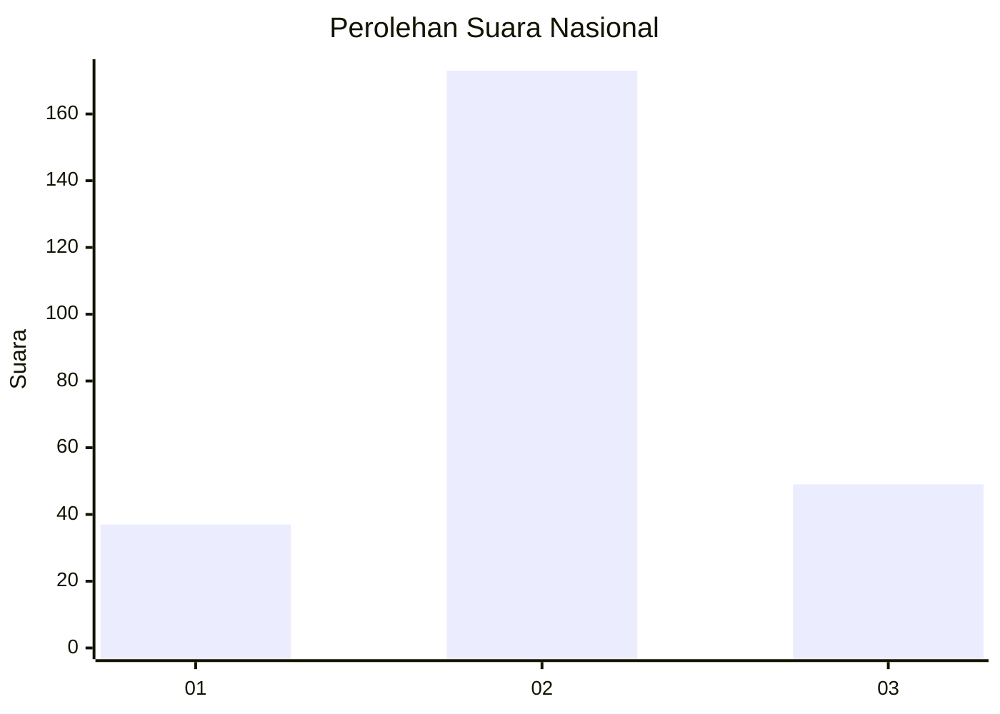
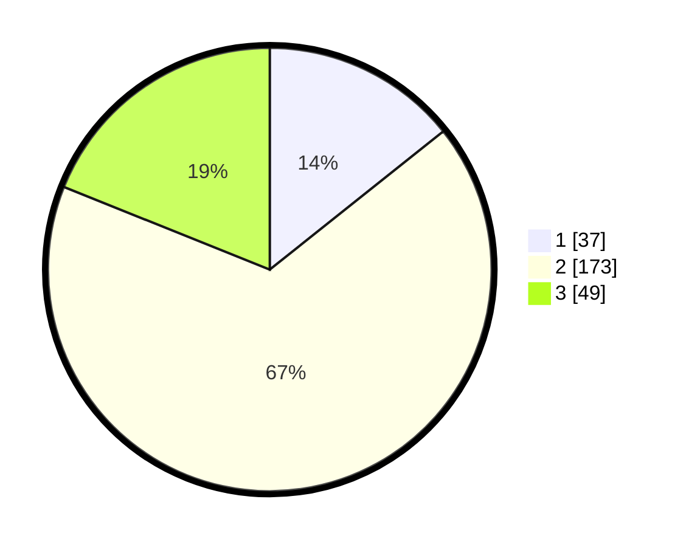

# Hasil

## Grafik

## Tabel

| No. | Nama Paslon    | Suara | Suara (raw) | Persentase |
|:--- |:-------------- | -----:| -----------:| ----------:|
| 1   | ANIES MUHAIMIN | 37    | [37][p-1]   | 14,29      |
| 2   | PRABOWO GIBRAN | 173   | [173][p-2]  | 66,80      |
| 3   | GANJAR MAHFUD  | 49    | [49][p-3]   | 18,92      |

[p-1]: https://github.com/gigit-pemilu/pemilu-2024/blob/main/pilpres/hitung-suara/sub/34-di-yogyakarta/sub/02-bantul/sub/16-kasihan/sub/2001-bangunjiwo/sub/079-tps/sub/paslon-1.txt
[p-2]: https://github.com/gigit-pemilu/pemilu-2024/blob/main/pilpres/hitung-suara/sub/34-di-yogyakarta/sub/02-bantul/sub/16-kasihan/sub/2001-bangunjiwo/sub/079-tps/sub/paslon-2.txt
[p-3]: https://github.com/gigit-pemilu/pemilu-2024/blob/main/pilpres/hitung-suara/sub/34-di-yogyakarta/sub/02-bantul/sub/16-kasihan/sub/2001-bangunjiwo/sub/079-tps/sub/paslon-3.txt

## Foto C Plano

https://sirekap-obj-formc.kpu.go.id/9ebd/pemilu/ppwp/34/02/16/20/01/3402162001079-20240215-053333--5c648883-2b57-4ea2-b663-2998424e54ff.jpg

https://sirekap-obj-formc.kpu.go.id/9ebd/pemilu/ppwp/34/02/16/20/01/3402162001079-20240215-053417--88264602-8670-4b01-96ca-71952b7c6403.jpg

https://sirekap-obj-formc.kpu.go.id/9ebd/pemilu/ppwp/34/02/16/20/01/3402162001079-20240223-211349--3806dc22-26de-4185-a24f-e999e4448260.jpg

## Metadata

| Key        | Value               |
| ---------- | ------------------- |
| Time Stamp | 2024-02-24 22:31:28 |

