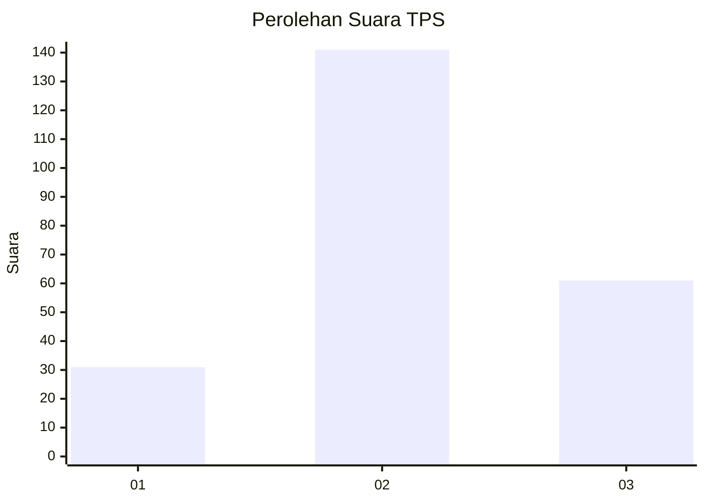
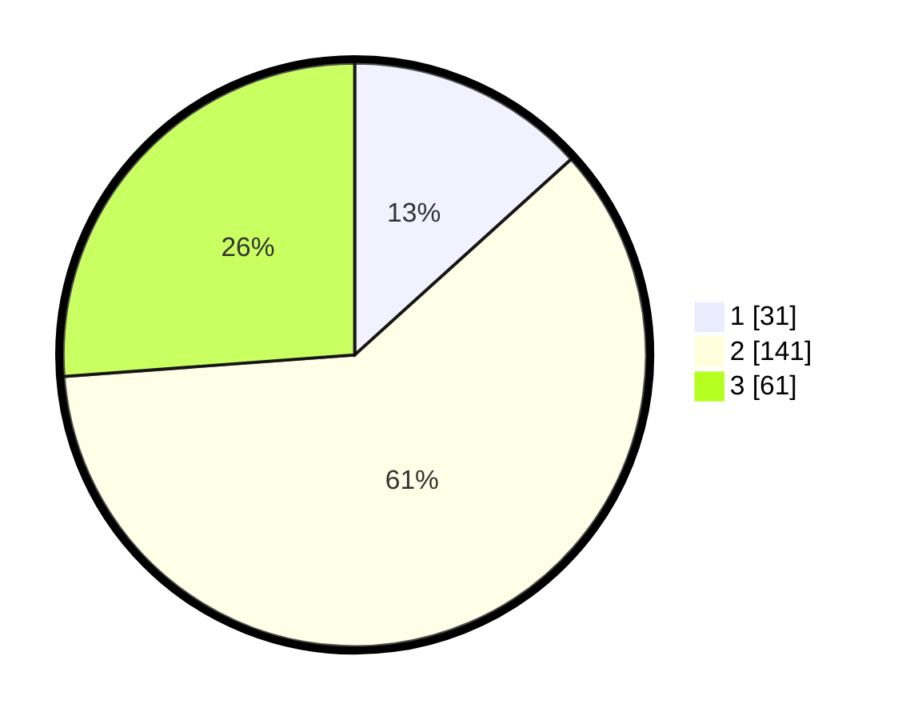

# Hasil

## Grafik

## Tabel

| No. | Nama Paslon    | Suara | Suara (raw) | Persentase |
|:--- |:-------------- | -----:| -----------:| ----------:|
| 1   | ANIES MUHAIMIN | 31    | [31][p-1]   | 13,30      |
| 2   | PRABOWO GIBRAN | 141   | [141][p-2]  | 60,52      |
| 3   | GANJAR MAHFUD  | 61    | [61][p-3]   | 26,18      |

[p-1]: https://github.com/gigit-pemilu/pemilu-2024-34-di-yogyakarta/blob/main/pilpres/hitung-suara/sub/34-di-yogyakarta/sub/02-bantul/sub/16-kasihan/sub/2001-bangunjiwo/sub/086-tps/sub/paslon-1.txt
[p-2]: https://github.com/gigit-pemilu/pemilu-2024-34-di-yogyakarta/blob/main/pilpres/hitung-suara/sub/34-di-yogyakarta/sub/02-bantul/sub/16-kasihan/sub/2001-bangunjiwo/sub/086-tps/sub/paslon-2.txt
[p-3]: https://github.com/gigit-pemilu/pemilu-2024-34-di-yogyakarta/blob/main/pilpres/hitung-suara/sub/34-di-yogyakarta/sub/02-bantul/sub/16-kasihan/sub/2001-bangunjiwo/sub/086-tps/sub/paslon-3.txt

## Foto C Plano

https://sirekap-obj-formc.kpu.go.id/4121/pemilu/ppwp/34/02/16/20/01/3402162001086-20240214-204756--f0781c2f-2f15-439b-a35c-4b617c889903.jpg

https://sirekap-obj-formc.kpu.go.id/4121/pemilu/ppwp/34/02/16/20/01/3402162001086-20240214-204919--022ad1f7-6715-430d-98e4-34b4c2e04862.jpg

https://sirekap-obj-formc.kpu.go.id/4121/pemilu/ppwp/34/02/16/20/01/3402162001086-20240214-205048--f2a4069c-010c-4e1e-9eea-1de8f4f9604c.jpg

## Metadata

| Key        | Value               |
| ---------- | ------------------- |
| Time Stamp | 2024-02-25 15:00:00 |

