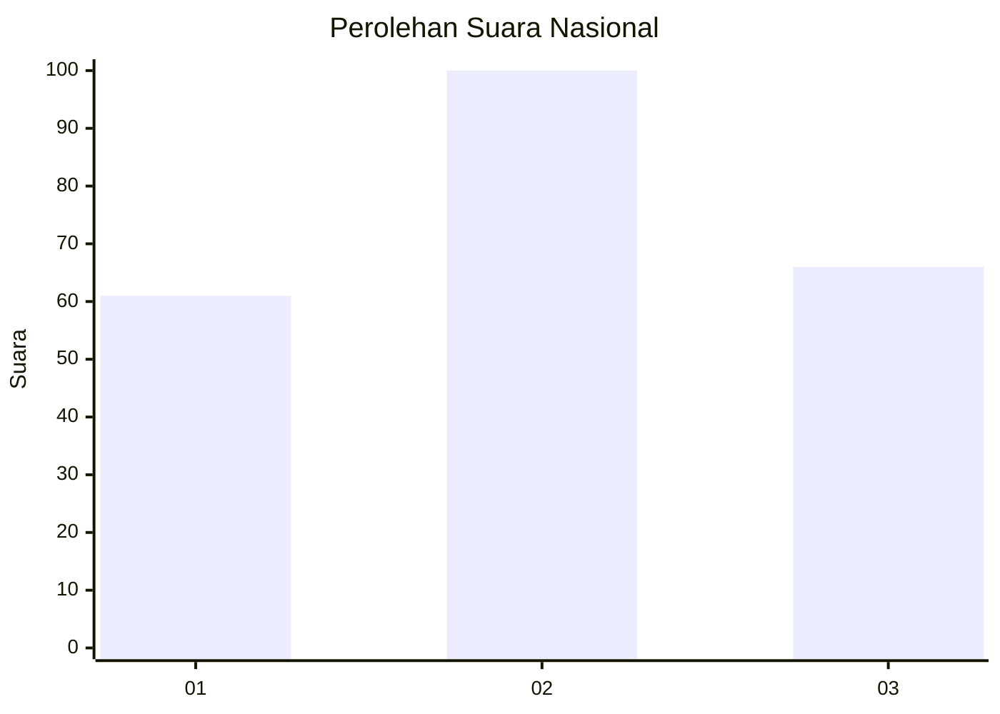
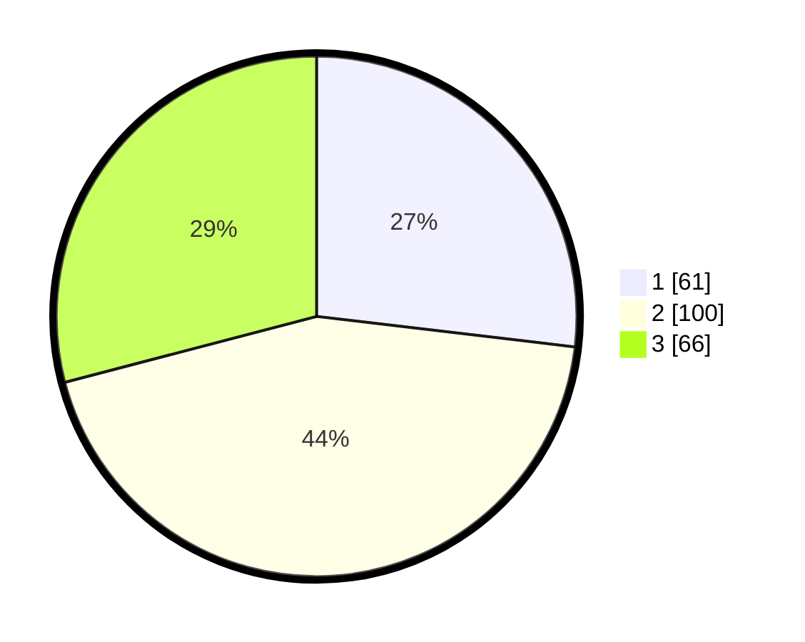

# Hasil

## Grafik

## Tabel

| No. | Nama Paslon    | Suara | Suara (raw) | Persentase |
|:--- |:-------------- | -----:| -----------:| ----------:|
| 1   | ANIES MUHAIMIN | 61    | [61][p-1]   | 26,87      |
| 2   | PRABOWO GIBRAN | 100   | [100][p-2]  | 44,05      |
| 3   | GANJAR MAHFUD  | 66    | [66][p-3]   | 29,07      |

[p-1]: https://github.com/gigit-pemilu/pemilu-2024/blob/main/pilpres/hitung-suara/sub/34-di-yogyakarta/sub/02-bantul/sub/16-kasihan/sub/2002-tirtonirmolo/sub/012-tps/sub/paslon-1.txt
[p-2]: https://github.com/gigit-pemilu/pemilu-2024/blob/main/pilpres/hitung-suara/sub/34-di-yogyakarta/sub/02-bantul/sub/16-kasihan/sub/2002-tirtonirmolo/sub/012-tps/sub/paslon-2.txt
[p-3]: https://github.com/gigit-pemilu/pemilu-2024/blob/main/pilpres/hitung-suara/sub/34-di-yogyakarta/sub/02-bantul/sub/16-kasihan/sub/2002-tirtonirmolo/sub/012-tps/sub/paslon-3.txt

## Foto C Plano

https://sirekap-obj-formc.kpu.go.id/e910/pemilu/ppwp/34/02/16/20/02/3402162002012-20240214-155517--53aa40d7-89f4-4a3f-8f88-5015f23a8417.jpg

https://sirekap-obj-formc.kpu.go.id/e910/pemilu/ppwp/34/02/16/20/02/3402162002012-20240214-155920--8d6bdf92-ba4a-4c91-830b-a8b3e9257e15.jpg

https://sirekap-obj-formc.kpu.go.id/e910/pemilu/ppwp/34/02/16/20/02/3402162002012-20240215-021355--c17e0553-b1b8-4f0b-9a76-794c893914c3.jpg

## Metadata

| Key        | Value               |
| ---------- | ------------------- |
| Time Stamp | 2024-02-15 04:00:24 |

