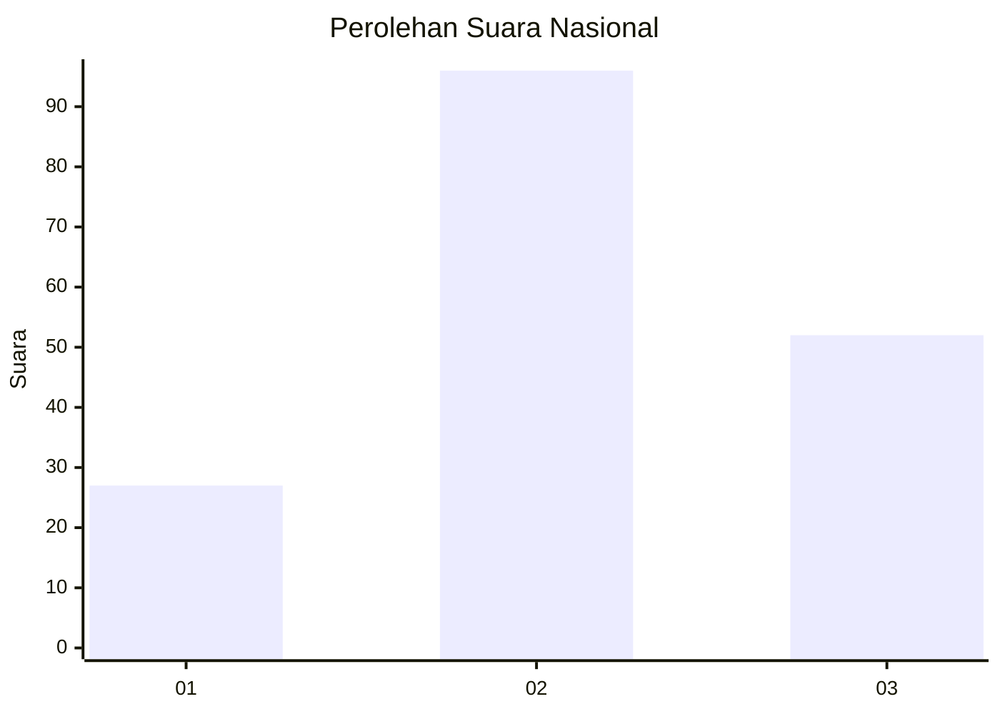
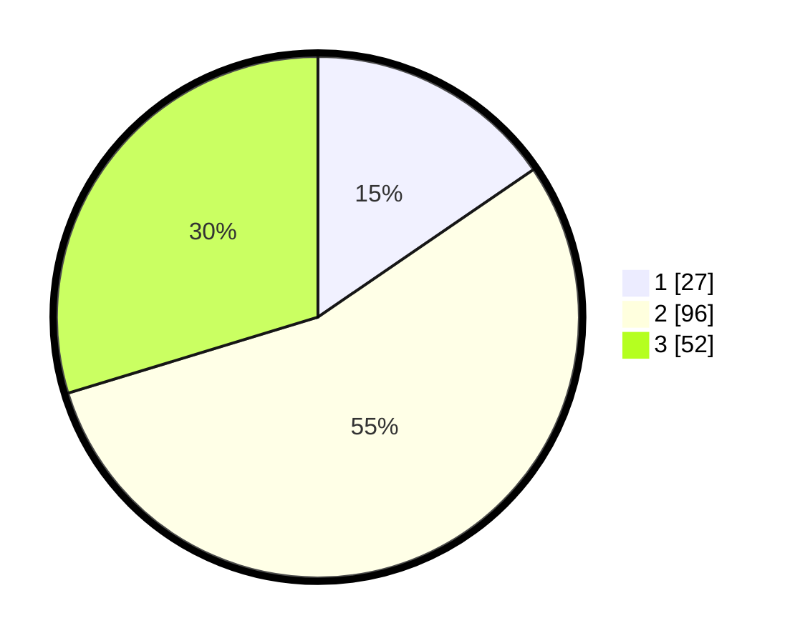

# Hasil

## Grafik

## Tabel

| No. | Nama Paslon    | Suara | Suara (raw) | Persentase |
|:--- |:-------------- | -----:| -----------:| ----------:|
| 1   | ANIES MUHAIMIN | 27    | [27][p-1]   | 15,43      |
| 2   | PRABOWO GIBRAN | 96    | [96][p-2]   | 54,86      |
| 3   | GANJAR MAHFUD  | 52    | [52][p-3]   | 29,71      |

[p-1]: https://github.com/gigit-pemilu/pemilu-2024/blob/main/pilpres/hitung-suara/sub/34-di-yogyakarta/sub/02-bantul/sub/16-kasihan/sub/2002-tirtonirmolo/sub/018-tps/sub/paslon-1.txt
[p-2]: https://github.com/gigit-pemilu/pemilu-2024/blob/main/pilpres/hitung-suara/sub/34-di-yogyakarta/sub/02-bantul/sub/16-kasihan/sub/2002-tirtonirmolo/sub/018-tps/sub/paslon-2.txt
[p-3]: https://github.com/gigit-pemilu/pemilu-2024/blob/main/pilpres/hitung-suara/sub/34-di-yogyakarta/sub/02-bantul/sub/16-kasihan/sub/2002-tirtonirmolo/sub/018-tps/sub/paslon-3.txt

## Foto C Plano

https://sirekap-obj-formc.kpu.go.id/0d35/pemilu/ppwp/34/02/16/20/02/3402162002018-20240214-235719--bd5da9e1-c283-4c97-bef8-4b1d3dc852df.jpg

https://sirekap-obj-formc.kpu.go.id/0d35/pemilu/ppwp/34/02/16/20/02/3402162002018-20240214-235940--07dee871-d7f3-47c5-aadc-fbc823931d17.jpg

https://sirekap-obj-formc.kpu.go.id/0d35/pemilu/ppwp/34/02/16/20/02/3402162002018-20240215-000152--7f576c1a-b125-4395-ad71-7d4fa6467e78.jpg

## Metadata

| Key        | Value               |
| ---------- | ------------------- |
| Time Stamp | 2024-02-25 10:00:00 |

