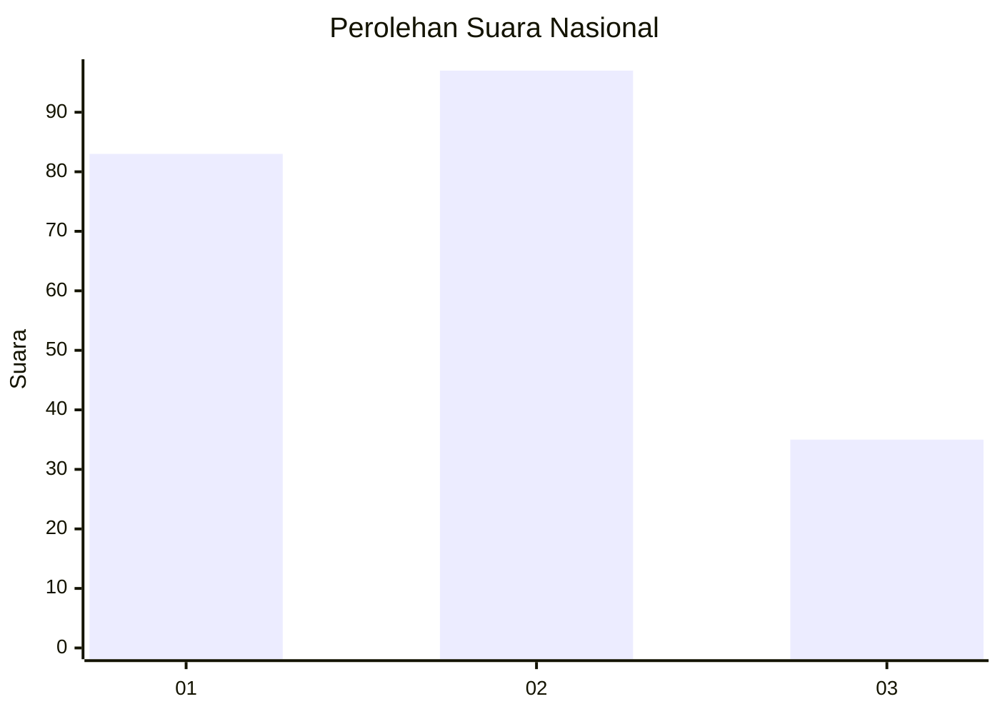
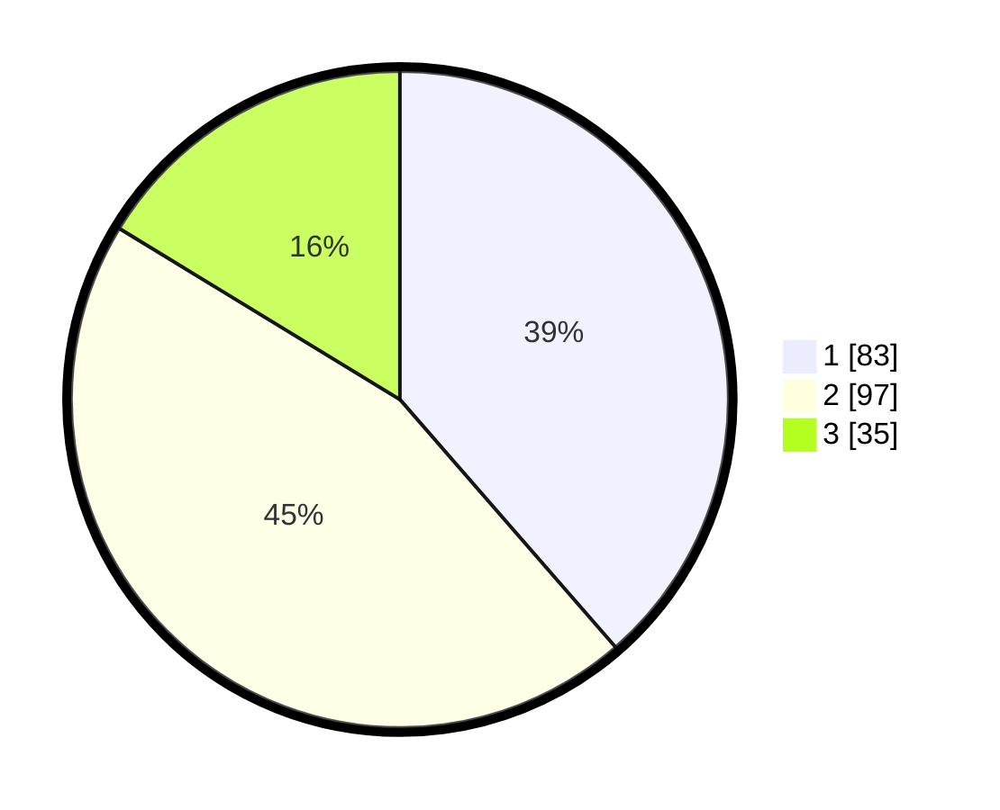

# Hasil

## Grafik

## Tabel

| No. | Nama Paslon    | Suara | Suara (raw) | Persentase |
|:--- |:-------------- | -----:| -----------:| ----------:|
| 1   | ANIES MUHAIMIN | 83    | [83][p-1]   | 38,60      |
| 2   | PRABOWO GIBRAN | 97    | [97][p-2]   | 45,12      |
| 3   | GANJAR MAHFUD  | 35    | [35][p-3]   | 16,28      |

[p-1]: https://github.com/gigit-pemilu/pemilu-2024/blob/main/pilpres/hitung-suara/sub/34-di-yogyakarta/sub/02-bantul/sub/16-kasihan/sub/2002-tirtonirmolo/sub/028-tps/sub/paslon-1.txt
[p-2]: https://github.com/gigit-pemilu/pemilu-2024/blob/main/pilpres/hitung-suara/sub/34-di-yogyakarta/sub/02-bantul/sub/16-kasihan/sub/2002-tirtonirmolo/sub/028-tps/sub/paslon-2.txt
[p-3]: https://github.com/gigit-pemilu/pemilu-2024/blob/main/pilpres/hitung-suara/sub/34-di-yogyakarta/sub/02-bantul/sub/16-kasihan/sub/2002-tirtonirmolo/sub/028-tps/sub/paslon-3.txt

## Foto C Plano

https://sirekap-obj-formc.kpu.go.id/f01d/pemilu/ppwp/34/02/16/20/02/3402162002028-20240215-215435--b40fc110-ea83-4472-afd8-1bc085c4b661.jpg

https://sirekap-obj-formc.kpu.go.id/f01d/pemilu/ppwp/34/02/16/20/02/3402162002028-20240215-215437--09181875-c402-465c-8353-c121a9975e97.jpg

https://sirekap-obj-formc.kpu.go.id/f01d/pemilu/ppwp/34/02/16/20/02/3402162002028-20240215-215436--79064a74-0e70-4602-89af-5bb402a47ade.jpg

## Metadata

| Key        | Value               |
| ---------- | ------------------- |
| Time Stamp | 2024-02-15 22:30:27 |

## DATA PEMILIH TETAP

Jumlah pemilih dalam DPT: **248**.
 * L: **117**.
 * P: **131**.

## DATA PENGGUNA HAK PILIH

Jumlah pengguna hak pilih dalam DPT: **206**.
 * L: **92**.
 * P: **114**.

Jumlah pengguna hak pilih dalam DPTb: **11**.
 * L: **4**.
 * P: **7**.

Jumlah pengguna hak pilih dalam DPK: **2**.
 * L: **2**.
 * P: **0**.

Jumlah pengguna hak pilih: **219**.
 * L: **98**.
 * P: **121**.

## JUMLAH SUARA SAH DAN TIDAK SAH

JUMLAH SELURUH SUARA SAH: **215**.

JUMLAH SUARA TIDAK SAH: **4**.

JUMLAH SELURUH SUARA SAH DAN SUARA TIDAK SAH: **219**.

