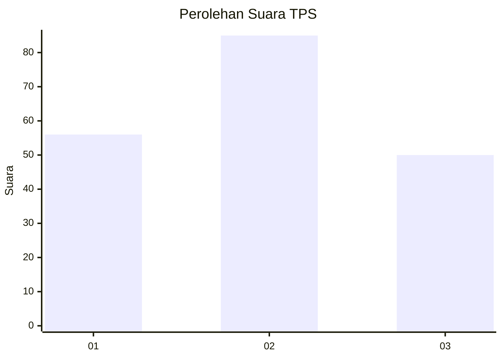
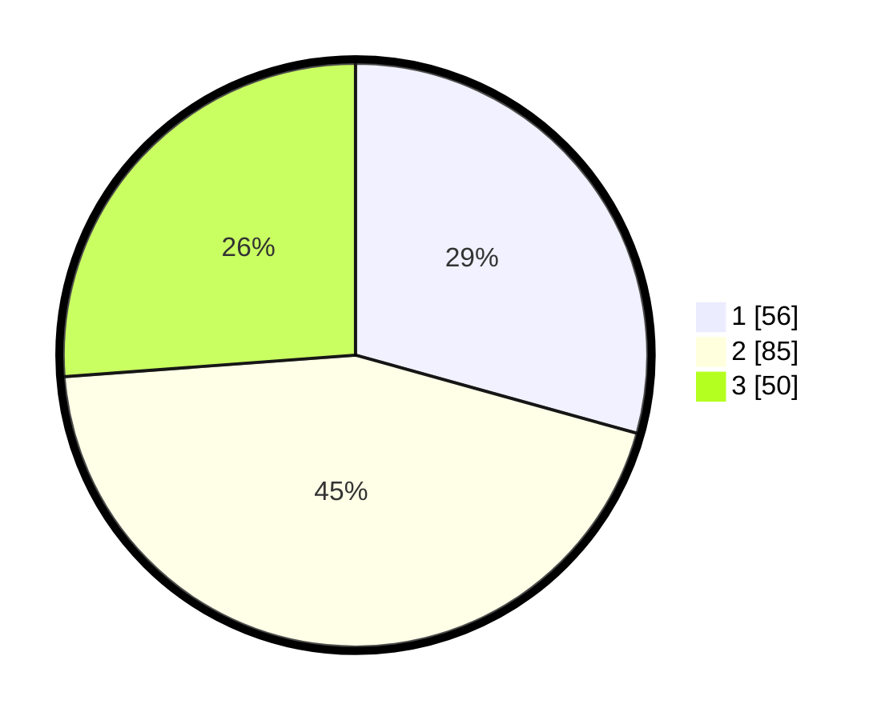

# Hasil

## Grafik

## Tabel

| No. | Nama Paslon    | Suara | Suara (raw) | Persentase |
|:--- |:-------------- | -----:| -----------:| ----------:|
| 1   | ANIES MUHAIMIN | 56    | [56][p-1]   | 29,32      |
| 2   | PRABOWO GIBRAN | 85    | [85][p-2]   | 44,50      |
| 3   | GANJAR MAHFUD  | 50    | [50][p-3]   | 26,18      |

[p-1]: https://github.com/gigit-pemilu/pemilu-2024-34-di-yogyakarta/blob/main/pilpres/hitung-suara/sub/34-di-yogyakarta/sub/02-bantul/sub/16-kasihan/sub/2002-tirtonirmolo/sub/047-tps/sub/paslon-1.txt
[p-2]: https://github.com/gigit-pemilu/pemilu-2024-34-di-yogyakarta/blob/main/pilpres/hitung-suara/sub/34-di-yogyakarta/sub/02-bantul/sub/16-kasihan/sub/2002-tirtonirmolo/sub/047-tps/sub/paslon-2.txt
[p-3]: https://github.com/gigit-pemilu/pemilu-2024-34-di-yogyakarta/blob/main/pilpres/hitung-suara/sub/34-di-yogyakarta/sub/02-bantul/sub/16-kasihan/sub/2002-tirtonirmolo/sub/047-tps/sub/paslon-3.txt

## Foto C Plano

https://sirekap-obj-formc.kpu.go.id/9d29/pemilu/ppwp/34/02/16/20/02/3402162002047-20240214-223039--9a2535a2-3bbd-4b37-9999-401b2674c498.jpg

https://sirekap-obj-formc.kpu.go.id/9d29/pemilu/ppwp/34/02/16/20/02/3402162002047-20240214-223113--20be6490-3923-4795-86ea-eec32d86c58e.jpg

https://sirekap-obj-formc.kpu.go.id/9d29/pemilu/ppwp/34/02/16/20/02/3402162002047-20240214-223245--08462e8d-90d5-487c-9d59-3c0907c611db.jpg

## Metadata

| Key        | Value               |
| ---------- | ------------------- |
| Time Stamp | 2024-02-15 20:00:44 |

## DATA PEMILIH TETAP

Jumlah pemilih dalam DPT: **212**.
 * L: **108**.
 * P: **104**.

## DATA PENGGUNA HAK PILIH

Jumlah pengguna hak pilih dalam DPT: **184**.
 * L: **94**.
 * P: **90**.

Jumlah pengguna hak pilih dalam DPTb: **5**.
 * L: **2**.
 * P: **3**.

Jumlah pengguna hak pilih dalam DPK: **5**.
 * L: **5**.
 * P: **0**.

Jumlah pengguna hak pilih: **194**.
 * L: **101**.
 * P: **93**.

## JUMLAH SUARA SAH DAN TIDAK SAH

JUMLAH SELURUH SUARA SAH: **191**.

JUMLAH SUARA TIDAK SAH: **3**.

JUMLAH SELURUH SUARA SAH DAN SUARA TIDAK SAH: **194**.

