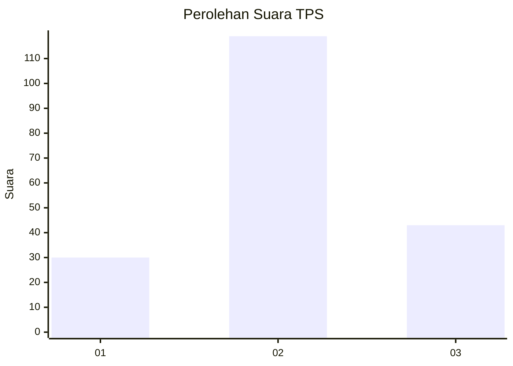
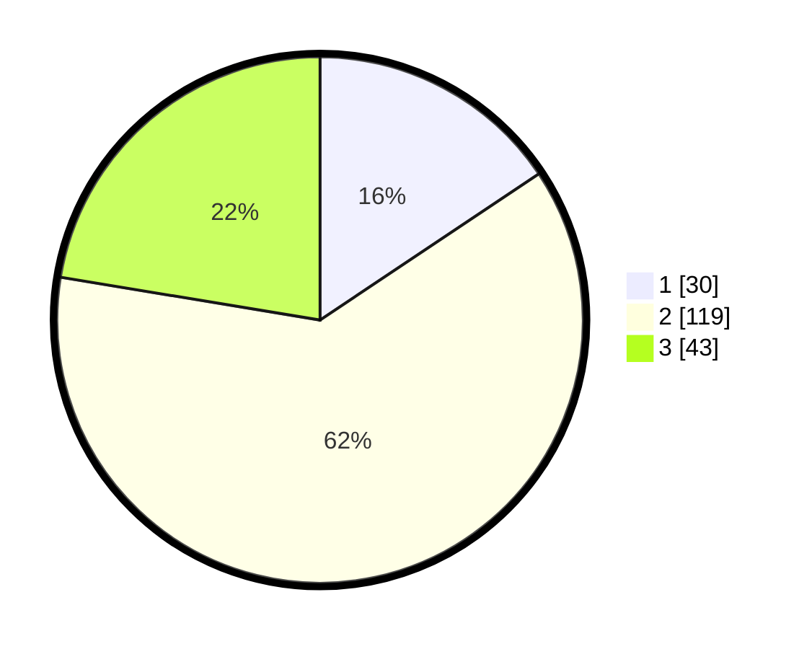

# Hasil

## Grafik

## Tabel

| No. | Nama Paslon    | Suara | Suara (raw) | Persentase |
|:--- |:-------------- | -----:| -----------:| ----------:|
| 1   | ANIES MUHAIMIN | 30    | [30][p-1]   | 15,63      |
| 2   | PRABOWO GIBRAN | 119   | [119][p-2]  | 61,98      |
| 3   | GANJAR MAHFUD  | 43    | [43][p-3]   | 22,40      |

[p-1]: https://github.com/gigit-pemilu/pemilu-2024-34-di-yogyakarta/blob/main/pilpres/hitung-suara/sub/34-di-yogyakarta/sub/02-bantul/sub/16-kasihan/sub/2002-tirtonirmolo/sub/059-tps/sub/paslon-1.txt
[p-2]: https://github.com/gigit-pemilu/pemilu-2024-34-di-yogyakarta/blob/main/pilpres/hitung-suara/sub/34-di-yogyakarta/sub/02-bantul/sub/16-kasihan/sub/2002-tirtonirmolo/sub/059-tps/sub/paslon-2.txt
[p-3]: https://github.com/gigit-pemilu/pemilu-2024-34-di-yogyakarta/blob/main/pilpres/hitung-suara/sub/34-di-yogyakarta/sub/02-bantul/sub/16-kasihan/sub/2002-tirtonirmolo/sub/059-tps/sub/paslon-3.txt

## Foto C Plano

https://sirekap-obj-formc.kpu.go.id/c19f/pemilu/ppwp/34/02/16/20/02/3402162002059-20240214-230100--a34d58a4-03e5-482c-a03b-c2dc09faf83c.jpg

https://sirekap-obj-formc.kpu.go.id/c19f/pemilu/ppwp/34/02/16/20/02/3402162002059-20240214-230257--66b0fc75-57cd-43fa-960d-29217d7025ab.jpg

https://sirekap-obj-formc.kpu.go.id/c19f/pemilu/ppwp/34/02/16/20/02/3402162002059-20240214-230429--6015bcbe-445e-42da-971b-ae00b61d1bdc.jpg

## Metadata

| Key        | Value               |
| ---------- | ------------------- |
| Time Stamp | 2024-02-24 22:31:28 |

