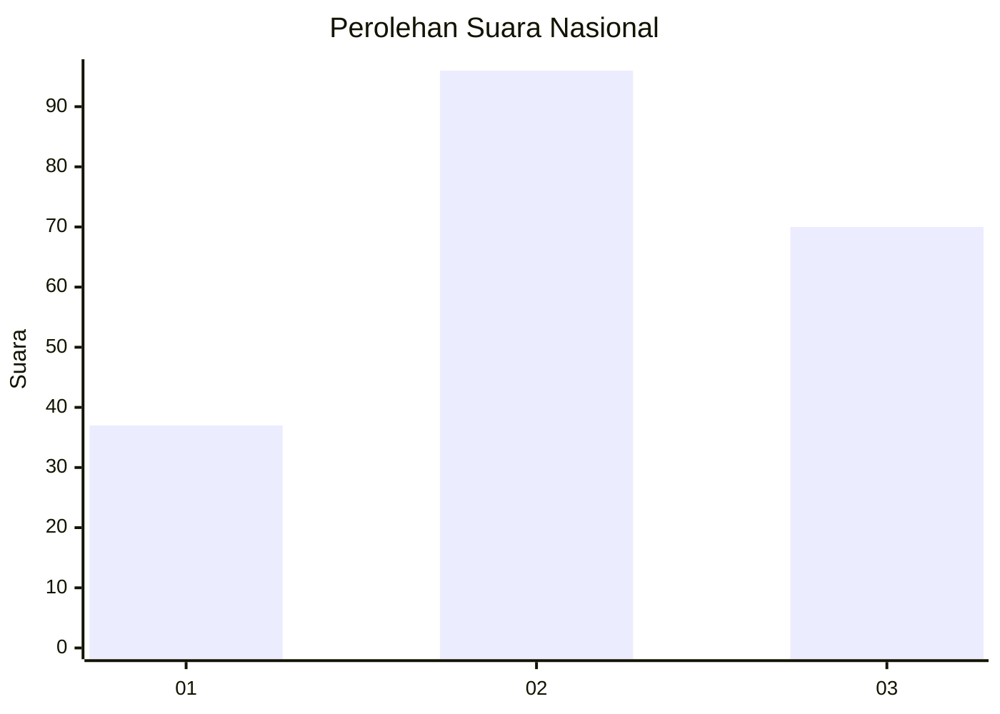
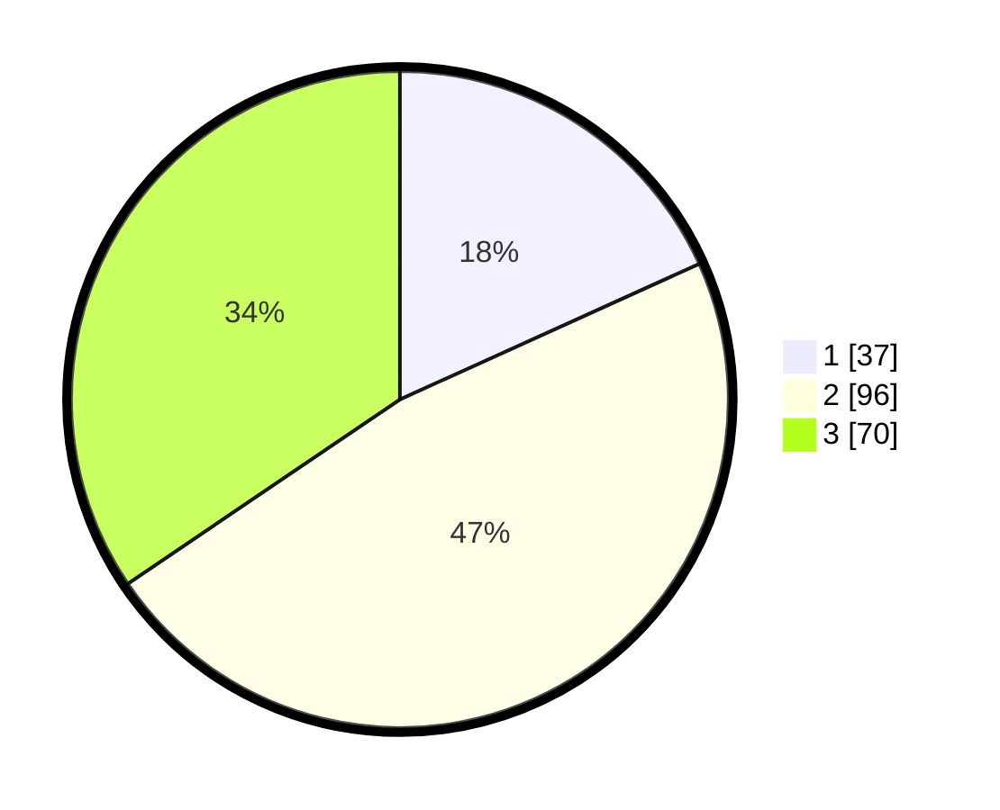

# Hasil

## Grafik

## Tabel

| No. | Nama Paslon    | Suara | Suara (raw) | Persentase |
|:--- |:-------------- | -----:| -----------:| ----------:|
| 1   | ANIES MUHAIMIN | 37    | [37][p-1]   | 18,23      |
| 2   | PRABOWO GIBRAN | 96    | [96][p-2]   | 47,29      |
| 3   | GANJAR MAHFUD  | 70    | [70][p-3]   | 34,48      |

[p-1]: https://github.com/gigit-pemilu/pemilu-2024/blob/main/pilpres/hitung-suara/sub/34-di-yogyakarta/sub/02-bantul/sub/16-kasihan/sub/2002-tirtonirmolo/sub/060-tps/sub/paslon-1.txt
[p-2]: https://github.com/gigit-pemilu/pemilu-2024/blob/main/pilpres/hitung-suara/sub/34-di-yogyakarta/sub/02-bantul/sub/16-kasihan/sub/2002-tirtonirmolo/sub/060-tps/sub/paslon-2.txt
[p-3]: https://github.com/gigit-pemilu/pemilu-2024/blob/main/pilpres/hitung-suara/sub/34-di-yogyakarta/sub/02-bantul/sub/16-kasihan/sub/2002-tirtonirmolo/sub/060-tps/sub/paslon-3.txt

## Foto C Plano

https://sirekap-obj-formc.kpu.go.id/9ee4/pemilu/ppwp/34/02/16/20/02/3402162002060-20240214-221612--86faa0bf-d646-4b5f-a196-b3d0853e0f35.jpg

https://sirekap-obj-formc.kpu.go.id/9ee4/pemilu/ppwp/34/02/16/20/02/3402162002060-20240214-221251--5ea57db9-d7d2-4ebc-a579-f8b66739e7b0.jpg

https://sirekap-obj-formc.kpu.go.id/9ee4/pemilu/ppwp/34/02/16/20/02/3402162002060-20240214-221800--c255fe45-0074-4784-8807-650c2ced8aac.jpg

## Metadata

| Key        | Value               |
| ---------- | ------------------- |
| Time Stamp | 2024-02-15 15:00:29 |

