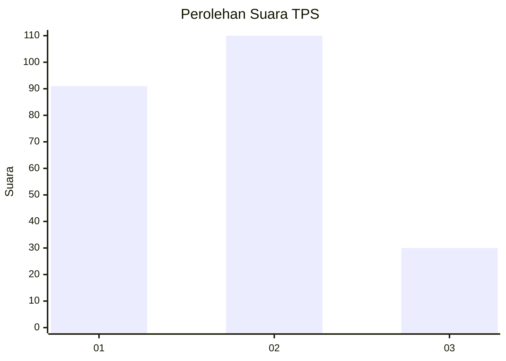
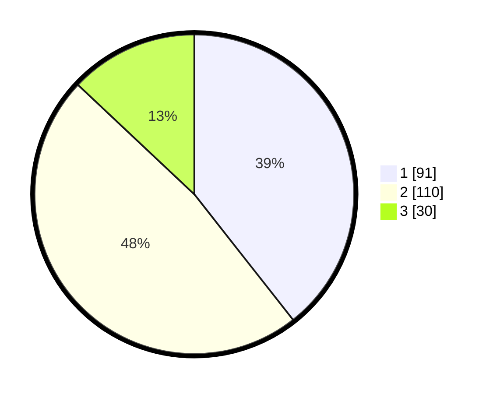

# Hasil

## Grafik

## Tabel

| No. | Nama Paslon    | Suara | Suara (raw) | Persentase |
|:--- |:-------------- | -----:| -----------:| ----------:|
| 1   | ANIES MUHAIMIN | 91    | [91][p-1]   | 39,39      |
| 2   | PRABOWO GIBRAN | 110   | [110][p-2]  | 47,62      |
| 3   | GANJAR MAHFUD  | 30    | [30][p-3]   | 12,99      |

[p-1]: https://github.com/gigit-pemilu/pemilu-2024-34-di-yogyakarta/blob/main/pilpres/hitung-suara/sub/34-di-yogyakarta/sub/02-bantul/sub/16-kasihan/sub/2002-tirtonirmolo/sub/071-tps/sub/paslon-1.txt
[p-2]: https://github.com/gigit-pemilu/pemilu-2024-34-di-yogyakarta/blob/main/pilpres/hitung-suara/sub/34-di-yogyakarta/sub/02-bantul/sub/16-kasihan/sub/2002-tirtonirmolo/sub/071-tps/sub/paslon-2.txt
[p-3]: https://github.com/gigit-pemilu/pemilu-2024-34-di-yogyakarta/blob/main/pilpres/hitung-suara/sub/34-di-yogyakarta/sub/02-bantul/sub/16-kasihan/sub/2002-tirtonirmolo/sub/071-tps/sub/paslon-3.txt

## Foto C Plano

https://sirekap-obj-formc.kpu.go.id/0b1e/pemilu/ppwp/34/02/16/20/02/3402162002071-20240215-001810--0d16910a-a00c-456c-9642-171d12d19ac0.jpg

https://sirekap-obj-formc.kpu.go.id/0b1e/pemilu/ppwp/34/02/16/20/02/3402162002071-20240215-002112--aa37cca7-3b98-48d6-abe1-a7513463d5e0.jpg

https://sirekap-obj-formc.kpu.go.id/0b1e/pemilu/ppwp/34/02/16/20/02/3402162002071-20240215-002255--fa6a85b0-503b-4561-ae7b-a2bd26f7ad22.jpg

## Metadata

| Key        | Value               |
| ---------- | ------------------- |
| Time Stamp | 2024-02-24 22:31:28 |

