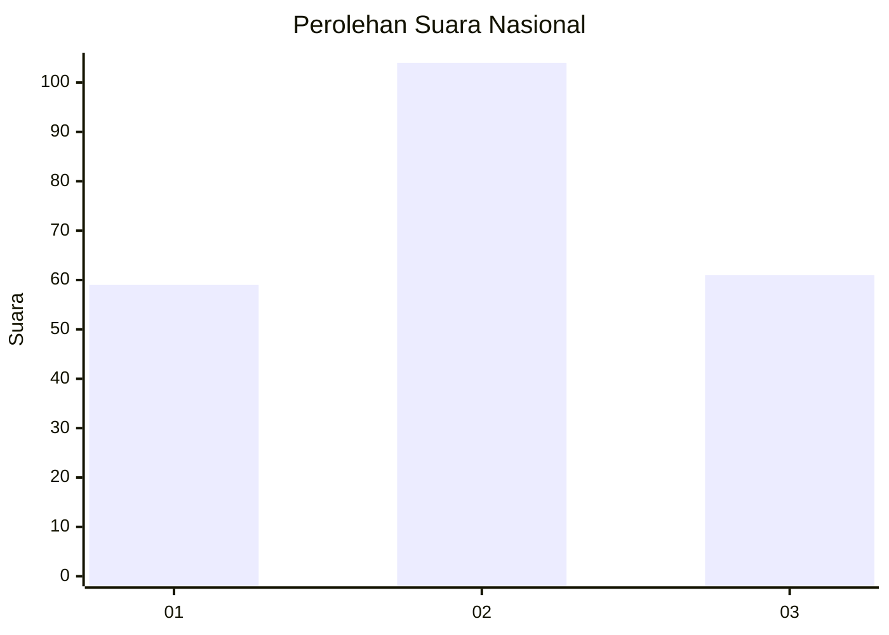
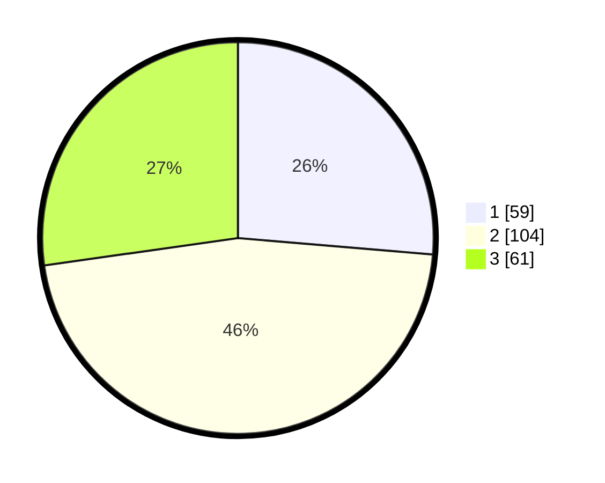

# Hasil

## Grafik

## Tabel

| No. | Nama Paslon    | Suara | Suara (raw) | Persentase |
|:--- |:-------------- | -----:| -----------:| ----------:|
| 1   | ANIES MUHAIMIN | 59    | [59][p-1]   | 26,34      |
| 2   | PRABOWO GIBRAN | 104   | [104][p-2]  | 46,43      |
| 3   | GANJAR MAHFUD  | 61    | [61][p-3]   | 27,23      |

[p-1]: https://github.com/gigit-pemilu/pemilu-2024/blob/main/pilpres/hitung-suara/sub/34-di-yogyakarta/sub/02-bantul/sub/16-kasihan/sub/2003-tamantirto/sub/001-tps/sub/paslon-1.txt
[p-2]: https://github.com/gigit-pemilu/pemilu-2024/blob/main/pilpres/hitung-suara/sub/34-di-yogyakarta/sub/02-bantul/sub/16-kasihan/sub/2003-tamantirto/sub/001-tps/sub/paslon-2.txt
[p-3]: https://github.com/gigit-pemilu/pemilu-2024/blob/main/pilpres/hitung-suara/sub/34-di-yogyakarta/sub/02-bantul/sub/16-kasihan/sub/2003-tamantirto/sub/001-tps/sub/paslon-3.txt

## Foto C Plano

https://sirekap-obj-formc.kpu.go.id/44e9/pemilu/ppwp/34/02/16/20/03/3402162003001-20240215-000309--acf6408d-fc63-4c80-9205-ffb97a96d811.jpg

https://sirekap-obj-formc.kpu.go.id/44e9/pemilu/ppwp/34/02/16/20/03/3402162003001-20240215-000401--9554a55b-fb95-4ecf-9c26-fd68be2af8c7.jpg

https://sirekap-obj-formc.kpu.go.id/44e9/pemilu/ppwp/34/02/16/20/03/3402162003001-20240215-000849--57ca6b65-cc84-4a1f-90dc-936f52610e4a.jpg

## Metadata

| Key        | Value               |
| ---------- | ------------------- |
| Time Stamp | 2024-02-24 22:31:28 |

