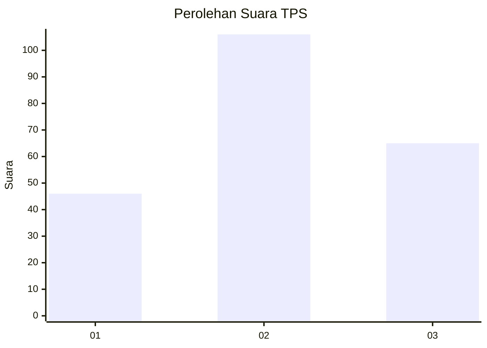
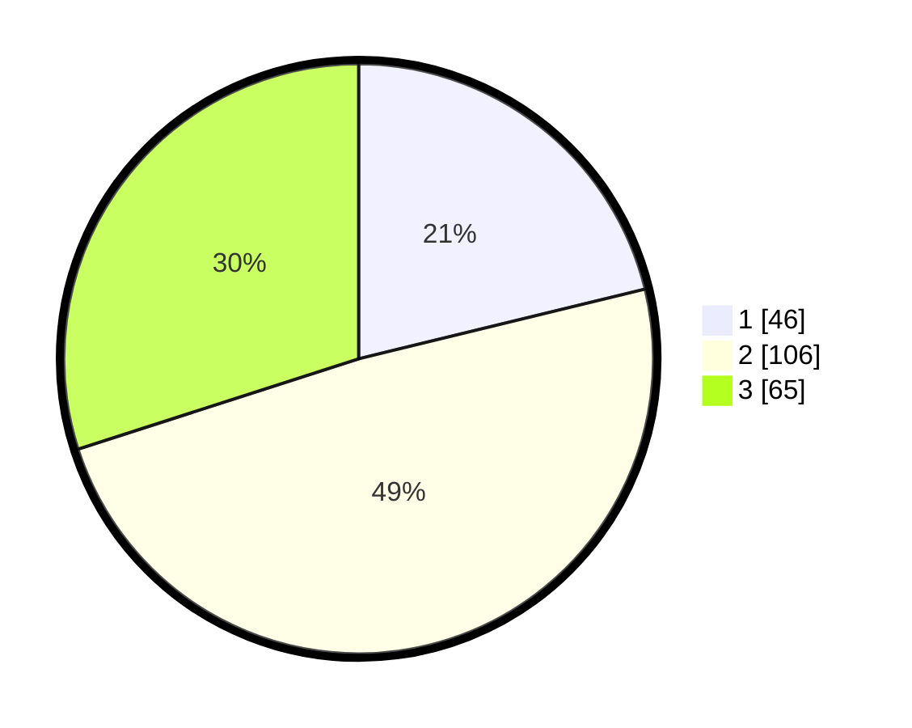

# Hasil

## Grafik

## Tabel

| No. | Nama Paslon    | Suara | Suara (raw) | Persentase |
|:--- |:-------------- | -----:| -----------:| ----------:|
| 1   | ANIES MUHAIMIN | 46    | [46][p-1]   | 21,20      |
| 2   | PRABOWO GIBRAN | 106   | [106][p-2]  | 48,85      |
| 3   | GANJAR MAHFUD  | 65    | [65][p-3]   | 29,95      |

[p-1]: https://github.com/gigit-pemilu/pemilu-2024-34-di-yogyakarta/blob/main/pilpres/hitung-suara/sub/34-di-yogyakarta/sub/02-bantul/sub/16-kasihan/sub/2003-tamantirto/sub/008-tps/sub/paslon-1.txt
[p-2]: https://github.com/gigit-pemilu/pemilu-2024-34-di-yogyakarta/blob/main/pilpres/hitung-suara/sub/34-di-yogyakarta/sub/02-bantul/sub/16-kasihan/sub/2003-tamantirto/sub/008-tps/sub/paslon-2.txt
[p-3]: https://github.com/gigit-pemilu/pemilu-2024-34-di-yogyakarta/blob/main/pilpres/hitung-suara/sub/34-di-yogyakarta/sub/02-bantul/sub/16-kasihan/sub/2003-tamantirto/sub/008-tps/sub/paslon-3.txt

## Foto C Plano

https://sirekap-obj-formc.kpu.go.id/c623/pemilu/ppwp/34/02/16/20/03/3402162003008-20240215-011819--5c3631f7-5196-4cfa-9fa1-1c7c9b4c08db.jpg

https://sirekap-obj-formc.kpu.go.id/c623/pemilu/ppwp/34/02/16/20/03/3402162003008-20240215-011931--8b0296d8-832c-4caf-8c05-f9046b00d823.jpg

https://sirekap-obj-formc.kpu.go.id/c623/pemilu/ppwp/34/02/16/20/03/3402162003008-20240215-012102--18e21675-cded-4d55-b877-35b632180c83.jpg

## Metadata

| Key        | Value               |
| ---------- | ------------------- |
| Time Stamp | 2024-02-24 22:31:28 |

