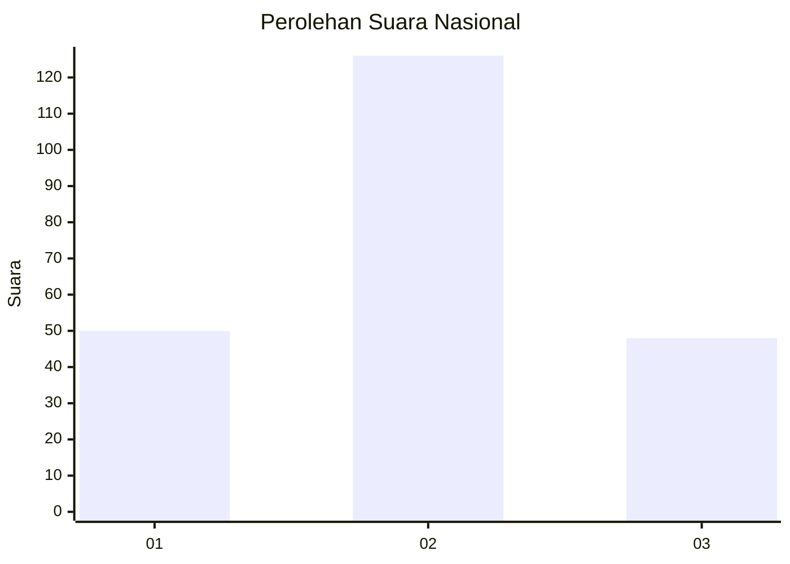
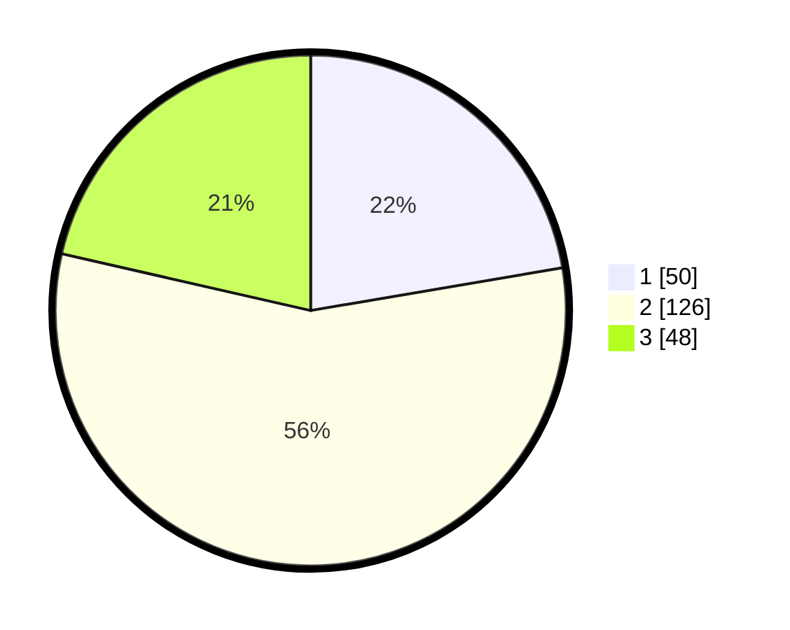

# Hasil

## Grafik

## Tabel

| No. | Nama Paslon    | Suara | Suara (raw) | Persentase |
|:--- |:-------------- | -----:| -----------:| ----------:|
| 1   | ANIES MUHAIMIN | 50    | [50][p-1]   | 22,32      |
| 2   | PRABOWO GIBRAN | 126   | [126][p-2]  | 56,25      |
| 3   | GANJAR MAHFUD  | 48    | [48][p-3]   | 21,43      |

[p-1]: https://github.com/gigit-pemilu/pemilu-2024/blob/main/pilpres/hitung-suara/sub/34-di-yogyakarta/sub/02-bantul/sub/16-kasihan/sub/2003-tamantirto/sub/010-tps/sub/paslon-1.txt
[p-2]: https://github.com/gigit-pemilu/pemilu-2024/blob/main/pilpres/hitung-suara/sub/34-di-yogyakarta/sub/02-bantul/sub/16-kasihan/sub/2003-tamantirto/sub/010-tps/sub/paslon-2.txt
[p-3]: https://github.com/gigit-pemilu/pemilu-2024/blob/main/pilpres/hitung-suara/sub/34-di-yogyakarta/sub/02-bantul/sub/16-kasihan/sub/2003-tamantirto/sub/010-tps/sub/paslon-3.txt

## Foto C Plano

https://sirekap-obj-formc.kpu.go.id/f165/pemilu/ppwp/34/02/16/20/03/3402162003010-20240214-190144--c569d3fe-2366-4e76-ba21-6325e86d8528.jpg

https://sirekap-obj-formc.kpu.go.id/f165/pemilu/ppwp/34/02/16/20/03/3402162003010-20240214-184828--b6c28b8e-57c8-4ea5-b578-d9b6ccad86ae.jpg

https://sirekap-obj-formc.kpu.go.id/f165/pemilu/ppwp/34/02/16/20/03/3402162003010-20240214-185743--8f8af36b-c9ba-455f-a389-941bd07ccf03.jpg

## Metadata

| Key        | Value               |
| ---------- | ------------------- |
| Time Stamp | 2024-02-14 21:46:01 |

