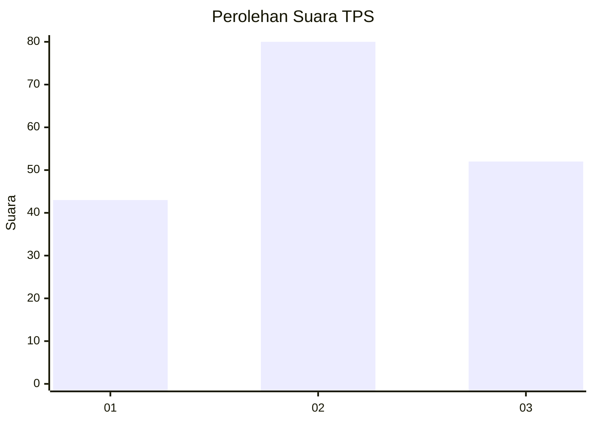
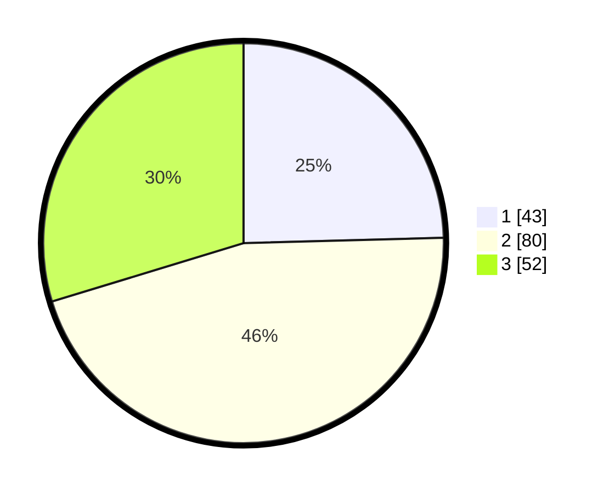

# Hasil

## Grafik

## Tabel

| No. | Nama Paslon    | Suara | Suara (raw) | Persentase |
|:--- |:-------------- | -----:| -----------:| ----------:|
| 1   | ANIES MUHAIMIN | 43    | [43][p-1]   | 24,57      |
| 2   | PRABOWO GIBRAN | 80    | [80][p-2]   | 45,71      |
| 3   | GANJAR MAHFUD  | 52    | [52][p-3]   | 29,71      |

[p-1]: https://github.com/gigit-pemilu/pemilu-2024-34-di-yogyakarta/blob/main/pilpres/hitung-suara/sub/34-di-yogyakarta/sub/02-bantul/sub/16-kasihan/sub/2003-tamantirto/sub/011-tps/sub/paslon-1.txt
[p-2]: https://github.com/gigit-pemilu/pemilu-2024-34-di-yogyakarta/blob/main/pilpres/hitung-suara/sub/34-di-yogyakarta/sub/02-bantul/sub/16-kasihan/sub/2003-tamantirto/sub/011-tps/sub/paslon-2.txt
[p-3]: https://github.com/gigit-pemilu/pemilu-2024-34-di-yogyakarta/blob/main/pilpres/hitung-suara/sub/34-di-yogyakarta/sub/02-bantul/sub/16-kasihan/sub/2003-tamantirto/sub/011-tps/sub/paslon-3.txt

## Foto C Plano

https://sirekap-obj-formc.kpu.go.id/9db1/pemilu/ppwp/34/02/16/20/03/3402162003011-20240215-030515--72ccc65d-f4f3-4957-a6ee-309846a24142.jpg

https://sirekap-obj-formc.kpu.go.id/9db1/pemilu/ppwp/34/02/16/20/03/3402162003011-20240215-030607--b33c9d5f-ee71-44f8-8f4c-b7ba6b685a72.jpg

https://sirekap-obj-formc.kpu.go.id/9db1/pemilu/ppwp/34/02/16/20/03/3402162003011-20240215-030651--b6d1b9eb-448a-4b7a-83a7-604bbc494cfe.jpg

## Metadata

| Key        | Value               |
| ---------- | ------------------- |
| Time Stamp | 2024-02-16 11:00:29 |

